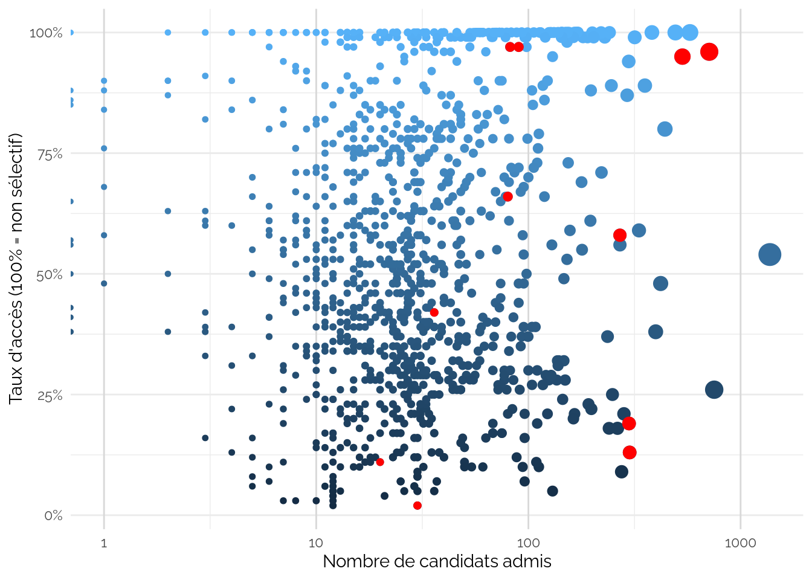
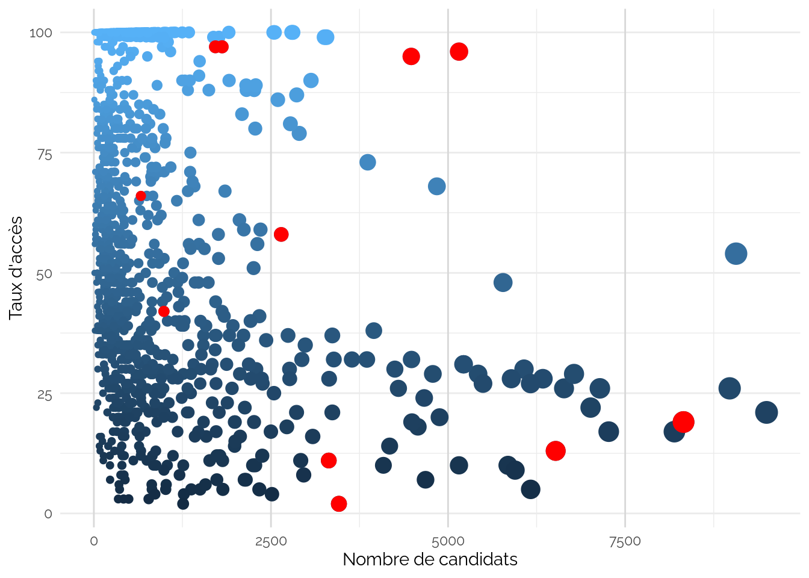

Cartographie
================

Pour contextualiser cette enquête qualitative, nous allons employer une
approche quantitative exploitant les données ouvertes du gouvernement,
concernant les lycées et formations supérieures de Nouvelle-Aquitaine.

## Candidats

La Figure 1 utilise le jeu de données
`Indicateurs de valeur ajoutée des lycées d'enseignement général et technologique`
[1] pour visualiser les lycées de Nouvelle-Aquitaine en fonction du
nombre de candidats au baccalauréat, et du taux de mention (moyenne
générale supérieure à 12), qui est l’indicateur principal de «
performance scolaire ». A droite nous y trouvons les plus grands lycées
et en haut les plus « performants ».

Les points rouge indiquent la position des établissement des candidats
enquêtés. Ces derniers occupent une position centrale en terme de
taille, allant de 160 à 320, et son représentatif de tous les niveaux de
performance, allant de 60% à 90% de taux de mention.

Voir les données

| etablissement                                 | effectif\_presents\_total\_series | taux\_mention\_brut\_toutes\_series | annee | ville          | code\_etablissement | commune | academie | departement       | secteur\_public\_pu\_prive\_pr | effectif\_presents\_serie\_l | effectif\_presents\_serie\_es | effectif\_presents\_serie\_s | effectif\_presents\_serie\_stg | effectif\_presents\_serie\_sti2d | effectif\_presents\_serie\_std2a | effectif\_presents\_serie\_stmg | effectif\_presents\_serie\_sti | effectif\_presents\_serie\_stl | effectif\_presents\_serie\_st2s | effectif\_presents\_serie\_musiq\_danse | effectif\_presents\_serie\_hotellerie | taux\_brut\_de\_reussite\_serie\_l | taux\_brut\_de\_reussite\_serie\_es | taux\_brut\_de\_reussite\_serie\_s | taux\_brut\_de\_reussite\_serie\_stg | taux\_brut\_de\_reussite\_serie\_sti2d | taux\_brut\_de\_reussite\_serie\_std2a | taux\_brut\_de\_reussite\_serie\_stmg | taux\_brut\_de\_reussite\_serie\_sti | taux\_brut\_de\_reussite\_serie\_stl | taux\_brut\_de\_reussite\_serie\_st2s | taux\_brut\_de\_reussite\_serie\_musiq\_danse | taux\_brut\_de\_reussite\_serie\_hotellerie | taux\_brut\_de\_reussite\_total\_series | taux\_reussite\_attendu\_acad\_serie\_l | taux\_reussite\_attendu\_acad\_serie\_es | taux\_reussite\_attendu\_acad\_serie\_s | taux\_reussite\_attendu\_acad\_serie\_stg | taux\_reussite\_attendu\_acad\_serie\_sti2d | taux\_reussite\_attendu\_acad\_serie\_std2a | taux\_reussite\_attendu\_acad\_serie\_stmg | taux\_reussite\_attendu\_acad\_serie\_sti | taux\_reussite\_attendu\_acad\_serie\_stl | taux\_reussite\_attendu\_acad\_serie\_st2s | taux\_reussite\_attendu\_acad\_serie\_musiq\_danse | taux\_reussite\_attendu\_acad\_serie\_hotellerie | taux\_reussite\_attendu\_acad\_total\_series | taux\_reussite\_attendu\_france\_serie\_l | taux\_reussite\_attendu\_france\_serie\_es | taux\_reussite\_attendu\_france\_serie\_s | taux\_reussite\_attendu\_france\_serie\_stg | taux\_reussite\_attendu\_france\_serie\_sti2d | taux\_reussite\_attendu\_france\_serie\_std2a | taux\_reussite\_attendu\_france\_serie\_stmg | taux\_reussite\_attendu\_france\_serie\_sti | taux\_reussite\_attendu\_france\_serie\_stl | taux\_reussite\_attendu\_france\_serie\_st2s | taux\_reussite\_attendu\_france\_serie\_musiq\_danse | taux\_reussite\_attendu\_france\_serie\_hotellerie | taux\_reussite\_attendu\_france\_total\_series | taux\_mention\_brut\_serie\_l | taux\_mention\_brut\_serie\_es | taux\_mention\_brut\_serie\_s | taux\_mention\_brut\_serie\_sti2d | taux\_mention\_brut\_serie\_std2a | taux\_mention\_brut\_serie\_stmg | taux\_mention\_brut\_serie\_stl | taux\_mention\_brut\_serie\_st2s | taux\_mention\_brut\_serie\_musiq\_danse | taux\_mention\_brut\_serie\_hotellerie | taux\_mention\_attendu\_serie\_l | taux\_mention\_attendu\_serie\_es | taux\_mention\_attendu\_serie\_s | taux\_mention\_attendu\_serie\_sti2d | taux\_mention\_attendu\_serie\_std2a | taux\_mention\_attendu\_serie\_stmg | taux\_mention\_attendu\_serie\_stl | taux\_mention\_attendu\_serie\_st2s | taux\_mention\_attendu\_serie\_musiq\_danse | taux\_mention\_attendu\_serie\_hotellerie | taux\_mention\_attendu\_toutes\_series | sructure\_pedagogique\_en\_5\_groupes | sructure\_pedagogique\_en\_7\_groupes | pourcentage\_bacheliers\_sortants\_2de\_1re\_term\_etab | pourcentage\_bacheliers\_sortants\_terminales\_etab | pourcentage\_bacheliers\_sortants\_2de\_1re\_term\_acad | pourcentage\_bacheliers\_sortants\_terminales\_acad | pourcentage\_bacheliers\_sortants\_2de\_1re\_term\_france | pourcentage\_bacheliers\_sortants\_terminales\_france | effectif\_de\_seconde | effectif\_de\_premiere | effectif\_de\_terminale | taux\_acces\_brut\_seconde\_bac | taux\_acces\_attendu\_acad\_seconde\_bac | taux\_acces\_attendu\_france\_seconde\_bac | taux\_acces\_brut\_premiere\_bac | taux\_acces\_attendu\_acad\_premiere\_bac | taux\_acces\_attendu\_france\_premiere\_bac | taux\_acces\_brut\_terminale\_bac | taux\_acces\_attendu\_france\_terminale\_bac | libelle\_region\_2016 | code\_region\_2016 | code\_departement | libelle\_departement | va\_reu\_total | va\_acc\_seconde | va\_men\_total | va\_reu\_l | va\_reu\_es | va\_reu\_s | va\_reu\_stg | va\_reu\_sti2d | va\_reu\_std2a | va\_reu\_stmg | va\_reu\_sti | va\_reu\_stl | va\_reu\_st2s | va\_reu\_musiq\_danse | va\_reu\_hotellerie | va\_acc\_premiere | va\_acc\_terminale | va\_men\_l | va\_men\_es | va\_men\_s | va\_men\_sti2d | va\_men\_std2a | va\_men\_stmg | va\_men\_stl | va\_men\_st2s | va\_men\_musiq\_danse | va\_men\_hotellerie | presents\_gnle | taux\_reu\_brut\_gnle | va\_reu\_gnle | taux\_men\_brut\_gnle | va\_men\_gnle |
|:----------------------------------------------|----------------------------------:|------------------------------------:|------:|:---------------|:--------------------|:--------|:---------|:------------------|:-------------------------------|-----------------------------:|------------------------------:|-----------------------------:|-------------------------------:|---------------------------------:|---------------------------------:|--------------------------------:|-------------------------------:|-------------------------------:|--------------------------------:|----------------------------------------:|--------------------------------------:|-----------------------------------:|------------------------------------:|-----------------------------------:|-------------------------------------:|---------------------------------------:|---------------------------------------:|--------------------------------------:|-------------------------------------:|-------------------------------------:|--------------------------------------:|----------------------------------------------:|--------------------------------------------:|----------------------------------------:|----------------------------------------:|-----------------------------------------:|----------------------------------------:|------------------------------------------:|--------------------------------------------:|--------------------------------------------:|-------------------------------------------:|------------------------------------------:|------------------------------------------:|-------------------------------------------:|---------------------------------------------------:|-------------------------------------------------:|---------------------------------------------:|:------------------------------------------|:-------------------------------------------|:------------------------------------------|--------------------------------------------:|:----------------------------------------------|:----------------------------------------------|:---------------------------------------------|--------------------------------------------:|:--------------------------------------------|:---------------------------------------------|:-----------------------------------------------------|:---------------------------------------------------|:-----------------------------------------------|------------------------------:|-------------------------------:|------------------------------:|----------------------------------:|----------------------------------:|---------------------------------:|--------------------------------:|---------------------------------:|-----------------------------------------:|---------------------------------------:|:---------------------------------|:----------------------------------|:---------------------------------|:-------------------------------------|:-------------------------------------|:------------------------------------|:-----------------------------------|:------------------------------------|:--------------------------------------------|:------------------------------------------|:---------------------------------------|--------------------------------------:|:--------------------------------------|--------------------------------------------------------:|----------------------------------------------------:|--------------------------------------------------------:|----------------------------------------------------:|----------------------------------------------------------:|------------------------------------------------------:|----------------------:|-----------------------:|------------------------:|:--------------------------------|-----------------------------------------:|:-------------------------------------------|---------------------------------:|------------------------------------------:|:--------------------------------------------|----------------------------------:|:---------------------------------------------|:----------------------|-------------------:|:------------------|:---------------------|:---------------|:-----------------|:---------------|:-----------|:------------|:-----------|:-------------|:---------------|:---------------|:--------------|:-------------|:-------------|:--------------|:----------------------|:--------------------|:------------------|:-------------------|:-----------|:------------|:-----------|:---------------|:---------------|:--------------|:-------------|:--------------|:----------------------|:--------------------|---------------:|----------------------:|:--------------|----------------------:|:--------------|
| LYCEE BERNARD PALISSY                         |                               290 |                                  60 |  2021 | SAINTES        | 0170060Y            | 17415   | POITIERS | CHARENTE MARITIME | PU                             |                           NA |                            NA |                           NA |                             NA |                               48 |                               NA |                              55 |                             NA |                             NA |                              NA |                                      NA |                                    NA |                                 NA |                                  NA |                                 NA |                                   NA |                                     96 |                                     NA |                                    93 |                                   NA |                                   NA |                                    NA |                                            NA |                                          NA |                                      98 |                                      NA |                                       NA |                                      NA |                                        NA |                                          NA |                                          NA |                                         NA |                                        NA |                                        NA |                                         NA |                                                 NA |                                               NA |                                           NA |                                           |                                            |                                           |                                          NA |                                               |                                               |                                              |                                          NA |                                             |                                              |                                                      |                                                    |                                                |                            NA |                             NA |                            NA |                                56 |                                NA |                               44 |                              NA |                               NA |                                       NA |                                     NA |                                  |                                   |                                  |                                      |                                      |                                     |                                    |                                     |                                             |                                           |                                        |                                    NA |                                       |                                                      NA |                                                  NA |                                                      NA |                                                  NA |                                                        NA |                                                    NA |                   232 |                    247 |                     240 | 86                              |                                       NA |                                            |                               96 |                                        NA |                                             |                                99 |                                              | NOUVELLE-AQUITAINE    |                 75 | 17                | Charente-Maritime    | 0              | -3               | -7             |            |             |            |              | -1             |                | -2            |              |              |               |                       |                     | 0                 | 1                  |            |             |            | -5             |                | -8            |              |               |                       |                     |            187 |                    99 | 1             |                    65 | -7            |
| LYCEE FENELON NOTRE-DAME (GENERAL ET TECHNO.) |                               163 |                                  82 |  2021 | LA ROCHELLE    | 0170100S            | 17300   | POITIERS | CHARENTE MARITIME | PR                             |                           NA |                            NA |                           NA |                             NA |                                6 |                               NA |                              18 |                             NA |                             NA |                               8 |                                      NA |                                    NA |                                 NA |                                  NA |                                 NA |                                   NA |                                    100 |                                     NA |                                   100 |                                   NA |                                   NA |                                   100 |                                            NA |                                          NA |                                      99 |                                      NA |                                       NA |                                      NA |                                        NA |                                          NA |                                          NA |                                         NA |                                        NA |                                        NA |                                         NA |                                                 NA |                                               NA |                                           NA |                                           |                                            |                                           |                                          NA |                                               |                                               |                                              |                                          NA |                                             |                                              |                                                      |                                                    |                                                |                            NA |                             NA |                            NA |                                83 |                                NA |                               67 |                              NA |                               63 |                                       NA |                                     NA |                                  |                                   |                                  |                                      |                                      |                                     |                                    |                                     |                                             |                                           |                                        |                                    NA |                                       |                                                      NA |                                                  NA |                                                      NA |                                                  NA |                                                        NA |                                                    NA |                   246 |                    225 |                     173 | 86                              |                                       NA |                                            |                               91 |                                        NA |                                             |                                99 |                                              | NOUVELLE-AQUITAINE    |                 75 | 17                | Charente-Maritime    | 0              | -4               | 6              |            |             |            |              | ND             |                | 2             |              |              | ND            |                       |                     | -5                | 0                  |            |             |            | ND             |                | 1             |              | ND            |                       |                     |            131 |                    99 | 0             |                    85 | 6             |
| LYCEE VICTOR DURUY                            |                               275 |                                  75 |  2021 | MONT DE MARSAN | 0400017B            | 40192   | BORDEAUX | LANDES            | PU                             |                           NA |                            NA |                           NA |                             NA |                               29 |                               NA |                              34 |                             NA |                             NA |                              NA |                                      NA |                                    NA |                                 NA |                                  NA |                                 NA |                                   NA |                                    100 |                                     NA |                                    97 |                                   NA |                                   NA |                                    NA |                                            NA |                                          NA |                                      99 |                                      NA |                                       NA |                                      NA |                                        NA |                                          NA |                                          NA |                                         NA |                                        NA |                                        NA |                                         NA |                                                 NA |                                               NA |                                           NA |                                           |                                            |                                           |                                          NA |                                               |                                               |                                              |                                          NA |                                             |                                              |                                                      |                                                    |                                                |                            NA |                             NA |                            NA |                                66 |                                NA |                               59 |                              NA |                               NA |                                       NA |                                     NA |                                  |                                   |                                  |                                      |                                      |                                     |                                    |                                     |                                             |                                           |                                        |                                    NA |                                       |                                                      NA |                                                  NA |                                                      NA |                                                  NA |                                                        NA |                                                    NA |                   352 |                    299 |                     285 | 85                              |                                       NA |                                            |                               95 |                                        NA |                                             |                               100 |                                              | NOUVELLE-AQUITAINE    |                 75 | 40                | Landes               | 1              | -5               | 2              |            |             |            |              | 3              |                | 1             |              |              |               |                       |                     | -1                | 1                  |            |             |            | 3              |                | 4             |              |               |                       |                     |            212 |                   100 | 1             |                    79 | 2             |
| LYCEE ST JOSEPH DE TIVOLI                     |                               222 |                                  82 |  2021 | BORDEAUX       | 0331502D            | 33063   | BORDEAUX | GIRONDE           | PR                             |                           NA |                            NA |                           NA |                             NA |                               NA |                               NA |                              24 |                             NA |                             NA |                              NA |                                      NA |                                    NA |                                 NA |                                  NA |                                 NA |                                   NA |                                     NA |                                     NA |                                   100 |                                   NA |                                   NA |                                    NA |                                            NA |                                          NA |                                     100 |                                      NA |                                       NA |                                      NA |                                        NA |                                          NA |                                          NA |                                         NA |                                        NA |                                        NA |                                         NA |                                                 NA |                                               NA |                                           NA |                                           |                                            |                                           |                                          NA |                                               |                                               |                                              |                                          NA |                                             |                                              |                                                      |                                                    |                                                |                            NA |                             NA |                            NA |                                NA |                                NA |                               58 |                              NA |                               NA |                                       NA |                                     NA |                                  |                                   |                                  |                                      |                                      |                                     |                                    |                                     |                                             |                                           |                                        |                                    NA |                                       |                                                      NA |                                                  NA |                                                      NA |                                                  NA |                                                        NA |                                                    NA |                   254 |                    254 |                     237 | 91                              |                                       NA |                                            |                               94 |                                        NA |                                             |                                99 |                                              | NOUVELLE-AQUITAINE    |                 75 | 33                | Gironde              | 1              | -2               | -4             |            |             |            |              |                |                | 1             |              |              |               |                       |                     | -3                | 0                  |            |             |            |                |                | -11           |              |               |                       |                     |            198 |                   100 | 1             |                    85 | -3            |
| LYCEE SAINT ANDRE (GENERAL ET TECHNO.)        |                               266 |                                  89 |  2021 | NIORT          | 0790078F            | 79191   | POITIERS | DEUX-SEVRES       | PR                             |                           NA |                            NA |                           NA |                             NA |                               13 |                               NA |                              36 |                             NA |                             NA |                              22 |                                      NA |                                    NA |                                 NA |                                  NA |                                 NA |                                   NA |                                    100 |                                     NA |                                   100 |                                   NA |                                   NA |                                   100 |                                            NA |                                          NA |                                     100 |                                      NA |                                       NA |                                      NA |                                        NA |                                          NA |                                          NA |                                         NA |                                        NA |                                        NA |                                         NA |                                                 NA |                                               NA |                                           NA |                                           |                                            |                                           |                                          NA |                                               |                                               |                                              |                                          NA |                                             |                                              |                                                      |                                                    |                                                |                            NA |                             NA |                            NA |                                92 |                                NA |                               97 |                              NA |                               73 |                                       NA |                                     NA |                                  |                                   |                                  |                                      |                                      |                                     |                                    |                                     |                                             |                                           |                                        |                                    NA |                                       |                                                      NA |                                                  NA |                                                      NA |                                                  NA |                                                        NA |                                                    NA |                   307 |                    310 |                     275 | 91                              |                                       NA |                                            |                               96 |                                        NA |                                             |                               100 |                                              | NOUVELLE-AQUITAINE    |                 75 | 79                | Deux-Sèvres          | 1              | -1               | 6              |            |             |            |              | 2              |                | 1             |              |              | 2             |                       |                     | -1                | 1                  |            |             |            | 21             |                | 27            |              | 3             |                       |                     |            195 |                   100 | 1             |                    89 | 2             |
| LYCEE MICHEL MONTAIGNE                        |                               318 |                                  73 |  2021 | BORDEAUX       | 0330021U            | 33063   | BORDEAUX | GIRONDE           | PU                             |                           NA |                            NA |                           NA |                             NA |                               NA |                               NA |                              NA |                             NA |                             NA |                              NA |                                      NA |                                    NA |                                 NA |                                  NA |                                 NA |                                   NA |                                     NA |                                     NA |                                    NA |                                   NA |                                   NA |                                    NA |                                            NA |                                          NA |                                      98 |                                      NA |                                       NA |                                      NA |                                        NA |                                          NA |                                          NA |                                         NA |                                        NA |                                        NA |                                         NA |                                                 NA |                                               NA |                                           NA |                                           |                                            |                                           |                                          NA |                                               |                                               |                                              |                                          NA |                                             |                                              |                                                      |                                                    |                                                |                            NA |                             NA |                            NA |                                NA |                                NA |                               NA |                              NA |                               NA |                                       NA |                                     NA |                                  |                                   |                                  |                                      |                                      |                                     |                                    |                                     |                                             |                                           |                                        |                                    NA |                                       |                                                      NA |                                                  NA |                                                      NA |                                                  NA |                                                        NA |                                                    NA |                   307 |                    300 |                     308 | 96                              |                                       NA |                                            |                               98 |                                        NA |                                             |                                99 |                                              | NOUVELLE-AQUITAINE    |                 75 | 33                | Gironde              | -1             | 4                | -8             |            |             |            |              |                |                |               |              |              |               |                       |                     | 1                 | 0                  |            |             |            |                |                |               |              |               |                       |                     |            318 |                    98 | -1            |                    73 | -8            |

## Formations

La Figure 2 utilise le jeu de données
`Parcoursup 2021 - vœux de poursuite d'études et de réorientation dans l'enseignement supérieur et réponses des établissements`
[2] pour visualiser les formations de Nouvelle-Aquitaine en fonction du
nombre de candidats, et du taux d’accès (100% correspondant aux filières
non sélectives), qui est l’indicateur officiel de sélectivité. A droite
nous y trouvons les plus grandes formation et en haut les plus
difficiles d’accès.

Les points rouge indiquent la position des formations des CEV enquêtés.
Ces dernieres occupent tout le champs des formations, allant de 850 à
8300 candidatures, pour 20 à 500 places, avec des taux d’accès de 97% à
2%.

### Formations incluses ici

Lorsque `Libellé` est `NA`, je n’ai pas trouvé de formation
correspondante.

<table>
<thead>
<tr>
<th style="text-align:left;">
Licence
</th>
<th style="text-align:left;">
Ville
</th>
<th style="text-align:left;">
UAI
</th>
<th style="text-align:left;">
Libellé
</th>
</tr>
</thead>
<tbody>
<tr>
<td style="text-align:left;">
Economie et gestion
</td>
<td style="text-align:left;">
Bordeaux
</td>
<td style="text-align:left;">
0333298F
</td>
<td style="text-align:left;">
Université de Bordeaux - Bordeaux Métropole - Licence - Portail Economie
et gestion - Economie gestion
</td>
</tr>
<tr>
<td style="text-align:left;">
Administration économique et sociale
</td>
<td style="text-align:left;">
Bordeaux
</td>
<td style="text-align:left;">
0241131Z
</td>
<td style="text-align:left;">
Université de Bordeaux - Bordeaux Métropole - Licence - Administration
économique et sociale
</td>
</tr>
<tr>
<td style="text-align:left;">
Géographie et aménagement
</td>
<td style="text-align:left;">
UPPA
</td>
<td style="text-align:left;">
0640251A
</td>
<td style="text-align:left;">
Université de Pau et des Pays de l’Adour - Licence - Géographie et
aménagement
</td>
</tr>
<tr>
<td style="text-align:left;">
Sociologie
</td>
<td style="text-align:left;">
UPPA
</td>
<td style="text-align:left;">
0640251A
</td>
<td style="text-align:left;">
Université de Pau et des Pays de l’Adour - Licence - Sociologie
</td>
</tr>
<tr>
<td style="text-align:left;">
Sociologie
</td>
<td style="text-align:left;">
Bordeaux
</td>
<td style="text-align:left;">
0333298F
</td>
<td style="text-align:left;">
Université de Bordeaux - Bordeaux Métropole - Licence - Sociologie
</td>
</tr>
<tr>
<td style="text-align:left;">
Droit
</td>
<td style="text-align:left;">
UPPA
</td>
<td style="text-align:left;">
0640251A
</td>
<td style="text-align:left;">
Université de Pau et des Pays de l’Adour - Licence - Droit
</td>
</tr>
<tr>
<td style="text-align:left;">
Sciences et Techniques des Activités Physiques et Sportives
</td>
<td style="text-align:left;">
Bordeaux
</td>
<td style="text-align:left;">
0333298F
</td>
<td style="text-align:left;">
Université de Bordeaux - Bordeaux Métropole - Licence - Portail Sciences
et Techniques des Activités Physiques et Sportives
</td>
</tr>
<tr>
<td style="text-align:left;">
Sciences et Techniques des Activités Physiques et Sportives
</td>
<td style="text-align:left;">
UPPA
</td>
<td style="text-align:left;">
0640251A
</td>
<td style="text-align:left;">
Université de Pau et des Pays de l’Adour - Licence - Sciences et
Techniques des Activités Physiques et Sportives - Parcours Campus de
Tarbes
</td>
</tr>
<tr>
<td style="text-align:left;">
Etudes Théâtrales
</td>
<td style="text-align:left;">
Bordeaux
</td>
<td style="text-align:left;">
0331766R
</td>
<td style="text-align:left;">
Université Bordeaux Montaigne - Licence - Arts du spectacle - Parcours
Licence 1 Théâtre
</td>
</tr>
<tr>
<td style="text-align:left;">
Psychologie
</td>
<td style="text-align:left;">
Bordeaux
</td>
<td style="text-align:left;">
0333298F
</td>
<td style="text-align:left;">
Université de Bordeaux - Bordeaux Métropole - Licence - Portail
Psychologie
</td>
</tr>
<tr>
<td style="text-align:left;">
Ergonomie-Design
</td>
<td style="text-align:left;">
Bordeaux
</td>
<td style="text-align:left;">
NA
</td>
<td style="text-align:left;">
NA
</td>
</tr>
<tr>
<td style="text-align:left;">
Psychomotricien
</td>
<td style="text-align:left;">
Bordeaux
</td>
<td style="text-align:left;">
NA
</td>
<td style="text-align:left;">
NA
</td>
</tr>
</tbody>
</table>

#### Université de Bordeaux

Voir les données

|     | Filière.de.formation                      | Filière.de.formation.détaillée.1                                           | Filière.de.formation.détaillée                                                                                                                                                                                                          | Code.UAI.de.l.établissement |
|:----|:------------------------------------------|:---------------------------------------------------------------------------|:----------------------------------------------------------------------------------------------------------------------------------------------------------------------------------------------------------------------------------------|:----------------------------|
| 1   | Licence - Droit-économie-gestion          | Droit                                                                      | Université de Bordeaux - Bordeaux Métropole - Licence - Portail Droit                                                                                                                                                                   | 0470947Z                    |
| 2   | Licence - Sciences - technologies - santé | Parcours d’Accès Spécifique Santé (PASS)                                   | Université de Bordeaux - Bordeaux Métropole - Licence - Parcours d’Accès Spécifique Santé (PASS)                                                                                                                                        | 0333298F                    |
| 3   | Licence - Sciences - technologies - santé | Sciences de la vie                                                         | Université de Bordeaux - Bordeaux Métropole - Licence - Sciences de la vie - Parcours International                                                                                                                                     | 0333298F                    |
| 4   | C.M.I - Cursus Master en Ingénierie       | Informatique                                                               | Université de Bordeaux - Bordeaux Métropole - C.M.I - Cursus Master en Ingénierie - Informatique - Cursus Master En Ingénierie (CMI) - Ingénierie de la statistique et informatique (ISI)                                               | 0333298F                    |
| 5   | DEUST                                     | Production, contrôles et qualité des produits de santé                     | Université de Bordeaux - Bordeaux Métropole - DEUST - Production, contrôles et qualité des produits de santé                                                                                                                            | 0333298F                    |
| 6   | Licence - Droit-économie-gestion          | Economie et gestion                                                        | Université de Bordeaux - Bordeaux Métropole - Licence - Portail Economie et gestion - Economie gestion                                                                                                                                  | 0333298F                    |
| 7   | C.M.I - Cursus Master en Ingénierie       | Sciences pour l’ingénieur                                                  | Université de Bordeaux - Bordeaux Métropole - C.M.I - Cursus Master en Ingénierie - Sciences pour l’ingénieur - Cursus Master En Ingénierie (CMI) - Mécanique, génie civil et énergétique (MGCE)                                        | 0333298F                    |
| 8   | Licence - Droit-économie-gestion          | Droit                                                                      | Université de Bordeaux - Bordeaux Métropole - Licence - Droit - Parcours International Droit français-droit espagnol                                                                                                                    | 0333298F                    |
| 9   | Licence - Droit-économie-gestion          | Administration économique et sociale                                       | Université de Bordeaux - Bordeaux Métropole - Licence - Administration économique et sociale                                                                                                                                            | 0241131Z                    |
| 11  | Licence - Sciences - technologies - santé | Sciences pour l’ingénieur                                                  | Université de Bordeaux - Bordeaux Métropole - Licence - Portail Sciences et technologies                                                                                                                                                | 0333298F                    |
| 12  | Licence - Sciences - technologies - santé | Physique                                                                   | Université de Bordeaux - Bordeaux Métropole - Licence - Portail Sciences et technologies                                                                                                                                                | 0333298F                    |
| 13  | Licence - Sciences - technologies - santé | Chimie                                                                     | Université de Bordeaux - Bordeaux Métropole - Licence - Portail Sciences et technologies                                                                                                                                                | 0333298F                    |
| 14  | Licence - Sciences - technologies - santé | Sciences de la terre                                                       | Université de Bordeaux - Bordeaux Métropole - Licence - Portail Sciences et technologies                                                                                                                                                | 0333298F                    |
| 16  | Licence - Sciences - technologies - santé | Mathématiques                                                              | Université de Bordeaux - Bordeaux Métropole - Licence - Mathématiques - Parcours International                                                                                                                                          | 0333298F                    |
| 17  | Licence - Sciences - technologies - santé | Informatique                                                               | Université de Bordeaux - Bordeaux Métropole - Licence - Informatique - Parcours International                                                                                                                                           | 0333298F                    |
| 18  | D.E secteur sanitaire                     | Certificat de capacité d’Orthophoniste                                     | Regroupement Nouvelle Aquitaine - Certificat de capacité d’Orthophoniste                                                                                                                                                                | 0333234L                    |
| 21  | D.E secteur sanitaire                     | Certificat de capacité d’Orthoptiste                                       | Regroupement Nouvelle Aquitaine et Occitanie (Est) - Certificat de capacité d’Orthoptiste                                                                                                                                               | 0333234L                    |
| 22  | Licence - Sciences - technologies - santé | Informatique                                                               | Université de Bordeaux - Bordeaux Métropole - Licence - Portail Sciences et technologies                                                                                                                                                | 0333298F                    |
| 23  | Licence - Sciences - technologies - santé | Physique, chimie                                                           | Université de Bordeaux - Bordeaux Métropole - Licence - Portail Sciences et technologies                                                                                                                                                | 0333298F                    |
| 24  | Licence - Sciences - technologies - santé | Sciences de la vie                                                         | Université de Bordeaux - Bordeaux Métropole - Licence - Portail Sciences et technologies                                                                                                                                                | 0333298F                    |
| 26  | C.M.I - Cursus Master en Ingénierie       | Sciences de la terre                                                       | Université de Bordeaux - Bordeaux Métropole - C.M.I - Cursus Master en Ingénierie - Sciences de la terre - Cursus Master En Ingénierie (CMI) - Ingénierie Géologique et civile (IGéoc)                                                  | 0333298F                    |
| 27  | Licence - Droit-économie-gestion          | Droit                                                                      | Université de Bordeaux - Bordeaux Métropole - Licence - Droit - Parcours International Droit français-droit anglais                                                                                                                     | 0333298F                    |
| 28  | C.M.I - Cursus Master en Ingénierie       | Sciences pour l’ingénieur                                                  | Université de Bordeaux - Bordeaux Métropole - C.M.I - Cursus Master en Ingénierie - Sciences pour l’ingénieur - Cursus Master en Ingénierie (CMI): Ingénierie et Maintenance des Systèmes pour l’Aéronautique et les Transports (IMSAT) | 0333298F                    |
| 29  | Licence - STAPS                           | Sciences et Techniques des Activités Physiques et Sportives                | Université de Bordeaux - Bordeaux Métropole - Licence - Portail Sciences et Techniques des Activités Physiques et Sportives                                                                                                             | 0333298F                    |
| 30  | Licence - Droit-économie-gestion          | Administration économique et sociale                                       | Université de Bordeaux - Bordeaux Métropole - Licence - Administration économique et sociale                                                                                                                                            | 0333298F                    |
| 31  | C.M.I - Cursus Master en Ingénierie       | Physique                                                                   | Université de Bordeaux - Bordeaux Métropole - C.M.I - Cursus Master en Ingénierie - Physique - Cursus Master en Ingénierie (CMI) : Physique : rayonnements et instrumentation (RI)                                                      | 0333298F                    |
| 32  | C.M.I - Cursus Master en Ingénierie       | Mathématiques                                                              | Université de Bordeaux - Bordeaux Métropole - C.M.I - Cursus Master en Ingénierie - Mathématiques - Cursus Master en Ingénierie : Optimisation mathématique et algorithmes pour l’aide à la décision (OPTIM)                            | 0333298F                    |
| 33  | Licence - Sciences humaines et sociales   | Psychologie                                                                | Université de Bordeaux - Bordeaux Métropole - Licence - Portail Psychologie                                                                                                                                                             | 0333298F                    |
| 34  | Licence - Droit-économie-gestion          | Droit                                                                      | Université de Bordeaux - Bordeaux Métropole - Licence - Portail Droit                                                                                                                                                                   | 0241131Z                    |
| 35  | Licence - Sciences - technologies - santé | Chimie                                                                     | Université de Bordeaux - Bordeaux Métropole - Licence - Chimie - Parcours International                                                                                                                                                 | 0333298F                    |
| 41  | Licence - Droit-économie-gestion          | Droit                                                                      | Université de Bordeaux - Bordeaux Métropole - Licence - Portail Droit                                                                                                                                                                   | 0333298F                    |
| 42  | Licence - Sciences - technologies - santé | Mathématiques                                                              | Université de Bordeaux - Bordeaux Métropole - Licence - Portail Sciences et technologies                                                                                                                                                | 0333298F                    |
| 43  | DCG                                       | Diplôme de Comptabilité et de Gestion                                      | Université de Bordeaux - Bordeaux Métropole - Diplôme de Comptabilité et de Gestion                                                                                                                                                     | 0333298F                    |
| 44  | Licence - Sciences humaines et sociales   | Sociologie                                                                 | Université de Bordeaux - Bordeaux Métropole - Licence - Sociologie                                                                                                                                                                      | 0333298F                    |
| 46  | Licence - Sciences - technologies - santé | Physique, chimie                                                           | Université de Bordeaux - Bordeaux Métropole - Licence - Physique, chimie - Parcours International                                                                                                                                       | 0333298F                    |
| 47  | Licence - Sciences - technologies - santé | Physique                                                                   | Université de Bordeaux - Bordeaux Métropole - Licence - Physique - Parcours International                                                                                                                                               | 0333298F                    |
| 48  | Licence - Sciences - technologies - santé | Sciences pour l’ingénieur                                                  | Université de Bordeaux - Bordeaux Métropole - Licence - Sciences pour l’ingénieur - Parcours International                                                                                                                              | 0333298F                    |
| 52  | D.E secteur sanitaire                     | D.E Audioprothésiste                                                       | Regroupement inter-régions - D.E Audioprothésiste                                                                                                                                                                                       | 0333234L                    |
| 53  | Licence - Droit-économie-gestion          | Administration économique et sociale                                       | Université de Bordeaux - Bordeaux Métropole - Licence - Administration économique et sociale                                                                                                                                            | 0470947Z                    |
| 55  | Licence - Sciences - technologies - santé | Mathématiques et informatique appliquées aux sciences humaines et sociales | Université de Bordeaux - Bordeaux Métropole - Licence - Mathématiques et informatique appliquées aux sciences humaines et sociales - Parcours Economie-gestion, Sciences cognitives                                                     | 0333298F                    |
| 56  | Licence - Droit-économie-gestion          | Droit                                                                      | Université de Bordeaux - Bordeaux Métropole - Licence - Droit - Parcours International franco-allemand en droit                                                                                                                         | 0333298F                    |

#### Commune de Bordeaux

Voir les données

|     | Filière.de.formation                              | Filière.de.formation.détaillée.1                                                | Filière.de.formation.détaillée                                                                                                                                                                                                                                                                                                          | Code.UAI.de.l.établissement |
|:----|:--------------------------------------------------|:--------------------------------------------------------------------------------|:----------------------------------------------------------------------------------------------------------------------------------------------------------------------------------------------------------------------------------------------------------------------------------------------------------------------------------------|:----------------------------|
| 1   | DN MADE                                           | Graphisme                                                                       | Lycée Du Matin Le Mirail - DN MADE - Graphisme - - Spécialité : Création graphique et innovation                                                                                                                                                                                                                                        | 0331498Z                    |
| 2   | DN MADE                                           | Graphisme                                                                       | Lycée St Vincent De Paul - DN MADE - Graphisme - - Spécialité : Communication digitale                                                                                                                                                                                                                                                  | 0331590Z                    |
| 3   | Formations des écoles d’ingénieurs                | Formation d’ingénieur Bac + 5                                                   | CESI Ecole d?Ingénieurs ? (Paris La Défense) - Formation d’ingénieur Bac + 5 - Cycle Préparatoire Intégré - Spécialité Généraliste, BTP, Informatique, Systèmes embarqués                                                                                                                                                               | 0332984P                    |
| 4   | Formation des écoles supérieures de cuisine       | Formation des écoles supérieures de cuisine Bac +3                              | Ecole FERRANDI - Formation des écoles supérieures de cuisine Bac +3 - Arts culinaires et entrepreneuriat / Option Pâtisserie                                                                                                                                                                                                            | 0333364C                    |
| 5   | Formation des écoles de commerce et de management | Formation des écoles de commerce et de management Bac + 4                       | Concours PASS - Formation des écoles de commerce et de management Bac + 4                                                                                                                                                                                                                                                               | 0332818J                    |
| 6   | Classe préparatoire économique et commerciale     | ECG - Mathématiques approfondies + HGG                                          | Lycée Montaigne - CPGE - ECG                                                                                                                                                                                                                                                                                                            | 0330021U                    |
| 7   | Classe préparatoire scientifique                  | MPSI                                                                            | Lycée Sainte Marie Grand Lebrun - CPGE - MPSI                                                                                                                                                                                                                                                                                           | 0331503E                    |
| 8   | BTS - Services                                    | Commerce International                                                          | Lycée Bel Orme - BTS - Services - Commerce International                                                                                                                                                                                                                                                                                | 0331591A                    |
| 9   | Mention complémentaire                            | FCIL classe passerelle BTS option service                                       | Lycée Nicolas Bremontier - Mention complémentaire - FCIL classe passerelle BTS option service                                                                                                                                                                                                                                           | 0330029C                    |
| 10  | Formations des écoles d’ingénieurs                | Formation d’ingénieur Bac + 5                                                   | Concours Advance - Formation d’ingénieur Bac + 5 - Bac Série générale                                                                                                                                                                                                                                                                   | T593500B                    |
| 11  | Classe préparatoire littéraire                    | Lettres                                                                         | Lycée Montaigne - CPGE - Lettres                                                                                                                                                                                                                                                                                                        | 0330021U                    |
| 12  | Classe préparatoire littéraire                    | Lettres                                                                         | Lycée Camille Jullian - CPGE - Lettres                                                                                                                                                                                                                                                                                                  | 0330023W                    |
| 13  | Classe préparatoire scientifique                  | PCSI                                                                            | Lycée Gustave Eiffel - CPGE - PCSI                                                                                                                                                                                                                                                                                                      | 0330028B                    |
| 14  | Classe préparatoire économique et commerciale     | ENS Rennes D1                                                                   | Lycée Gustave Eiffel - CPGE - ENS Rennes D1                                                                                                                                                                                                                                                                                             | 0330028B                    |
| 15  | BTS - Services                                    | Management Commercial Opérationnel                                              | Lycée Gustave Eiffel - BTS - Services - Management Commercial Opérationnel                                                                                                                                                                                                                                                              | 0330028B                    |
| 16  | BTS - Services                                    | Négociation et digitalisation de la Relation Client                             | Lycée Nicolas Bremontier - BTS - Services - Négociation et digitalisation de la Relation Client                                                                                                                                                                                                                                         | 0330029C                    |
| 17  | BUT - Service                                     | Information communication Parcours métiers du livre et du patrimoine            | IUT Bordeaux Montaigne - BUT - Information communication Parcours métiers du livre et du patrimoine                                                                                                                                                                                                                                     | 0331420P                    |
| 18  | BTS - Services                                    | Service et prestation des secteurs sanitaire et social                          | Lycée Sainte-Marie Bastide - BTS - Services - Service et prestation des secteurs sanitaire et social                                                                                                                                                                                                                                    | 0331501C                    |
| 19  | BTS - Services                                    | Communication                                                                   | Lycée Sainte-Marie Bastide - BTS - Services - Communication                                                                                                                                                                                                                                                                             | 0331501C                    |
| 20  | BTS - Production                                  | Biotechnologies                                                                 | Lycée St Louis - BTS - Production - Biotechnologies                                                                                                                                                                                                                                                                                     | 0332468D                    |
| 21  | BTS - Services                                    | Assurance                                                                       | Lycée Jean Condorcet - BTS - Services - Assurance                                                                                                                                                                                                                                                                                       | 0332747G                    |
| 22  | BUT - Service                                     | Gestion logistique et transport                                                 | I.U.T. de Bordeaux - Site Bordeaux-Bastide - BUT - Gestion logistique et transport Parcours : Management de la mobilité et de la supply chain connectées - Management de la mobilité et de la supply chain durables                                                                                                                     | 0333358W                    |
| 23  | BTS - Services                                    | Notariat                                                                        | Institut national des formations notariales - Bordeaux - BTS - Services - Notariat                                                                                                                                                                                                                                                      | 0333203C                    |
| 24  | Classe préparatoire scientifique                  | PCSI                                                                            | Lycée Camille Jullian - CPGE - PCSI                                                                                                                                                                                                                                                                                                     | 0330023W                    |
| 25  | BTS - Production                                  | Conception de produits industriels                                              | Lycée Gustave Eiffel - BTS - Production - Conception de produits industriels                                                                                                                                                                                                                                                            | 0330028B                    |
| 26  | BTS - Production                                  | Electrotechnique                                                                | Lycée Gustave Eiffel - BTS - Production - Electrotechnique                                                                                                                                                                                                                                                                              | 0330028B                    |
| 27  | DCG                                               | Diplôme de Comptabilité et de Gestion                                           | Lycée Gustave Eiffel - Diplôme de Comptabilité et de Gestion                                                                                                                                                                                                                                                                            | 0330028B                    |
| 28  | BTS - Services                                    | Support à l’action managériale                                                  | Lycée Nicolas Bremontier - BTS - Services - Support à l’action managériale                                                                                                                                                                                                                                                              | 0330029C                    |
| 29  | BUT - Service                                     | Information communication Parcours information numérique dans les organisations | IUT Bordeaux Montaigne - BUT - Information communication Parcours information numérique dans les organisations                                                                                                                                                                                                                          | 0331420P                    |
| 30  | BTS - Services                                    | Comptabilité et gestion                                                         | Lycée St Joseph De Tivoli - BTS - Services - Comptabilité et gestion                                                                                                                                                                                                                                                                    | 0331502D                    |
| 31  | BTS - Services                                    | Négociation et digitalisation de la Relation Client                             | Lycée St Vincent De Paul - BTS - Services - Négociation et digitalisation de la Relation Client                                                                                                                                                                                                                                         | 0331590Z                    |
| 32  | BTS - Production                                  | Métiers de la chimie                                                            | Lycée St Louis - BTS - Production - Métiers de la chimie                                                                                                                                                                                                                                                                                | 0332468D                    |
| 33  | BTS - Production                                  | Bioanalyses et contrôles                                                        | Lycée St Louis - BTS - Production - Bioanalyses et contrôles                                                                                                                                                                                                                                                                            | 0332468D                    |
| 34  | BTS - Services                                    | Support à l’action managériale                                                  | Lycée Jean Condorcet - BTS - Services - Support à l’action managériale                                                                                                                                                                                                                                                                  | 0332747G                    |
| 35  | BUT - Service                                     | Gestion des entreprises et des administrations                                  | I.U.T. de Bordeaux - Site Bordeaux-Bastide - BUT - Gestion des entreprises et des administrations Parcours : Gestion comptable, fiscale et financière - Gestion et pilotage des ressources humaines - Gestion, entrepreneuriat et management d?activités - Contrôle de gestion et pilotage de la performance                            | 0333358W                    |
| 36  | BUT - Service                                     | Techniques de commercialisation                                                 | I.U.T. de Bordeaux - Site Bordeaux-Bastide - BUT - Techniques de commercialisation Parcours : Marketing digital, e-business et entrepreneuriat - Business international : achat et vente - Marketing et management du point de vente - Business développement et management de la relation client - Stratégie de marque et événementiel | 0333358W                    |
| 37  | DN MADE                                           | Objet                                                                           | Lycée Francois Magendie - DN MADE - Objet - - Spécialité : Design et matériaux innovants : le bois et ses dérivés                                                                                                                                                                                                                       | 0330026Z                    |
| 38  | DN MADE                                           | Espace                                                                          | Lycée Du Matin Le Mirail - DN MADE - Espace - - Spécialité : Espace de Communication, Innovation packaging et éco design                                                                                                                                                                                                                | 0331498Z                    |
| 39  | Classe préparatoire économique et commerciale     | ECG - Mathématiques approfondies + HGG                                          | Lycée Sainte Marie Grand Lebrun - CPGE - ECG                                                                                                                                                                                                                                                                                            | 0331503E                    |
| 40  | Classe préparatoire économique et commerciale     | ECG - Mathématiques appliquées + ESH                                            | Lycée Montaigne - CPGE - ECG                                                                                                                                                                                                                                                                                                            | 0330021U                    |
| 41  | Formation des écoles de commerce et de management | Formation des écoles de commerce et de management Bac + 3                       | ESSCA School of Management - Angers - Formation des écoles de commerce et de management Bac + 3 - Bachelor en Management International                                                                                                                                                                                                  | 0333363B                    |
| 42  | D.E secteur sanitaire                             | Certificat de capacité d’Orthophoniste                                          | Regroupement Nouvelle Aquitaine - Certificat de capacité d’Orthophoniste                                                                                                                                                                                                                                                                | 0333234L                    |
| 43  | D.E secteur sanitaire                             | Certificat de capacité d’Orthoptiste                                            | Regroupement Nouvelle Aquitaine et Occitanie (Est) - Certificat de capacité d’Orthoptiste                                                                                                                                                                                                                                               | 0333234L                    |
| 44  | Classe préparatoire économique et commerciale     | ECG - Mathématiques approfondies + ESH                                          | Lycée Montaigne - CPGE - ECG                                                                                                                                                                                                                                                                                                            | 0330021U                    |
| 45  | BTS - Services                                    | Commerce International                                                          | Lycée L ’Assomption - Sainte Clotilde - BTS - Services - Commerce International                                                                                                                                                                                                                                                         | 0331495W                    |
| 46  | Classe préparatoire scientifique                  | PCSI                                                                            | Lycée Montaigne - CPGE - PCSI                                                                                                                                                                                                                                                                                                           | 0330021U                    |
| 47  | Classe préparatoire littéraire                    | B/L - Lettres et sciences sociales                                              | Lycée Montaigne - CPGE - B/L - Lettres et sciences sociales                                                                                                                                                                                                                                                                             | 0330021U                    |
| 48  | Classe préparatoire scientifique                  | MPSI                                                                            | Lycée Camille Jullian - CPGE - MPSI                                                                                                                                                                                                                                                                                                     | 0330023W                    |
| 49  | Classe préparatoire aux études supérieures        | CPES - Littéraire                                                               | Lycée Camille Jullian - CPES - Littéraire                                                                                                                                                                                                                                                                                               | 0330023W                    |
| 50  | BTS - Services                                    | Comptabilité et gestion                                                         | Lycée Francois Mauriac - BTS - Services - Comptabilité et gestion                                                                                                                                                                                                                                                                       | 0330027A                    |
| 51  | Classe préparatoire économique et commerciale     | ENS Cachan D2                                                                   | Lycée Gustave Eiffel - CPGE - ENS Cachan D2                                                                                                                                                                                                                                                                                             | 0330028B                    |
| 52  | BTS - Services                                    | Comptabilité et gestion                                                         | Lycée Gustave Eiffel - BTS - Services - Comptabilité et gestion                                                                                                                                                                                                                                                                         | 0330028B                    |
| 53  | BUT - Production                                  | Métiers du multimédia et de l’internet                                          | IUT Bordeaux Montaigne - BUT - Métiers du multimédia et de l’internet Parcours : Stratégie de communication numérique et design d?expérience - Création numérique - Développement web et dispositifs interactifs                                                                                                                        | 0331420P                    |
| 54  | BUT - Service                                     | Carrières sociales Parcours animation sociale et socioculturelle                | IUT Bordeaux Montaigne - BUT - Carrières sociales Parcours animation sociale et socioculturelle                                                                                                                                                                                                                                         | 0331420P                    |
| 55  | BUT - Service                                     | Information communication Parcours communication des organisations              | IUT Bordeaux Montaigne - BUT - Information communication Parcours communication des organisations                                                                                                                                                                                                                                       | 0331420P                    |
| 56  | BTS - Services                                    | Management Commercial Opérationnel                                              | Lycée Sainte-Marie Bastide - BTS - Services - Management Commercial Opérationnel                                                                                                                                                                                                                                                        | 0331501C                    |
| 57  | BTS - Services                                    | Comptabilité et gestion                                                         | Lycée Jean Condorcet - BTS - Services - Comptabilité et gestion                                                                                                                                                                                                                                                                         | 0332747G                    |
| 58  | BUT - Service                                     | Carrières sociales parcours villes et territoires durables                      | IUT Bordeaux Montaigne - BUT - Carrières sociales parcours villes et territoires durables                                                                                                                                                                                                                                               | 0331420P                    |
| 59  | BTS - Services                                    | Services informatiques aux organisations                                        | Lycée Gustave Eiffel - BTS - Services - Services informatiques aux organisations                                                                                                                                                                                                                                                        | 0330028B                    |
| 60  | BTS - Services                                    | Economie sociale familiale                                                      | Lycée Bel Orme - BTS - Services - Economie sociale familiale                                                                                                                                                                                                                                                                            | 0331591A                    |
| 61  | BTS - Services                                    | Analyses de biologie médicale                                                   | Lycée St Louis - BTS - Services - Analyses de biologie médicale                                                                                                                                                                                                                                                                         | 0332468D                    |
| 62  | BTS - Services                                    | Diététique                                                                      | Lycée St Louis - BTS - Services - Diététique                                                                                                                                                                                                                                                                                            | 0332468D                    |
| 63  | BTS - Services                                    | Commerce International                                                          | Lycée Jean Condorcet - BTS - Services - Commerce International                                                                                                                                                                                                                                                                          | 0332747G                    |
| 64  | DN MADE                                           | Objet                                                                           | Lycée Francois Magendie - DN MADE - Objet - - Spécialité : Design et innovation sociale : modes de vie et pratiques de l’usager                                                                                                                                                                                                         | 0330026Z                    |
| 65  | Formation des écoles de commerce et de management | Formation des écoles de commerce et de management Bac + 5                       | Concours ACCES - Formation des écoles de commerce et de management Bac + 5                                                                                                                                                                                                                                                              | 0333363B                    |
| 66  | Formation des écoles supérieures de cuisine       | Formation des écoles supérieures de cuisine Bac +3                              | Ecole FERRANDI - Formation des écoles supérieures de cuisine Bac +3 - Arts culinaires et entrepreneuriat / Option Cuisine                                                                                                                                                                                                               | 0333364C                    |
| 67  | Classe préparatoire économique et commerciale     | ECG - Mathématiques appliquées + HGG                                            | Lycée Sainte Marie Grand Lebrun - CPGE - ECG                                                                                                                                                                                                                                                                                            | 0331503E                    |
| 68  | Classe préparatoire économique et commerciale     | ECG - Mathématiques appliquées + HGG                                            | Lycée Montaigne - CPGE - ECG                                                                                                                                                                                                                                                                                                            | 0330021U                    |
| 69  | Classe préparatoire économique et commerciale     | ECG - Mathématiques approfondies + ESH                                          | Lycée Sainte Marie Grand Lebrun - CPGE - ECG                                                                                                                                                                                                                                                                                            | 0331503E                    |
| 70  | Classe préparatoire scientifique                  | MPSI                                                                            | Lycée Montaigne - CPGE - MPSI                                                                                                                                                                                                                                                                                                           | 0330021U                    |
| 71  | Classe préparatoire scientifique                  | BCPST                                                                           | Lycée Montaigne - CPGE - BCPST                                                                                                                                                                                                                                                                                                          | 0330021U                    |
| 72  | BTS - Services                                    | Négociation et digitalisation de la Relation Client                             | Lycée Francois Mauriac - BTS - Services - Négociation et digitalisation de la Relation Client                                                                                                                                                                                                                                           | 0330027A                    |
| 73  | Classe préparatoire scientifique                  | PTSI                                                                            | Lycée Gustave Eiffel - CPGE - PTSI                                                                                                                                                                                                                                                                                                      | 0330028B                    |
| 74  | BTS - Production                                  | Maintenance des systèmes - option A Systèmes de production                      | Lycée Gustave Eiffel - BTS - Production - Maintenance des systèmes - option A Systèmes de production                                                                                                                                                                                                                                    | 0330028B                    |
| 75  | BTS - Services                                    | Négociation et digitalisation de la Relation Client                             | Lycée Gustave Eiffel - BTS - Services - Négociation et digitalisation de la Relation Client                                                                                                                                                                                                                                             | 0330028B                    |
| 76  | Classe préparatoire économique et commerciale     | ECT - Option technologique                                                      | Lycée Nicolas Bremontier - CPGE - ECT - Option technologique                                                                                                                                                                                                                                                                            | 0330029C                    |
| 77  | BTS - Services                                    | Commerce International                                                          | Lycée Nicolas Bremontier - BTS - Services - Commerce International                                                                                                                                                                                                                                                                      | 0330029C                    |
| 78  | BTS - Services                                    | Gestion de la PME                                                               | Lycée Nicolas Bremontier - BTS - Services - Gestion de la PME                                                                                                                                                                                                                                                                           | 0330029C                    |
| 79  | BUT - Service                                     | Information communication Parcours publicité                                    | IUT Bordeaux Montaigne - BUT - Information communication Parcours publicité                                                                                                                                                                                                                                                             | 0331420P                    |
| 80  | BTS - Services                                    | Management Commercial Opérationnel                                              | Lycée L ’Assomption - Sainte Clotilde - BTS - Services - Management Commercial Opérationnel                                                                                                                                                                                                                                             | 0331495W                    |
| 81  | BTS - Production                                  | Bâtiment                                                                        | Lycée Ste Famille - Saintonge - BTS - Production - Bâtiment                                                                                                                                                                                                                                                                             | 0331556M                    |
| 82  | BTS - Production                                  | Management économique de la construction                                        | Lycée Ste Famille - Saintonge - BTS - Production - Management économique de la construction                                                                                                                                                                                                                                             | 0331556M                    |
| 83  | BTS - Services                                    | Gestion de la PME                                                               | Lycée Bel Orme - BTS - Services - Gestion de la PME                                                                                                                                                                                                                                                                                     | 0331591A                    |
| 84  | BTS - Services                                    | Métiers de l’esthétique-cosmétique-parfumerie                                   | Ecole privée d’esthétique Françoise B-Groupe Silvya Terrade - BTS - Services - Métiers de l’esthétique-cosmétique-parfumerie                                                                                                                                                                                                            | 0331557N                    |
| 85  | DN MADE                                           | Espace                                                                          | Lycée Du Matin Le Mirail - DN MADE - Espace - - Spécialité : Espace de communication, aménagement éphémère et scénographie                                                                                                                                                                                                              | 0331498Z                    |
| 87  | D.E secteur sanitaire                             | D.E Audioprothésiste                                                            | Regroupement inter-régions - D.E Audioprothésiste                                                                                                                                                                                                                                                                                       | 0333234L                    |
| 88  | Classe préparatoire économique et commerciale     | ECG - Mathématiques appliquées + ESH                                            | Lycée Sainte Marie Grand Lebrun - CPGE - ECG                                                                                                                                                                                                                                                                                            | 0331503E                    |
| 89  | Formation des écoles de commerce et de management | Formation des écoles de commerce et de management Bac + 3                       | Concours Bachelor IDRAC Business School - Formation des écoles de commerce et de management Bac + 3                                                                                                                                                                                                                                     | 0333201A                    |
| 90  | Classe préparatoire scientifique                  | MP2I                                                                            | Lycée Montaigne - CPGE - MP2I                                                                                                                                                                                                                                                                                                           | 0330021U                    |
| 91  | Mention complémentaire                            | Accueil dans transports                                                         | Lycée professionnel Tregey Rive De Garonne - Mention complémentaire - Accueil dans transports                                                                                                                                                                                                                                           | 0330142A                    |
| 92  | D.E secteur sanitaire                             | D.E Infirmier                                                                   | Regroupement d’IFSI Université Bordeaux - D.E Infirmier                                                                                                                                                                                                                                                                                 | 0332436U                    |

#### UPPA

Voir les données

|     | Filière.de.formation                      | Filière.de.formation.détaillée.1                                           | Filière.de.formation.détaillée                                                                                                                                               | Code.UAI.de.l.établissement |
|:----|:------------------------------------------|:---------------------------------------------------------------------------|:-----------------------------------------------------------------------------------------------------------------------------------------------------------------------------|:----------------------------|
| 1   | Licence - Sciences - technologies - santé | Mathématiques                                                              | Université de Pau et des Pays de l’Adour - Licence - Mathématiques - Parcours Mathématiques et Informatique                                                                  | 0640251A                    |
| 2   | Licence - Sciences - technologies - santé | Sciences de la vie                                                         | Université de Pau et des Pays de l’Adour - Licence - Portail Sciences de la vie                                                                                              | 0640251A                    |
| 3   | C.M.I - Cursus Master en Ingénierie       | Physique, chimie                                                           | Université de Pau et des Pays de l’Adour - C.M.I - Cursus Master en Ingénierie - Physique, chimie - Géo-énergies, Environnement et Matériaux                                 | 0640251A                    |
| 4   | C.M.I - Cursus Master en Ingénierie       | Sciences de la terre                                                       | Université de Pau et des Pays de l’Adour - C.M.I - Cursus Master en Ingénierie - Sciences de la terre - Géo-énergies, Environnement et Matériaux                             | 0640251A                    |
| 5   | Licence - Sciences humaines et sociales   | Histoire de l’art et archéologie                                           | Université de Pau et des Pays de l’Adour - Licence - Histoire de l’art et archéologie                                                                                        | 0640251A                    |
| 6   | Licence - Droit-économie-gestion          | Administration économique et sociale                                       | Université de Pau et des Pays de l’Adour - Licence - Administration économique et sociale                                                                                    | 0640251A                    |
| 7   | Licence - Droit-économie-gestion          | Droit                                                                      | Université de Pau et des Pays de l’Adour - Licence - Droit                                                                                                                   | 0640251A                    |
| 8   | Licence - Arts-lettres-langues            | Lettres                                                                    | Université de Pau et des Pays de l’Adour - Licence - Lettres - Parcours Lettres modernes                                                                                     | 0640251A                    |
| 9   | Licence - Arts-lettres-langues            | Langues étrangères appliquées                                              | Université de Pau et des Pays de l’Adour - Licence - Langues étrangères appliquées - Parcours Anglais, Espagnol - écogestion                                                 | 0640251A                    |
| 10  | Licence - Sciences - technologies - santé | Mathématiques                                                              | Université de Pau et des Pays de l’Adour - Licence - Mathématiques                                                                                                           | 0640251A                    |
| 11  | Licence - Arts-lettres-langues            | Lettres                                                                    | Université de Pau et des Pays de l’Adour - Licence - Lettres - Parcours Cinéma, Théâtre, Danse                                                                               | 0640251A                    |
| 12  | Licence - Arts-lettres-langues            | Langues étrangères appliquées                                              | Université de Pau et des Pays de l’Adour - Licence - Langues étrangères appliquées - Parcours Anglais, Allemand - écogestion                                                 | 0640251A                    |
| 13  | Licence - Sciences humaines et sociales   | Histoire                                                                   | Université de Pau et des Pays de l’Adour - Licence - Histoire                                                                                                                | 0640251A                    |
| 14  | Licence - Sciences - technologies - santé | Physique, chimie                                                           | Université de Pau et des Pays de l’Adour - Licence - Portail Physique, chimie                                                                                                | 0640251A                    |
| 15  | Licence - Sciences - technologies - santé | Mathématiques et informatique appliquées aux sciences humaines et sociales | Université de Pau et des Pays de l’Adour - Licence - Mathématiques et informatique appliquées aux sciences humaines et sociales                                              | 0640251A                    |
| 16  | Licence - Sciences - technologies - santé | Sciences de la terre                                                       | Université de Pau et des Pays de l’Adour - Licence - Sciences de la terre                                                                                                    | 0640251A                    |
| 17  | Licence - Arts-lettres-langues            | Langues, littératures & civilisations étrangères et régionales             | Université de Pau et des Pays de l’Adour - Licence - Langues, littératures & civilisations étrangères et régionales - Parcours Anglais                                       | 0640251A                    |
| 18  | Licence - Sciences - technologies - santé | Informatique                                                               | Université de Pau et des Pays de l’Adour - Licence - Informatique - Parcours Mathématiques et Informatique                                                                   | 0640251A                    |
| 19  | C.M.I - Cursus Master en Ingénierie       | Sciences de la vie                                                         | Université de Pau et des Pays de l’Adour - C.M.I - Cursus Master en Ingénierie - Sciences de la vie - Géo-énergies, Environnement et Matériaux                               | 0640251A                    |
| 20  | Licence - Sciences - technologies - santé | Mathématiques et informatique appliquées aux sciences humaines et sociales | Université de Pau et des Pays de l’Adour / Lycée Louis Barthou de Pau - Licence - Mathématiques et informatique appliquées aux sciences humaines et sociales - Parcours PPPE | 0640251A                    |
| 21  | Licence - Arts-lettres-langues            | Langues étrangères appliquées                                              | Université de Pau et des Pays de l’Adour - Licence - Langues étrangères appliquées - Parcours Anglais, Allemand - langues de spécialité                                      | 0640251A                    |
| 22  | Licence - Arts-lettres-langues            | Langues étrangères appliquées                                              | Université de Pau et des Pays de l’Adour - Licence - Langues étrangères appliquées - Parcours Anglais, Espagnol - langues de spécialité                                      | 0640251A                    |
| 23  | Année préparatoire                        | Année préparatoire                                                         | Université de Pau et des Pays de l’Adour - Insertion à la Licence Scientifique (APILS)                                                                                       | 0640251A                    |
| 24  | Licence - Sciences humaines et sociales   | Géographie et aménagement                                                  | Université de Pau et des Pays de l’Adour - Licence - Géographie et aménagement                                                                                               | 0640251A                    |
| 25  | Licence - STAPS                           | Sciences et Techniques des Activités Physiques et Sportives                | Université de Pau et des Pays de l’Adour - Licence - Sciences et Techniques des Activités Physiques et Sportives - Parcours Campus de Tarbes                                 | 0640251A                    |
| 26  | Licence - Sciences - technologies - santé | Informatique                                                               | Université de Pau et des Pays de l’Adour - Licence - Informatique                                                                                                            | 0640251A                    |
| 27  | Licence - Arts-lettres-langues            | Langues, littératures & civilisations étrangères et régionales             | Université de Pau et des Pays de l’Adour - Licence - Langues, littératures & civilisations étrangères et régionales - Parcours Espagnol                                      | 0640251A                    |
| 29  | C.M.I - Cursus Master en Ingénierie       | Mathématiques                                                              | Université de Pau et des Pays de l’Adour - C.M.I - Cursus Master en Ingénierie - Mathématiques - Mathématiques et Ingénierie                                                 | 0640251A                    |
| 30  | Licence - Arts-lettres-langues            | Lettres                                                                    | Université de Pau et des Pays de l’Adour / Lycée Louis Barthou de Pau - Licence - Lettres - Parcours PPPE                                                                    | 0640251A                    |
| 32  | Licence - Droit-économie-gestion          | Economie et gestion                                                        | Université de Pau et des Pays de l’Adour - Licence - Economie et gestion                                                                                                     | 0640251A                    |
| 33  | Licence - Sciences humaines et sociales   | Sociologie                                                                 | Université de Pau et des Pays de l’Adour - Licence - Sociologie                                                                                                              | 0640251A                    |
| 34  | Licence - Arts-lettres-langues            | Lettres                                                                    | Université de Pau et des Pays de l’Adour - Licence - Lettres - Parcours Lettres classiques                                                                                   | 0640251A                    |

### Cartes

    ## Warning: Transformation introduced infinite values in continuous x-axis

    ## Warning: Removed 11 rows containing missing values (geom_point).

<!-- -->

    ## Warning: Transformation introduced infinite values in continuous x-axis

    ## Warning: Transformation introduced infinite values in continuous y-axis

<!-- -->

    ## Warning: Removed 11 rows containing missing values (geom_point).

<!-- -->

Voir les données

| Filière.de.formation.détaillée                                                                                              | Effectif.total.des.candidats.pour.une.formation | Admis | Taux.d.accès | Session | Statut.de.l.établissement.de.la.filière.de.formation..public..privé.. | Code.UAI.de.l.établissement | Établissement                                 | Code.départemental.de.l.établissement | Département.de.l.établissement | Région.de.l.établissement | Académie.de.l.établissement | Commune.de.l.établissement | Sélectivité             | Filière.de.formation.très.agrégée | Filière.de.formation                    | Filière.de.formation.détaillée.1                            | Filière.de.formation.très.détaillée                                                | Coordonnées.GPS.de.la.formation | Capacité.de.l.établissement.par.formation | Dont.effectif.des.candidates.pour.une.formation | Effectif.total.des.candidats.en.phase.principale | Dont.effectif.des.candidats.ayant.postulé.en.internat | Effectif.des.candidats.néo.bacheliers.généraux.en.phase.principale | Dont.effectif.des.candidats.boursiers.néo.bacheliers.généraux.en.phase.principale | Effectif.des.candidats.néo.bacheliers.technologiques.en.phase.principale | Dont.effectif.des.candidats.boursiers.néo.bacheliers.technologiques.en.phase.principale | Effectif.des.candidats.néo.bacheliers.professionnels.en.phase.principale | Dont.effectif.des.candidats.boursiers.néo.bacheliers.professionnels.en.phase.principale | Effectif.des.autres.candidats.en.phase.principale | Effectif.total.des.candidats.en.phase.complémentaire | Effectif.des.candidats.néo.bacheliers.généraux.en.phase.complémentaire | Effectif.des.candidats.néo.bacheliers.technologique.en.phase.complémentaire | Effectif.des.candidats.néo.bacheliers.professionnels.en.phase.complémentaire | Effectifs.des.autres.candidats.en.phase.complémentaire | Effectif.total.des.candidats.classés.par.l.établissement.en.phase.principale | Effectif.des.candidats.classés.par.l.établissement.en.phase.complémentaire | Effectif.des.candidats.classés.par.l.établissement.en.internat..CPGE. | Effectif.des.candidats.classés.par.l.établissement.hors.internat..CPGE. | Effectif.des.candidats.néo.bacheliers.généraux.classés.par.l.établissement | Dont.effectif.des.candidats.boursiers.néo.bacheliers.généraux.classés.par.l.établissement | Effectif.des.candidats.néo.bacheliers.technologiques.classés.par.l.établissement | Dont.effectif.des.candidats.boursiers.néo.bacheliers.technologiques.classés.par.l.établissement | Effectif.des.candidats.néo.bacheliers.professionnels.classés.par.l.établissement | Dont.effectif.des.candidats.boursiers.néo.bacheliers.professionnels.classés.par.l.établissement | Effectif.des.autres.candidats.classés.par.l.établissement | Effectif.total.des.candidats.ayant.reçu.une.proposition.d.admission.de.la.part.de.l.établissement | Dont.effectif.des.candidates.admises | Effectif.des.admis.en.phase.principale | Effectif.des.admis.en.phase.complémentaire | Dont.effectif.des.admis.ayant.reçu.leur.proposition.d.admission.à.l.ouverture.de.la.procédure.principale | Dont.effectif.des.admis.ayant.reçu.leur.proposition.d.admission.avant.le.baccalauréat | Dont.effectif.des.admis.ayant.reçu.leur.proposition.d.admission.avant.la.fin.de.la.procédure.principale | Dont.effectif.des.admis.en.internat | Dont.effectif.des.admis.boursiers.néo.bacheliers | Effectif.des.admis.néo.bacheliers | Effectif.des.admis.néo.bacheliers.généraux | Effectif.des.admis.néo.bacheliers.technologiques | Effectif.des.admis.néo.bacheliers.professionnels | Effectif.des.autres.candidats.admis | Dont.effectif.des.admis.néo.bacheliers.sans.information.sur.la.mention.au.bac | Dont.effectif.des.admis.néo.bacheliers.sans.mention.au.bac | Dont.effectif.des.admis.néo.bacheliers.avec.mention.Assez.Bien.au.bac | Dont.effectif.des.admis.néo.bacheliers.avec.mention.Bien.au.bac | Dont.effectif.des.admis.néo.bacheliers.avec.mention.Très.Bien.au.bac | Dont.effectif.des.admis.néo.bacheliers.avec.mention.Très.Bien.avec.félicitations.au.bac | Effectif.des.admis.néo.bacheliers.généraux.ayant.eu.une.mention.au.bac | Effectif.des.admis.néo.bacheliers.technologiques.ayant.eu.une.mention.au.bac | Effectif.des.admis.néo.bacheliers.professionnels.ayant.eu.une.mention.au.bac | Dont.effectif.des.admis.issus.du.même.établissement..BTS.CPGE. | Dont.effectif.des.admises.issues.du.même.établissement..BTS.CPGE. | Dont.effectif.des.admis.issus.de.la.même.académie | Dont.effectif.des.admis.issus.de.la.même.académie..Paris.Créteil.Versailles.réunies. | X..d.admis.ayant.reçu.leur.proposition.d.admission.à.l.ouverture.de.la.procédure.principale | X..d.admis.ayant.reçu.leur.proposition.d.admission.avant.le.baccalauréat | X..d.admis.ayant.reçu.leur.proposition.d.admission.avant.la.fin.de.la.procédure.principale | X..d.admis.dont.filles | X..d.admis.néo.bacheliers.issus.de.la.même.académie | X..d.admis.néo.bacheliers.issus.de.la.même.académie..Paris.Créteil.Versailles.réunies. | X..d.admis.néo.bacheliers.issus.du.même.établissement..BTS.CPGE. | X..d.admis.néo.bacheliers.boursiers | X..d.admis.néo.bacheliers | X..d.admis.néo.bacheliers.sans.information.sur.la.mention.au.bac | X..d.admis.néo.bacheliers.sans.mention.au.bac | X..d.admis.néo.bacheliers.avec.mention.Assez.Bien.au.bac | X..d.admis.néo.bacheliers.avec.mention.Bien.au.bac | X..d.admis.néo.bacheliers.avec.mention.Très.Bien.au.bac | X..d.admis.néo.bacheliers.avec.mention.Très.Bien.avec.félicitations.au.bac | X..d.admis.néo.bacheliers.généraux | Dont…d.admis.avec.mention | X..d.admis.néo.bacheliers.technologiques | Dont…d.admis.avec.mention.1 | X..d.admis.néo.bacheliers.professionnels | Dont…d.admis.avec.mention.2 | Effectif.des.candidats.en.terminale.générale.ayant.reçu.une.proposition.d.admission.de.la.part.de.l.établissement | Dont.effectif.des.candidats.boursiers.en.terminale.générale.ayant.reçu.une.proposition.d.admission.de.la.part.de.l.établissement | Effectif.des.candidats.en.terminale.technologique.ayant.reçu.une.proposition.d.admission.de.la.part.de.l.établissement | Dont.effectif.des.candidats.boursiers.en.terminale.technologique.ayant.reçu.une.proposition.d.admission.de.la.part.de.l.établissement | Effectif.des.candidats.en.terminale.professionnelle.ayant.reçu.une.proposition.d.admission.de.la.part.de.l.établissement | Dont.effectif.des.candidats.boursiers.en.terminale.générale.professionnelle.ayant.reçu.une.proposition.d.admission.de.la.part.de.l.établissement | Effectif.des.autres.candidats.ayant.reçu.une.proposition.d.admission.de.la.part.de.l.établissement | Regroupement.1.effectué.par.les.formations.pour.les.classements | Rang.du.dernier.appelé.du.groupe.1 | Regroupement.2.effectué.par.les.formations.pour.les.classements | Rang.du.dernier.appelé.du.groupe.2 | Regroupement.3.effectué.par.les.formations.pour.les.classements | Rang.du.dernier.appelé.du.groupe.3 | list\_com                                    | tri            | COD\_AFF\_FORM | LIB\_FOR\_VOE\_INS                                                            | detail\_forma2 | Lien.de.la.formation.sur.la.plateforme.Parcoursup                            | Dont.taux.d.accès.des.candidats.ayant.un.bac.général.ayant.postulé.à.la.formation | Dont.taux.d.accès.des.candidats.ayant.un.bac.technologique.ayant.postulé.à.la.formation | Dont.taux.d.accès.des.candidats.ayant.un.bac.professionnel.ayant.postulé.à.la.formation | etablissement\_id\_paysage | composante\_id\_paysage |
|:----------------------------------------------------------------------------------------------------------------------------|------------------------------------------------:|------:|-------------:|--------:|:----------------------------------------------------------------------|:----------------------------|:----------------------------------------------|:--------------------------------------|:-------------------------------|:--------------------------|:----------------------------|:---------------------------|:------------------------|:----------------------------------|:----------------------------------------|:------------------------------------------------------------|:-----------------------------------------------------------------------------------|:--------------------------------|------------------------------------------:|------------------------------------------------:|-------------------------------------------------:|------------------------------------------------------:|-------------------------------------------------------------------:|----------------------------------------------------------------------------------:|-------------------------------------------------------------------------:|----------------------------------------------------------------------------------------:|-------------------------------------------------------------------------:|----------------------------------------------------------------------------------------:|--------------------------------------------------:|-----------------------------------------------------:|-----------------------------------------------------------------------:|----------------------------------------------------------------------------:|-----------------------------------------------------------------------------:|-------------------------------------------------------:|-----------------------------------------------------------------------------:|---------------------------------------------------------------------------:|----------------------------------------------------------------------:|------------------------------------------------------------------------:|---------------------------------------------------------------------------:|------------------------------------------------------------------------------------------:|---------------------------------------------------------------------------------:|------------------------------------------------------------------------------------------------:|---------------------------------------------------------------------------------:|------------------------------------------------------------------------------------------------:|----------------------------------------------------------:|--------------------------------------------------------------------------------------------------:|-------------------------------------:|---------------------------------------:|-------------------------------------------:|---------------------------------------------------------------------------------------------------------:|--------------------------------------------------------------------------------------:|--------------------------------------------------------------------------------------------------------:|------------------------------------:|-------------------------------------------------:|----------------------------------:|-------------------------------------------:|-------------------------------------------------:|-------------------------------------------------:|------------------------------------:|------------------------------------------------------------------------------:|-----------------------------------------------------------:|----------------------------------------------------------------------:|----------------------------------------------------------------:|---------------------------------------------------------------------:|----------------------------------------------------------------------------------------:|-----------------------------------------------------------------------:|-----------------------------------------------------------------------------:|-----------------------------------------------------------------------------:|---------------------------------------------------------------:|------------------------------------------------------------------:|--------------------------------------------------:|-------------------------------------------------------------------------------------:|:--------------------------------------------------------------------------------------------|:-------------------------------------------------------------------------|:-------------------------------------------------------------------------------------------|:-----------------------|:----------------------------------------------------|:---------------------------------------------------------------------------------------|-----------------------------------------------------------------:|:------------------------------------|:--------------------------|:-----------------------------------------------------------------|:----------------------------------------------|:---------------------------------------------------------|:---------------------------------------------------|:--------------------------------------------------------|:---------------------------------------------------------------------------|:-----------------------------------|:--------------------------|:-----------------------------------------|:----------------------------|:-----------------------------------------|:----------------------------|------------------------------------------------------------------------------------------------------------------:|---------------------------------------------------------------------------------------------------------------------------------:|-----------------------------------------------------------------------------------------------------------------------:|--------------------------------------------------------------------------------------------------------------------------------------:|-------------------------------------------------------------------------------------------------------------------------:|-------------------------------------------------------------------------------------------------------------------------------------------------:|---------------------------------------------------------------------------------------------------:|:----------------------------------------------------------------|-----------------------------------:|:----------------------------------------------------------------|-----------------------------------:|:----------------------------------------------------------------|-----------------------------------:|:---------------------------------------------|:---------------|---------------:|:------------------------------------------------------------------------------|:---------------|:-----------------------------------------------------------------------------|----------------------------------------------------------------------------------:|----------------------------------------------------------------------------------------:|----------------------------------------------------------------------------------------:|:---------------------------|:------------------------|
| Université de Bordeaux - Bordeaux Métropole - Licence - Portail Economie et gestion - Economie gestion                      |                                            5155 |   712 |           96 |    2021 | Public                                                                | 0333298F                    | Université de Bordeaux - Bordeaux Métropole   | 33                                    | Gironde                        | Nouvelle-Aquitaine        | Bordeaux                    | Talence                    | formation non sélective | Licence                           | Licence - Droit-économie-gestion        | Economie et gestion                                         | Economie gestion                                                                   | 44.797, -0.61796                |                                       740 |                                            2301 |                                             4900 |                                                    NA |                                                               3270 |                                                                               488 |                                                                      417 |                                                                                     115 |                                                                       46 |                                                                                      25 |                                              1167 |                                                  255 |                                                                     43 |                                                                          24 |                                                                           10 |                                                    178 |                                                                         4706 |                                                                        223 |                                                                    NA |                                                                      NA |                                                                       3270 |                                                                                       488 |                                                                              417 |                                                                                             115 |                                                                               46 |                                                                                              25 |                                                       973 |                                                                                              3471 |                                  244 |                                    578 |                                        130 |                                                                                                       44 |                                                                                   498 |                                                                                                     624 |                                  NA |                                              107 |                               444 |                                        380 |                                               45 |                                               19 |                                 268 |                                                                             7 |                                                        215 |                                                                   148 |                                                              63 |                                                                   11 |                                                                                       0 |                                                                    199 |                                                                           17 |                                                                            6 |                                                             NA |                                                                NA |                                               315 |                                                                                  315 | 6,18                                                                                        | 69,94                                                                    | 87,64                                                                                      | 34,296875              | 70,890625                                           | 70,890625                                                                              |                                                               NA | 24,09765625                         | 62,3984375                | 1,599853515625                                                   | 48,3984375                                    | 33,296875                                                | 14,19921875                                        | 2,5                                                     | 0                                                                          | 85,59375                           | 44,796875                 | 10,099609375                             | 3,7998046875                | 4,2998046875                             | 1,39990234375               |                                                                                                              2353 |                                                                                                                              359 |                                                                                                                    254 |                                                                                                                                    79 |                                                                                                                       34 |                                                                                                                                               15 |                                                                                                830 | Tous les candidats                                              |                               4916 |                                                                 |                                 NA |                                                                 |                                 NA | Liste d’appel commune à plusieurs formations | 1\_universités |           4462 | Licence - Portail Economie et gestion - Economie gestion                      |                | <https://dossier.parcoursup.fr/Candidat/carte?g_ti_cod=26669&g_ta_cod=4462>  |                                                                                81 |                                                                                      13 |                                                                                       5 | 90I54                      |                         |
| Université de Bordeaux - Bordeaux Métropole - Licence - Administration économique et sociale                                |                                            1716 |    82 |           97 |    2021 | Public                                                                | 0241131Z                    | Université de Bordeaux - Antenne de Périgueux | 24                                    | Dordogne                       | Nouvelle-Aquitaine        | Bordeaux                    | Périgueux                  | formation non sélective | Licence                           | Licence - Droit-économie-gestion        | Administration économique et sociale                        | Administration générale et territoriale, Administration et gestion des entreprises | 45.1841, 0.71803                |                                       110 |                                             972 |                                             1521 |                                                    NA |                                                                996 |                                                                               195 |                                                                      182 |                                                                                      64 |                                                                       27 |                                                                                      11 |                                               316 |                                                  195 |                                                                     39 |                                                                          17 |                                                                            4 |                                                    135 |                                                                         1470 |                                                                        162 |                                                                    NA |                                                                      NA |                                                                        996 |                                                                                       195 |                                                                              182 |                                                                                              64 |                                                                               27 |                                                                                              11 |                                                       265 |                                                                                              1058 |                                   37 |                                     43 |                                         39 |                                                                                                        2 |                                                                                    39 |                                                                                                      63 |                                  NA |                                               12 |                                44 |                                         32 |                                               10 |                                                2 |                                  38 |                                                                             2 |                                                         26 |                                                                    10 |                                                               6 |                                                                    0 |                                                                                       0 |                                                                     12 |                                                                            3 |                                                                            1 |                                                             NA |                                                                NA |                                                29 |                                                                                   29 | 2,44                                                                                        | 47,56                                                                    | 76,83                                                                                      | 45,09375               | 65,890625                                           | 65,890625                                                                              |                                                               NA | 27,296875                           | 53,6953125                | 4,5                                                              | 59,09375                                      | 22,69921875                                              | 13,599609375                                       | 0                                                       | 0                                                                          | 72,6875                            | 27,296875                 | 22,69921875                              | 6,7998046875                | 4,5                                      | 2,2998046875                |                                                                                                               700 |                                                                                                                              134 |                                                                                                                     93 |                                                                                                                                    34 |                                                                                                                       13 |                                                                                                                                                7 |                                                                                                252 | Tous les candidats                                              |                               4675 |                                                                 |                                 NA |                                                                 |                                 NA | Liste d’appel commune à plusieurs formations | 1\_universités |          27820 | Licence - Administration économique et sociale                                |                | <https://dossier.parcoursup.fr/Candidat/carte?g_ti_cod=4461&g_ta_cod=27820>  |                                                                                67 |                                                                                      21 |                                                                                      10 |                            |                         |
| Université de Bordeaux - Bordeaux Métropole - Licence - Portail Sciences et Techniques des Activités Physiques et Sportives |                                            6519 |   300 |           13 |    2021 | Public                                                                | 0333298F                    | Université de Bordeaux - Bordeaux Métropole   | 33                                    | Gironde                        | Nouvelle-Aquitaine        | Bordeaux                    | Talence                    | formation non sélective | Licence                           | Licence - STAPS                         | Sciences et Techniques des Activités Physiques et Sportives |                                                                                    | 44.7938, -0.61486               |                                       300 |                                            2011 |                                             6519 |                                                    NA |                                                               4221 |                                                                               651 |                                                                      715 |                                                                                     157 |                                                                      183 |                                                                                      61 |                                              1400 |                                                    0 |                                                                      0 |                                                                           0 |                                                                            0 |                                                      0 |                                                                         6510 |                                                                          0 |                                                                    NA |                                                                      NA |                                                                       4221 |                                                                                       651 |                                                                              715 |                                                                                             157 |                                                                              183 |                                                                                              61 |                                                      1391 |                                                                                               746 |                                  115 |                                    299 |                                          0 |                                                                                                       89 |                                                                                   268 |                                                                                                     287 |                                  NA |                                               50 |                               273 |                                        232 |                                               34 |                                                7 |                                  27 |                                                                             2 |                                                         36 |                                                                   112 |                                                             111 |                                                                   12 |                                                                                       0 |                                                                    196 |                                                                           32 |                                                                            7 |                                                             NA |                                                                NA |                                               243 |                                                                                  243 | 29,67                                                                                       | 89,33                                                                    | 95,67                                                                                      | 38,296875              | 89                                                  | 89                                                                                     |                                                               NA | 18,296875                           | 91                        | 0,699951171875                                                   | 13,19921875                                   | 41                                                       | 40,6953125                                         | 4,4                                                     | 0                                                                          | 85                                 | 71,796875                 | 12,5                                     | 11,69921875                 | 2,599609375                              | 2,599609375                 |                                                                                                               592 |                                                                                                                               95 |                                                                                                                     63 |                                                                                                                                    10 |                                                                                                                       19 |                                                                                                                                                3 |                                                                                                 72 | Tous les candidats                                              |                                902 |                                                                 |                                 NA |                                                                 |                                 NA | Liste d’appel commune à plusieurs formations | 1\_universités |           4388 | Licence - Portail Sciences et Techniques des Activités Physiques et Sportives |                | <https://dossier.parcoursup.fr/Candidat/carte?g_ti_cod=26685&g_ta_cod=4388>  |                                                                                85 |                                                                                      12 |                                                                                       3 | 90I54                      |                         |
| Université de Bordeaux - Bordeaux Métropole - Licence - Administration économique et sociale                                |                                            4480 |   532 |           95 |    2021 | Public                                                                | 0333298F                    | Université de Bordeaux - Bordeaux Métropole   | 33                                    | Gironde                        | Nouvelle-Aquitaine        | Bordeaux                    | Talence                    | formation non sélective | Licence                           | Licence - Droit-économie-gestion        | Administration économique et sociale                        |                                                                                    | 44.797, -0.61802                |                                       565 |                                            2564 |                                             4379 |                                                    NA |                                                               2986 |                                                                               604 |                                                                      474 |                                                                                     157 |                                                                       67 |                                                                                      34 |                                               852 |                                                  101 |                                                                     21 |                                                                          11 |                                                                            3 |                                                     66 |                                                                         4278 |                                                                         88 |                                                                    NA |                                                                      NA |                                                                       2986 |                                                                                       604 |                                                                              474 |                                                                                             157 |                                                                               67 |                                                                                              34 |                                                       751 |                                                                                              2713 |                                  284 |                                    485 |                                         44 |                                                                                                       46 |                                                                                   398 |                                                                                                     478 |                                  NA |                                              108 |                               412 |                                        357 |                                               44 |                                               11 |                                 120 |                                                                             2 |                                                        187 |                                                                   155 |                                                              57 |                                                                   11 |                                                                                       0 |                                                                    197 |                                                                           20 |                                                                            6 |                                                             NA |                                                                NA |                                               340 |                                                                                  340 | 8,65                                                                                        | 74,81                                                                    | 89,85                                                                                      | 53,3984375             | 82,5                                                | 82,5                                                                                   |                                                               NA | 26,19921875                         | 77,390625                 | 0,5                                                              | 45,3984375                                    | 37,59375                                                 | 13,798828125                                       | 2,7                                                     | 0                                                                          | 86,6875                            | 47,796875                 | 10,69921875                              | 4,8994140625                | 2,69970703125                            | 1,5                         |                                                                                                              2078 |                                                                                                                              418 |                                                                                                                    200 |                                                                                                                                    75 |                                                                                                                       31 |                                                                                                                                               15 |                                                                                                404 | Tous les candidats                                              |                               4531 |                                                                 |                                 NA |                                                                 |                                 NA | Liste d’appel commune à plusieurs formations | 1\_universités |           4461 | Licence - Administration économique et sociale                                |                | <https://dossier.parcoursup.fr/Candidat/carte?g_ti_cod=4461&g_ta_cod=4461>   |                                                                                84 |                                                                                      12 |                                                                                       3 | 90I54                      |                         |
| Université de Bordeaux - Bordeaux Métropole - Licence - Portail Psychologie                                                 |                                            8324 |   298 |           19 |    2021 | Public                                                                | 0333298F                    | Université de Bordeaux - Bordeaux Métropole   | 33                                    | Gironde                        | Nouvelle-Aquitaine        | Bordeaux                    | Talence                    | formation non sélective | Licence                           | Licence - Sciences humaines et sociales | Psychologie                                                 |                                                                                    | 44.83097, -0.57137              |                                       300 |                                            6960 |                                             8324 |                                                    NA |                                                               4453 |                                                                               911 |                                                                      625 |                                                                                     174 |                                                                      194 |                                                                                      86 |                                              3052 |                                                    0 |                                                                      0 |                                                                           0 |                                                                            0 |                                                      0 |                                                                         8303 |                                                                          0 |                                                                    NA |                                                                      NA |                                                                       4453 |                                                                                       911 |                                                                              625 |                                                                                             174 |                                                                              194 |                                                                                              86 |                                                      3031 |                                                                                              1111 |                                  265 |                                    298 |                                          0 |                                                                                                       32 |                                                                                   224 |                                                                                                     261 |                                  NA |                                               85 |                               219 |                                        211 |                                                4 |                                                4 |                                  79 |                                                                             0 |                                                          7 |                                                                    76 |                                                             110 |                                                                   23 |                                                                                       3 |                                                                    204 |                                                                            4 |                                                                            4 |                                                             NA |                                                                NA |                                               197 |                                                                                  197 | 10,74                                                                                       | 75,17                                                                    | 87,58                                                                                      | 88,890625              | 90                                                  | 90                                                                                     |                                                               NA | 38,796875                           | 73,5                      | 0                                                                | 3,19970703125                                 | 34,6953125                                               | 50,1953125                                         | 10,5                                                    | 1,4                                                                        | 96,296875                          | 93,1875                   | 1,7998046875                             | 1,7998046875                | 1,7998046875                             | 1,7998046875                |                                                                                                               707 |                                                                                                                              204 |                                                                                                                      4 |                                                                                                                                     3 |                                                                                                                        8 |                                                                                                                                                8 |                                                                                                392 | Tous les candidats                                              |                               1678 |                                                                 |                                 NA |                                                                 |                                 NA | Liste d’appel commune à plusieurs formations | 1\_universités |           4389 | Licence - Portail Psychologie                                                 |                | <https://dossier.parcoursup.fr/Candidat/carte?g_ti_cod=26672&g_ta_cod=4389>  |                                                                                97 |                                                                                       2 |                                                                                       1 | 90I54                      |                         |
| Université de Bordeaux - Bordeaux Métropole - Licence - Portail Economie et gestion - Economie gestion                      |                                             989 |    36 |           42 |    2021 | Public                                                                | 0333298F                    | Université de Bordeaux - Bordeaux Métropole   | 33                                    | Gironde                        | Nouvelle-Aquitaine        | Bordeaux                    | Talence                    | formation non sélective | Licence\_Las                      | Licence - Droit-économie-gestion        | Economie et gestion                                         | Economie gestion                                                                   | 44.797, -0.61802                |                                        35 |                                             497 |                                              989 |                                                    NA |                                                                614 |                                                                               109 |                                                                       64 |                                                                                      20 |                                                                       14 |                                                                                      10 |                                               297 |                                                    0 |                                                                      0 |                                                                           0 |                                                                            0 |                                                      0 |                                                                          951 |                                                                          0 |                                                                    NA |                                                                      NA |                                                                        614 |                                                                                       109 |                                                                               64 |                                                                                              20 |                                                                               14 |                                                                                              10 |                                                       259 |                                                                                               254 |                                   20 |                                     35 |                                          0 |                                                                                                        2 |                                                                                    21 |                                                                                                      29 |                                  NA |                                                0 |                                27 |                                         26 |                                                1 |                                                0 |                                   9 |                                                                             0 |                                                          6 |                                                                    14 |                                                               6 |                                                                    1 |                                                                                       0 |                                                                     20 |                                                                            1 |                                                                            0 |                                                             NA |                                                                NA |                                                24 |                                                                                   24 | 5,56                                                                                        | 58,33                                                                    | 80,56                                                                                      | 55,59375               | 88,890625                                           | 88,890625                                                                              |                                                               NA | 0                                   | 75                        | 0                                                                | 22,19921875                                   | 51,8984375                                               | 22,19921875                                        | 3,7                                                     | 0                                                                          | 96,296875                          | 74,09375                  | 3,69970703125                            | 3,69970703125               | 0                                        | 0                           |                                                                                                               216 |                                                                                                                               40 |                                                                                                                      2 |                                                                                                                                     0 |                                                                                                                        0 |                                                                                                                                                0 |                                                                                                 36 | Tous les candidats                                              |                               2349 |                                                                 |                                 NA |                                                                 |                                 NA | Liste d’appel commune à plusieurs formations | 1\_universités |          26670 | Licence - Portail Economie et gestion - Economie gestion                      |                | <https://dossier.parcoursup.fr/Candidat/carte?g_ti_cod=26669&g_ta_cod=26670> |                                                                                97 |                                                                                       3 |                                                                                       0 | 90I54                      |                         |
| Université de Bordeaux - Bordeaux Métropole - Licence - Portail Psychologie                                                 |                                            3316 |    20 |           11 |    2021 | Public                                                                | 0333298F                    | Université de Bordeaux - Bordeaux Métropole   | 33                                    | Gironde                        | Nouvelle-Aquitaine        | Bordeaux                    | Talence                    | formation non sélective | Licence\_Las                      | Licence - Sciences humaines et sociales | Psychologie                                                 |                                                                                    | 44.8312, -0.57166               |                                        20 |                                            2776 |                                             3316 |                                                    NA |                                                               1840 |                                                                               364 |                                                                      235 |                                                                                      65 |                                                                       72 |                                                                                      33 |                                              1169 |                                                    0 |                                                                      0 |                                                                           0 |                                                                            0 |                                                      0 |                                                                         3306 |                                                                          0 |                                                                    NA |                                                                      NA |                                                                       1840 |                                                                                       364 |                                                                              235 |                                                                                              65 |                                                                               72 |                                                                                              33 |                                                      1159 |                                                                                               131 |                                   20 |                                     20 |                                          0 |                                                                                                        0 |                                                                                    10 |                                                                                                      17 |                                  NA |                                                5 |                                18 |                                         18 |                                                0 |                                                0 |                                   2 |                                                                             0 |                                                          0 |                                                                     0 |                                                              12 |                                                                    6 |                                                                                       0 |                                                                     18 |                                                                            0 |                                                                            0 |                                                             NA |                                                                NA |                                                14 |                                                                                   14 | 0                                                                                           | 50                                                                       | 85                                                                                         | 100                    | 77,796875                                           | 77,796875                                                                              |                                                               NA | 27,796875                           | 90                        | 0                                                                | 0                                             | 0                                                        | 66,6875                                            | 33,3                                                    | 0                                                                          | 100                                | 100                       | 0                                        | 0                           | 0                                        | 0                           |                                                                                                                99 |                                                                                                                               29 |                                                                                                                      0 |                                                                                                                                     0 |                                                                                                                        0 |                                                                                                                                                0 |                                                                                                 32 | Tous les candidats                                              |                                814 |                                                                 |                                 NA |                                                                 |                                 NA | Liste d’appel commune à plusieurs formations | 1\_universités |          26673 | Licence - Portail Psychologie                                                 |                | <https://dossier.parcoursup.fr/Candidat/carte?g_ti_cod=26672&g_ta_cod=26673> |                                                                               100 |                                                                                       0 |                                                                                       0 | 90I54                      |                         |
| Université de Bordeaux - Bordeaux Métropole - Licence - Portail Sciences et Techniques des Activités Physiques et Sportives |                                            3459 |    30 |            2 |    2021 | Public                                                                | 0333298F                    | Université de Bordeaux - Bordeaux Métropole   | 33                                    | Gironde                        | Nouvelle-Aquitaine        | Bordeaux                    | Talence                    | formation non sélective | Licence\_Las                      | Licence - STAPS                         | Sciences et Techniques des Activités Physiques et Sportives |                                                                                    | 44.7938, -0.61483               |                                        30 |                                            1318 |                                             3459 |                                                    NA |                                                               2333 |                                                                               310 |                                                                      305 |                                                                                      72 |                                                                       73 |                                                                                      26 |                                               748 |                                                    0 |                                                                      0 |                                                                           0 |                                                                            0 |                                                      0 |                                                                         3455 |                                                                          0 |                                                                    NA |                                                                      NA |                                                                       2333 |                                                                                       310 |                                                                              305 |                                                                                              72 |                                                                               73 |                                                                                              26 |                                                       744 |                                                                                                66 |                                   16 |                                     30 |                                          0 |                                                                                                        8 |                                                                                    28 |                                                                                                      30 |                                  NA |                                                3 |                                30 |                                         30 |                                                0 |                                                0 |                                   0 |                                                                             0 |                                                          0 |                                                                     9 |                                                              13 |                                                                    8 |                                                                                       0 |                                                                     30 |                                                                            0 |                                                                            0 |                                                             NA |                                                                NA |                                                25 |                                                                                   25 | 26,67                                                                                       | 93,33                                                                    | 100                                                                                        | 53,296875              | 83,296875                                           | 83,296875                                                                              |                                                               NA | 10                                  | 100                       | 0                                                                | 0                                             | 30                                                       | 43,296875                                          | 26,7                                                    | 0                                                                          | 100                                | 100                       | 0                                        | 0                           | 0                                        | 0                           |                                                                                                                58 |                                                                                                                                7 |                                                                                                                      5 |                                                                                                                                     0 |                                                                                                                        2 |                                                                                                                                                0 |                                                                                                  1 | Tous les candidats                                              |                                122 |                                                                 |                                 NA |                                                                 |                                 NA | Liste d’appel commune à plusieurs formations | 1\_universités |          26686 | Licence - Portail Sciences et Techniques des Activités Physiques et Sportives |                | <https://dossier.parcoursup.fr/Candidat/carte?g_ti_cod=26685&g_ta_cod=26686> |                                                                               100 |                                                                                       0 |                                                                                       0 | 90I54                      |                         |
| Université de Bordeaux - Bordeaux Métropole - Licence - Sociologie                                                          |                                            2645 |   270 |           58 |    2021 | Public                                                                | 0333298F                    | Université de Bordeaux - Bordeaux Métropole   | 33                                    | Gironde                        | Nouvelle-Aquitaine        | Bordeaux                    | Talence                    | formation non sélective | Licence                           | Licence - Sciences humaines et sociales | Sociologie                                                  |                                                                                    | 44.8312, -0.5717                |                                       280 |                                            2070 |                                             2645 |                                                    NA |                                                               1658 |                                                                               378 |                                                                      185 |                                                                                      44 |                                                                       46 |                                                                                      16 |                                               756 |                                                    0 |                                                                      0 |                                                                           0 |                                                                            0 |                                                      0 |                                                                         2633 |                                                                          0 |                                                                    NA |                                                                      NA |                                                                       1658 |                                                                                       378 |                                                                              185 |                                                                                              44 |                                                                               46 |                                                                                              16 |                                                       744 |                                                                                              1171 |                                  225 |                                    269 |                                          0 |                                                                                                       21 |                                                                                   196 |                                                                                                     227 |                                  NA |                                               43 |                               192 |                                        163 |                                               21 |                                                8 |                                  78 |                                                                             0 |                                                         39 |                                                                   105 |                                                              40 |                                                                    7 |                                                                                       1 |                                                                    133 |                                                                           13 |                                                                            7 |                                                             NA |                                                                NA |                                               178 |                                                                                  178 | 7,78                                                                                        | 72,59                                                                    | 84,07                                                                                      | 83,296875              | 92,6875                                             | 92,6875                                                                                |                                                               NA | 22,3984375                          | 71,09375                  | 0                                                                | 20,296875                                     | 54,6953125                                               | 20,796875                                          | 3,6                                                     | 0,5                                                                        | 84,890625                          | 69,296875                 | 10,8984375                               | 6,7998046875                | 4,19921875                               | 3,599609375                 |                                                                                                               819 |                                                                                                                              181 |                                                                                                                     81 |                                                                                                                                    25 |                                                                                                                       23 |                                                                                                                                               10 |                                                                                                248 | Tous les candidats                                              |                               1523 |                                                                 |                                 NA |                                                                 |                                 NA | Liste d’appel propre à cette formation       | 1\_universités |           4390 | Licence - Sociologie                                                          |                | <https://dossier.parcoursup.fr/Candidat/carte?g_ti_cod=4390&g_ta_cod=4390>   |                                                                                83 |                                                                                      11 |                                                                                       5 | 90I54                      |                         |
| Université Bordeaux Montaigne - Licence - Arts du spectacle - Parcours Licence 1 Théâtre                                    |                                             664 |    80 |           66 |    2021 | Public                                                                | 0331766R                    | Université Bordeaux Montaigne                 | 33                                    | Gironde                        | Nouvelle-Aquitaine        | Bordeaux                    | Pessac                     | formation sélective     | Licence                           | Licence - Arts-lettres-langues          | Arts du spectacle                                           | Licence 1 Théâtre                                                                  | 44.7966, -0.61747               |                                        80 |                                             465 |                                              664 |                                                    NA |                                                                443 |                                                                               101 |                                                                       27 |                                                                                       8 |                                                                       22 |                                                                                       9 |                                               172 |                                                    0 |                                                                      0 |                                                                           0 |                                                                            0 |                                                      0 |                                                                          664 |                                                                          0 |                                                                    NA |                                                                      NA |                                                                        443 |                                                                                       101 |                                                                               27 |                                                                                               8 |                                                                               22 |                                                                                               9 |                                                       172 |                                                                                               307 |                                   53 |                                     80 |                                          0 |                                                                                                       11 |                                                                                    73 |                                                                                                      80 |                                  NA |                                               17 |                                56 |                                         52 |                                                1 |                                                3 |                                  24 |                                                                             0 |                                                          9 |                                                                    26 |                                                              19 |                                                                    2 |                                                                                       0 |                                                                     44 |                                                                            1 |                                                                            2 |                                                             NA |                                                                NA |                                                25 |                                                                                   25 | 13,75                                                                                       | 91,25                                                                    | 100                                                                                        | 66,296875              | 44,59375                                            | 44,59375                                                                               |                                                               NA | 30,3984375                          | 70                        | 0                                                                | 16,09765625                                   | 46,3984375                                               | 33,8984375                                         | 3,6                                                     | 0                                                                          | 92,890625                          | 78,59375                  | 1,7998046875                             | 1,7998046875                | 5,3994140625                             | 3,599609375                 |                                                                                                               227 |                                                                                                                               52 |                                                                                                                      7 |                                                                                                                                     3 |                                                                                                                        9 |                                                                                                                                                3 |                                                                                                 64 | Tous les candidats                                              |                                440 |                                                                 |                                 NA |                                                                 |                                 NA | Liste d’appel propre à cette formation       | 1\_universités |           4401 | Licence - Arts du spectacle - Parcours Licence 1 Théâtre                      |                | <https://dossier.parcoursup.fr/Candidat/carte?g_ti_cod=4401&g_ta_cod=4401>   |                                                                                91 |                                                                                       4 |                                                                                       4 | Mz90U                      |                         |
| Université de Bordeaux - Bordeaux Métropole - Licence - Administration économique et sociale                                |                                            1810 |    90 |           97 |    2021 | Public                                                                | 0470947Z                    | Université de Bordeaux - Antenne d’Agen       | 47                                    | Lot-et-Garonne                 | Nouvelle-Aquitaine        | Bordeaux                    | Agen                       | formation non sélective | Licence                           | Licence - Droit-économie-gestion        | Administration économique et sociale                        |                                                                                    | 44.2082, 0.62735                |                                       110 |                                            1044 |                                             1700 |                                                    NA |                                                               1154 |                                                                               250 |                                                                      179 |                                                                                      64 |                                                                       26 |                                                                                      13 |                                               341 |                                                  110 |                                                                     17 |                                                                          12 |                                                                            6 |                                                     75 |                                                                         1651 |                                                                         90 |                                                                    NA |                                                                      NA |                                                                       1154 |                                                                                       250 |                                                                              179 |                                                                                              64 |                                                                               26 |                                                                                              13 |                                                       292 |                                                                                              1003 |                                   52 |                                     71 |                                         18 |                                                                                                        2 |                                                                                    49 |                                                                                                      72 |                                  NA |                                               28 |                                69 |                                         55 |                                               10 |                                                4 |                                  21 |                                                                             0 |                                                         40 |                                                                    27 |                                                               2 |                                                                    0 |                                                                                       0 |                                                                     28 |                                                                            1 |                                                                            0 |                                                             NA |                                                                NA |                                                52 |                                                                                   52 | 2,22                                                                                        | 54,44                                                                    | 80                                                                                         | 57,796875              | 75,390625                                           | 75,390625                                                                              |                                                               NA | 40,59375                            | 76,6875                   | 0                                                                | 58                                            | 39,09375                                                 | 2,89990234375                                      | 0                                                       | 0                                                                          | 79,6875                            | 40,59375                  | 14,5                                     | 1,39990234375               | 5,7998046875                             | 0                           |                                                                                                               704 |                                                                                                                              152 |                                                                                                                     80 |                                                                                                                                    28 |                                                                                                                       13 |                                                                                                                                                9 |                                                                                                206 | Tous les candidats                                              |                               4661 |                                                                 |                                 NA |                                                                 |                                 NA | Liste d’appel commune à plusieurs formations | 1\_universités |          28197 | Licence - Administration économique et sociale                                |                | <https://dossier.parcoursup.fr/Candidat/carte?g_ti_cod=4461&g_ta_cod=28197>  |                                                                                76 |                                                                                      17 |                                                                                       8 |                            |                         |

[1] <https://www.data.gouv.fr/fr/datasets/indicateurs-de-valeur-ajoutee-des-lycees-denseignement-general-et-technologique/>

[2] <https://data.enseignementsup-recherche.gouv.fr/explore/dataset/fr-esr-parcoursup/information/>
