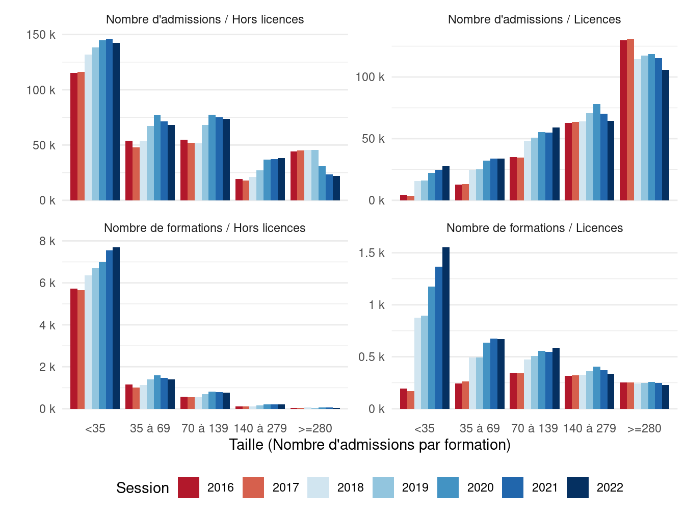

Et si Parcoursup était compté
================

| Method          | koRpus      | stringi       |
|:----------------|:------------|:--------------|
| Word count      | 1763        | 1813          |
| Character count | 11200       | 11955         |
| Sentence count  | 96          | Not available |
| Reading time    | 8.8 minutes | 9.1 minutes   |

Projet d’article pour « Orientation post-bac :Parcoursup et
l’introduction de la sélection à l’université – Varia (72/juin 2024) ».

Axes : transversal.

## Introduction

Remplaçant APB (Admission Post-Bac) en 2018, Parcoursup est désormais la
plateforme d’affectation des candidates et candidats à l’entrée dans
l’enseignement supérieur en France. De prime abord, la différence entre
APB et Parcoursup tient surtout à l’organisation globale de la
procédure, la façon dont les candidatures sont formulées et les
propositions retenues, ainsi que les informations disponibles pour faire
ces choix. Si l’algorithme qui sous-tend l’affectation, Gale-Shapley,
n’a pas changé (Courant and Gossa 2019), la façon dont les différents
acteurs appréhendent ce moment est bouleversé (Bodin, Mengneau, and
Orange 2020 ; Bodin and Orange 2019 ; Daverne-Bailly and Bobineau 2020 ;
Mizzi 2022 ; Frouillou, Pin, and Zanten 2019 ; Frouillou, Pin, and
Zanten 2020 ; Chauvel and Hugrée 2019 ), encore plus après la réforme du
Lycée général (Caillot and Sidokpohou 2022). Plus globalement,
Parcoursup est aussi le synonyme de transformations dans la répartition
des néo-bacheliers dans l’enseignement supérieur (Nagui Bechichi, Julien
Grenet, and Georgia Thebault 2021).

Parcoursup a été introduit par la loi ORE (Orientation et Réussite des
Etudiants), conçue pour faire face au problème des places dans
l’enseignement supérieur mais qui ouvre plus de questions qu’elle n’en
ferme (Beaud and Vatin 2018). Cette loi dispose de deux transformations
techniques mais majeures.

La première est la suppression de la phrase « *Tout candidat est libre
de s’inscrire dans l’établissement de son choix* » du L612-3 du Code de
l’éducation. Cette suppression abaisse le poids des candidats dans les
décisions d’affectation, puisque l’entrée en Licence n’est plus de droit
mais soumise à une forme de sélection.

La seconde est l’introduction, dans le même article, de la phrase : «
*Les capacités d’accueil \[…\] sont arrêtées chaque année par l’autorité
académique après dialogue avec chaque établissement.* ». L’autorité
académique désigne le rectorat, représentant de l’État dans les
académies. Cet ajout abaisse le poids des établissements dans les
décisions d’affection, puisqu’ils n’obtienne pas le contrôle sur les
capacités d’accueil en Licence, mais en plus le perdent pour les
formations sélectives (IUT et double Licences, notamment).

Au delà de l’impact sur les familles et équipes pédagogique, et comme en
témoigne le nombre de rapports publics à son sujet (Cour des comptes
2017 ; Cour des Comptes 2020 ; Noëlle Lenoir, présidente et al. 2019 ;
Isabelle Falque-Pierrotin et al. 2020 ; Isabelle Falque-Pierrotin et al.
2021 ; Isabelle Falque-Pierrotin, présidente et al. 2022 ; JUANICO and
SARLES 2020 ; CSORE 2019 ), Parcoursup est donc aussi un outil d’action
publique, permettant à l’État de mieux contrôler les flux du « -3/+3 ».
Cela nous conduit à nous interroger sur les indicateurs de cette action
publique, ceux mis en place pour l’actionner ou la qualifier, comme ceux
qui en ont disparu. Ce projet d’article propose donc de s’intéresser à
ces indicateurs, dans le temps, pour mieux percevoir à la fois l’état
actuel et l’orientation que prennent les affectations dans le supérieur.

## Méthodologie

Notre méthodologie est au croisement des sciences des données et des
sciences de l’action publique. Elle s’appuie sur deux piliers. D’une
part, une veille systématique des données ouvertes, tableaux de bord et
communiqués sur ces données permet de construire un état de l’art des
informations publiques disponibles sur l’affectation dans l’enseignement
supérieur, ce qu’on pourrait qualifier de meta-informations. D’autre
part, l’analyse de ces données, par des traitements et représentations
en sources ouvertes, permet de créer de l’information nouvelle pour
mieux percevoir et suivre l’évolution de notre système.

Les données sont pour l’essentiel en provenance directement de la
plateforme de données ouvertes du ministère [^1] [^2] [^3] [^4] [^5]
[^6], donc celles utilisée pour alimenter Parcoursup, ses tableaux de
bord, et les notes d’information du ministère. Les traitements sont
effectués en R (Xie, Allaire, and Grolemund 2019) et les représentations
en ggplot (Wickham 2009 ; Wilke 2019). Ils sont mis en ligne et
librement accessibles sur la plateforme GitHub[^7], ainsi que les
brouillons exploratoires [^8]. Les informations étonnantes sont
systématiquement discutées publiquement sur le réseau social Twitter.

## Principaux résulats

### Mesures de la procédure d’affectation : `Vitesse et débit`

La mesure communément retenue pour mesurer la qualité d’une affectation
est le niveau de satisfaction des candidates et candidats. Les sessions
APB étaient ainsi qualifiées en mesurant le taux de premiers vœux
satisfaits. Cette mesure a disparu avec Parcoursup, et on lui substitue
désormais le taux de candidates et candidats ayant reçu au moins une
proposition, et le temps qu’il faut pour la recevoir. Le taux de
propositions définitivement acceptées est encore disponible dans le
bilan, mais a disparu des tableaux de bord quotidiens.

La figure X gauche montre le tableau de bord Parcoursup en 2018 et 2022,
et permet de s’interroger sur le but poursuivi par ces modifications
(Julien Gossa 2020). La dernière version ne permet plus de connaitre
combien d’affectations ont été définitivement acceptées. La figure X
droite montre la vitesse de l’affectation.

\[captures TDB et SIES\]

Les mesures de la procédures d’affectation témoignent donc d’une
transition d’une logique de satisfaction des candidats à une logique de
gestion des flux, où la qualité de l’affectation s’est éclipsée au
profit de sa vitesse et de son débit.

### Mesures de la procédure d’affectation : `Taux de remplissage`

Le nombre de places proposées mais non pourvues ne fait pas partie des
mesures officielles, mais est regardé de près notamment par le CESP. Ce
dernier préconise son abaissement pour améliorer les performances de la
plateforme. Cette mesure est rendue difficile par une mauvaise
déclaration des capacités d’accueil officielles des formations,
notamment en Licences où elles peuvent être sans rapport avec les
capacités matérielles réelles surtout jusqu’en 2019. De plus, les
admissions sont limitées à celles gérées par Parcoursup, donc partielles
: des places pourvues peuvent apparaître comme vacantes.

La Figure X gauche présente le nombre de places non pourvues, calculées
comme la différence entre les capacités d’accueil officielles et les
admissions dans APB/Parcoursup. Malgré des tendances clairement
apparentes, on ne peut en déduire ni que les universités auraient
remplies 300 000 places vacantes, ni que les BTS seraient en voie de
désaffection. Ceci illustre la grande difficulté de construire des
indicateurs fiables : le nombre de `places non pourvues` n’est pas le
nombre réel de `places vacantes`.

Les figures X droite montrent la même information sous la forme de taux
globaux ou moyens, racontant à chaque fois une histoire différente. Ceci
démontre la nécessite de prendre beaucoup de précautions lorsqu’on
manipule cette information, et peut-être la nécessite de créer un
véritable indicateur `places vacantes`.

<!-- --><!-- --><!-- -->

## Mesure du `taux de poursuite d'étude` et l’`éviction`

Comme le montre l’exemple ci-dessus, les données de Parcoursup peuvent
être trop partielles pour avoir une vision complète d’un phénomène. Pour
percevoir la trajectoire des jeunes entre le Lycée et le supérieur, le
SIES a mis à disposition un jeu de données ouvertes de suivi des
bacheliers, qui croise plusieurs bases de données. Il permet de mieux
percevoir les évolutions des poursuites d’étude, de l’orientation et des
évictions, par académie, secteurs et filières du bac et du supérieur. Ce
jeu est cependant aveugle aux autres candidatures, et notamment les
étrangers et reprises et d’étude, dont l’admission est pourtant un grand
enjeu.

La figure X montre à gauche les taux de poursuite d’étude et à droit le
nombre absolu de non poursuivants. Là encore, ce sont deux histoires
différentes qui sont racontées, allant de l’amélioration des taux de
poursuite pour les bacheliers professionnels, à une entrée de plus en
plus difficile dans le supérieur pour les bac généraux et
technologiques. Il convient de nouveau d’être très prudents.

<!-- --><!-- -->

## Mesure de l’orientation : `sélectivité` des admissions post-bac.

L’amélioration de l’orientation était une des grandes promesses de
Parcoursup. Cependant, nous ne disposons d’aucune métrique permettant de
vérifier cette affirmation, tant la notion de « bonne » orientation est
vague. Même en la réduisant au taux de réussite sans redoublement, il
est impossible de séparer l’effet d’une meilleure orientation, d’une
meilleure pédagogie, ou d’un abaissement des exigences.

En revanche, on peut s’intéresser aux taux de sélection, pour percevoir
l’équilibre entre la liberté de choix des candidats et les classements
des candidatures pas les formations. Une fois de plus, cette mesure est
délicate : l’organisation de la procédure fait qu’il est difficile de
calculer avec certitude le rang du dernier appelé ; et les vœux groupés
et admissions communes peuvent augmenter artificiellement le nombre de
candidatures à certaines formations. Cette difficulté explique que le
`taux d'accès` mesure officielle de la sélectivité des formations, ne
soit accessible qu’à partir de 2020. Il est donc difficile d’évaluer
clairement l’impact de Parcoursup sur cet aspect.

<!-- --><!-- -->

La figure X montre qu’il existe des « formations sélectives » qui ne
sélectionnent pas, comme des « formations non sélectives » qui
sélectionnent. Ce constat invite à concevoir un indicateur global de
sélectivité de l’affectation post-bac pour permettre de suivre
l’évolution de notre système.

## Conclusion

A ce stade et dans leur état, les données ouvertes ne permettent pas de
confirmer les discours qui ont accompagné la mise en œuvre de Parcoursup
et de la loi ORE : on n’observe ni d’amélioration de la satisfaction des
étudiants ou des formations, ni des taux de remplissage ; le taux de
poursuite d’étude augmente légèrement, mais le nombre d’évictions reste
stable ; la mesure de la sélectivité est trop récente pour observer une
mutation.

Cela nous conduit à nous interroger sur l’utilisation que l’État a fait
de son nouveau pouvoir de contrôle sur les admissions post-bac. Nous
trouvons une piste en observant l’évolution de la distribution des
tailles de formation, que montre la figure X.

La croissance du nombre de formations hors Licence s’explique en partie
par la volonté d’intégrer à Parcoursup toutes les formations post-bac, y
compris privées. L’énorme croissance spontanée en 2018 du nombre de
petites Licences provient probablement d’une meilleure déclaration des
filières existantes, dans lesquelles l’inscription était auparavant
faites hors APB.

<!-- --><!-- -->
Cependant, la diminution des admissions dans les formations de très
grande taille et la croissance des admissions dans les effectifs de
petite taille démontre une « spécialisation » croissante de l’offre de
formation, en adéquation avec le discours de « personnalisation des
parcours ». Cette spécialisation est probablement une mutation de fond,
qui doit conduire à interroger la lisibilité de l’offre de formation, la
complexité des décisions d’affectation, et continuité de diplômes
nationaux équivalents partout sur le territoire.

Beaud, Olivier, and François Vatin. 2018. “« Orientation Et Réussite Des
Étudiants ». Une Nouvelle Loi Pour Les Universités (I).” *Commentaire*
Numéro 163 (3): 687–98. <https://doi.org/10.3917/comm.163.0687>.

Bodin, Romuald, Juliette Mengneau, and Sophie Orange. 2020. “Adhésion
Enchantée Et Aléas Universitaires : Les Effets Ambivalents de La
Sélection à l’Université.” *L’Année Sociologique* 70 (2): 443–67.
<https://doi.org/10.3917/anso.202.0443>.

Bodin, Romuald, and Sophie Orange. 2019. “La Gestion Des Risques
Scolaires. « Avec Parcoursup, Je Ne Serais Peut-Être Pas Là ».”
*Sociologie* Vol. 10 (2): 217–24.
<https://www.cairn.info/revue-sociologie-2019-2-page-217.htm>.

Caillot, Mélanie, and Olivier Sidokpohou. 2022. “Analyse Des Vœux Et
Affectations Dans l’enseignement Supérieur Des Bacheliers 2021 Après La
Réforme Du Lycée Général Et Technologique.” IGESR.
<https://www.education.gouv.fr/analyse-des-voeux-et-affectations-dans-l-enseignement-superieur-des-bacheliers-2021-apres-la-reforme-327062>.

Chauvel, Séverine, and Cédric Hugrée. 2019. “Enseignement Supérieur :
L’art Et Les Manières de Sélectionner. Introduction.” *Sociologie*, no.
N° 2, vol. 10 (July). <http://journals.openedition.org/sociologie/5451>.

Cour des comptes. 2017. “Admission Post-Bac Et Accès à l’enseignement
Supérieur - Un Dispositif Contesté à Réformer.”
<https://www.ccomptes.fr/sites/default/files/2017-10/20171019-rapport-admission-post-bac_0.pdf>.

Cour des Comptes. 2020. “Un Premier Bilan de l’accès à l’enseignement
Supérieur Dans Le Cadre de La Loi Orientation Et Réussite Des
Étudiants.” Cour des comptes.

Courant, Judicaël, and Julien Gossa. 2019. “De l’automatisation de
l’affectation Dans l’enseignement Supérieur.” In.
<https://hal.archives-ouvertes.fr/hal-02967579>.

CSORE. 2019. “Rapport Du Comité de Suivi de La Loi Orientation Et
Réussite Des Étudiants.” MESRI.
<http://cache.media.enseignementsup-recherche.gouv.fr/file/Actus/87/7/RAPPORT-_CSORE_1187877.pdf>.

Daverne-Bailly, Carole, and Claudie Bobineau. 2020. “Orienter Et
s’orienter Vers l’enseignement Supérieur Dans Un Contexte de Changement
Des Politiques Éducatives : Incertitudes, Choix, Inégalités.” *Éducation
Et Socialisation. Les Cahiers Du CERFEE*, no. 58 (December).
<https://doi.org/10.4000/edso.13048>.

Frouillou, Leïla, Clément Pin, and Agnès van Zanten. 2019. “Le Rôle Des
Instruments Dans La Sélection Des Bacheliers Dans l’enseignement
Supérieur. La Nouvelle Gouvernance Des Affectations Par Les
Algorithmes.” *Sociologie* Vol. 10 (2): 209–15.
<https://www.cairn.info/revue-sociologie-2019-2-page-209.htm>.

Frouillou, Leïla, Clément Pin, and Agnès van Zanten. 2020. “Les
Plateformes APB Et Parcoursup Au Service de l’égalité
Des Chances ?L’évolution Des Procédures Et Des Normes d’accès
à l’enseignement Supérieur En France.” *L’Année Sociologique* 70 (2):
337–63. <https://doi.org/10.3917/anso.202.0337>.

Isabelle Falque-Pierrotin, présidente, Jean-Richard Cytermann, Max
Dauchet, Jean-Marie Filloque, Catherine Moisan, and Isabelle Roussel.
2022. “4e Rapport Annuel Au Parlement.” Comité éthique et scientifique
de Parcoursup.
<https://www.enseignementsup-recherche.gouv.fr/sites/default/files/2022-02/rapport-cesp-2022-16793.pdf>.

Isabelle Falque-Pierrotin, Gérard Berry, Jean-Richard Cytermann, Max
Dauchet, Jean-Marie Filloque, Catherine Moisan, and Isabelle Roussel.
2020. “2e Rapport Annuel Au Parlement.” Comité éthique et scientifique
de Parcoursup.
<https://cache.media.enseignementsup-recherche.gouv.fr/file/2020/28/9/Rapport_du_CESP_2019_(janvier_2020)_1227289.pdf>.

Isabelle Falque-Pierrotin, Gérard Berry, Jean-Richard Cytermann, Max
Dauchet, Jean-Marie Filloque, Catherine Moisan, Isabelle Roussel, and
Guillaume Tronchet. 2021. “3e Rapport Annuel Au Parlement Du Comité
Éthique Et Scientifique de Parcoursup: Parcoursup à La Croisée Des
Chemins:” Comité éthique et scientifique de Parcoursup.
<https://cache.media.enseignementsup-recherche.gouv.fr/file/Parcoursup/21/0/Psup_comite_ethique_2021_1380210.pdf>.

JUANICO, RÉGIS, and NATHALIE SARLES. 2020. “Rapport d’information Sur
l’évaluation de l’accès à l’enseignement Supérieur.” Assemblée
nationale.
<http://www.assemblee-nationale.fr/dyn/15/rapports/cec/l15b3232_rapport-information.pdf>.

Julien Gossa. 2020. “Parcoursup : Le Bidonnage Continue.” *Docs En Stock
: Dans Les Coulisses de La Démocratie Universitaire*.
<http://blog.educpros.fr/julien-gossa/2020/07/17/parcoursup-le-bidonnage-continue/>.

Mizzi, Alban. 2022. “La Gestion Émotionnelle de Parcoursup. Une Épreuve
Entre Inégalités de Ressources Et d’incertitudes.” *L’orientation
Scolaire Et Professionnelle*, no. 51/1 (March): 137.
<https://doi.org/10.4000/osp.15873>.

Nagui Bechichi, Julien Grenet, and Georgia Thebault. 2021. “D’Admission
Post‑bac à Parcoursup : Quels Effets Sur La Répartition Des
Néo‑bacheliers Dans Les Formations d’enseignement Supérieur ?” INSEE.
<https://www.insee.fr/fr/statistiques/5432519?sommaire=5435421>.

Noëlle Lenoir, présidente, Gérard Berry, vice-président, Max Dauchet,
Julien Grenet, Laure Lucchesi, and Catherine Moisan. 2019. “1er Rapport
Annuel Au Parlement.” Comité éthique et scientifique de Parcoursup.
<https://services.dgesip.fr/fichiers/Rapport_du_CESP_1061363.pdf>.

Wickham, Hadley. 2009. *Ggplot2: Elegant Graphics for Data Analysis*.
Use R! New York: Springer.

Wilke, Claus. 2019. *Fundamentals of Data Visualization: A Primer on
Making Informative and Compelling Figures*. First edition. Beijing
Boston Farnham Sebastopol Tokyo: O’Reilly.

Xie, Yihui, Joseph J. Allaire, and Garrett Grolemund. 2019. *R Markdown:
The Definitive Guide*. Chapman & Hall/CRC, the R Series. Boca Raton
London New York: CRC Press, Taylor & Francis Group.

[^1]: <https://data.enseignementsup-recherche.gouv.fr/explore/dataset/fr-esr-parcoursup/>

[^2]: <https://data.enseignementsup-recherche.gouv.fr/explore/dataset/fr-esr-parcoursup_2020/>

[^3]: <https://data.enseignementsup-recherche.gouv.fr/explore/dataset/fr-esr-parcoursup-2019/>

[^4]: <https://data.enseignementsup-recherche.gouv.fr/explore/dataset/fr-esr-parcoursup-2018/>

[^5]: <https://data.enseignementsup-recherche.gouv.fr/explore/dataset/fr-esr-apb_voeux-et-admissions/>

[^6]: <https://data.enseignementsup-recherche.gouv.fr/explore/dataset/fr-esr-taux-poursuite-enseignement-superieur-par-academie/>

[^7]: <https://github.com/juliengossa/parcoursup/>

[^8]: <https://github.com/cpesr/RFC/>
