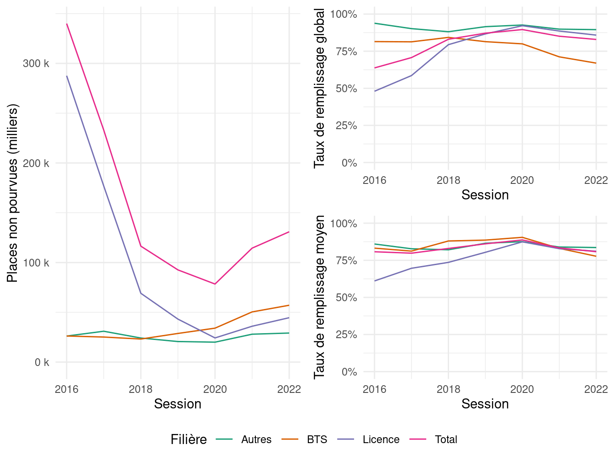
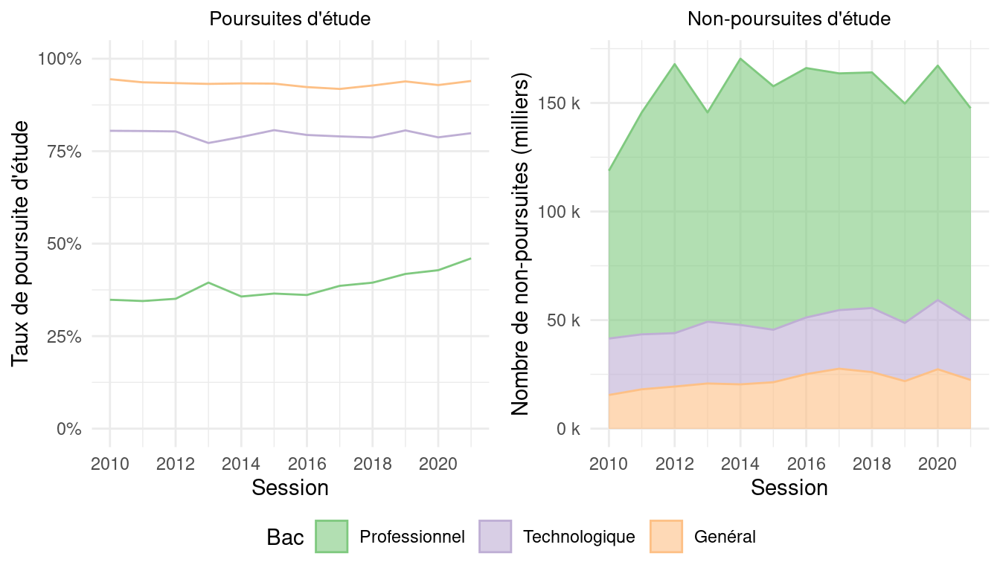

Et si Parcoursup était compté
================
Pauline Boyer, <pauline.boyer@cnrs.fr>Julien Gossa,
<gossa@unistra.fr>Université de Strasbourg

Projet d’article pour « Orientation post-bac : Parcoursup et
l’introduction de la sélection à l’université – Varia (72/juin 2024) ».

Axes : transversal.

## Introduction

Remplaçant APB (Admission Post-Bac) en 2018, Parcoursup est désormais la
plateforme d’affectation des candidates et candidats à l’entrée dans
l’enseignement supérieur en France. De prime abord, la différence entre
APB et Parcoursup tient surtout à l’organisation globale de la
procédure, la façon dont les candidatures sont formulées et les
propositions retenues, ainsi que les informations disponibles pour faire
ces choix. Si l’algorithme d’affectation est toujours Gale-Shapley, la
façon dont les différents acteurs appréhendent ce moment est transformé
(Bodin, Mengneau, and Orange 2020 ; Bodin and Orange 2019 ;
Daverne-Bailly and Bobineau 2020 ; Mizzi 2022 ; Frouillou, Pin, and
Zanten 2019 ; Frouillou, Pin, and Zanten 2020 ; Chauvel and Hugrée 2019
), encore plus après la réforme du Lycée général (Caillot and Sidokpohou
2022).

Plus globalement, Parcoursup est aussi le synonyme de transformations
dans la répartition des néo-bacheliers dans l’enseignement supérieur
(Nagui Bechichi, Julien Grenet, and Georgia Thebault 2021). La
plateforme est introduite par la loi ORE (Orientation et Réussite des
Etudiants), conçue pour faire face au problème des places dans
l’enseignement supérieur mais qui ouvre plus de questions qu’elle n’en
ferme (Beaud and Vatin 2018). Elle dispose de deux transformations
majeures.

La première est la suppression de la phrase « *Tout candidat est libre
de s’inscrire dans l’établissement de son choix* » du L612-3 du Code de
l’éducation [^1]. Cette suppression abaisse le poids des candidats dans
les décisions d’affectation, puisque l’entrée en Licence n’est plus de
droit mais désormais conditionnée par l’étude d’un dossier de
candidature.

La seconde est l’introduction, dans le même article, de la phrase : «
*Les capacités d’accueil \[…\] sont arrêtées chaque année par l’autorité
académique après dialogue avec chaque établissement.* ». L’autorité
académique désigne le rectorat, représentant de l’État dans les
académies. Cet ajout abaisse le poids des établissements dans les
décisions d’affection, puisqu’ils n’obtiennent pas le contrôle sur les
capacités d’accueil en Licence, mais en plus le perdent pour les
formations sélectives (IUT et double Licences, notamment).

Au delà de l’impact sur les familles et équipes pédagogique, et comme en
témoigne le nombre de rapports publics à son sujet (Cour des comptes
2017 ; Cour des Comptes 2020 ; Noëlle Lenoir, présidente et al. 2019 ;
Isabelle Falque-Pierrotin et al. 2020 ; Isabelle Falque-Pierrotin et al.
2021 ; Isabelle Falque-Pierrotin, présidente et al. 2022 ; Juanico and
Sarles 2020 ; CSORE 2019 ), Parcoursup est donc aussi un outil d’action
publique, permettant à l’État de mieux contrôler les flux du « -3/+3 »
notamment via leur évaluation par des indicateurs consultables librement
sur la plateforme ministérielle \#dataESR[^2]. Dans le prolongement des
travaux en sociologie de la quantification, ce projet d’article propose
de s’intéresser à ce que les indicateurs \#dataESR nous disent des
orientations des politiques publiques d’affectation post-bac, ce qui
sera l’occasion de montrer le passage d’une logique de satisfaction des
usagers à une logique de gestion des flux. Lorsque c’est pertinent, nous
tenterons d’opposer une rationalité différente de celle des indicateurs
officiels via la conception d’indicateurs alternatifs basés sur
l’exploration des données ouvertes. Enfin, nous proposons de montrer la
difficulté de construire des indicateurs fiables, et la possibilité
presque systématique de « raconter des histoires différentes » à partir
des mêmes données.

*Note* : En discussion avec les éditeurs, l’article peut faire plus ou
moins de place à chacun des aspects ci-dessus, ou se concentrer sur
certaines questions plus précises. L’article peut être écrit en écriture
inclusive, avec ou sans utilisation du point médian.

## Méthodologie

Notre méthodologie se situe au croisement des sciences des données et
des sciences de l’action publique. Elle s’appuie sur deux piliers. D’une
part, une veille systématique des données ouvertes, tableaux de bord,
notes d’information et communiqués permet de construire un état de l’art
des informations publiques disponibles sur l’affectation post-bac, ce
qu’on pourrait qualifier de meta-informations. D’autre part, l’analyse
de ces données, par des traitements et représentations en sources
ouvertes, permet de créer de l’information nouvelle pour mieux percevoir
et suivre l’évolution de notre système.

Les données proviennent pour l’essentiel de la plateforme de données
ouvertes du ministère [^3] [^4] [^5] [^6] [^7] [^8], également utilisée
pour alimenter Parcoursup, ses tableaux de bord, et les notes
d’information du ministère. Les traitements sont effectués en R (Xie,
Allaire, and Grolemund 2019) et les représentations en ggplot (Wickham
2009 ; Wilke 2019). Ils sont mis en ligne et librement accessibles sur
la plateforme GitHub[^9], ainsi que les brouillons exploratoires [^10].
Les irrégularités ou incohérences apparentes sont systématiquement
discutées publiquement sur le réseau social Twitter.

## Mesurer Parcoursup

Au cœur de Parcoursup, et plus largement de l’affectation dans
l’enseignement supérieur, se trouve la question de l’orientation. Son
amélioration était d’ailleurs une des grandes promesses, inscrite jusque
dans le nom de la loi ORE. Cependant, il n’existe aucune métrique
permettant de le mesurer, tant la notion de « bonne » orientation est
vague. Même en la réduisant au taux de réussite, il est impossible de
séparer l’effet d’une meilleure orientation, de celui d’une meilleure
pédagogie, ou d’un abaissement des exigences des formations.

Le confinement de 2020 a par exemple profondément impacté les conditions
d’étude, et donc les exigences pour l’obtention des diplômes,
participant à une augmentation des taux de réussite. Cet aspect est
cependant totalement gommé dans la présentation ministérielle, qui
attribue complètement cette augmentation à la loi ORE :

*« **L’échec en licence, qui était l’un des fléaux majeurs de notre
enseignement supérieur au début du quinquennat, est enfin en train de
refluer.** C’était l’un des engagements du Plan Etudiants et il a été
tenu. C’est une victoire collective, dans une bataille qui s’est jouée
sur plusieurs fronts, à commencer par **celui de l’accès à
l’enseignement supérieur.** »*[^11]

Cela nous conduit à nous poser la question : **Que peut-on réellement
mesurer à propos de Parcoursup ?** Dans la suite, nous discuterons des
mesures de la qualité de la l’affectation, de l’offre de formation, du
remplissage et des poursuites d’étude. La liste ne se prétend bien sûr
pas exhaustive.

### Qualité de l’affectation : de la `satisfaction de l'affectation` à la `satisfaction d'utilisation de la plateforme`

Plutôt que d’utiliser directement la plateforme Parcoursup pour mener
une enquête systématique auprès des candidats, le ministère a opté pour
une enquête sur un échantillon de 1001 néo-bacheliers, sous-traitée à
l’institut de sondage IPSOS[^12]. Cette enquête se concentre sur le
fonctionnement de la plateforme, et s’oriente vers la validation des
éléments de langage utilisés pour promouvoir la réforme, tels que « Le
fait de laisser le dernier mot au candidat » (80% d’opinion positive,
bien que les candidats n’aient pas le dernier mot dans le sens où leurs
vœux ne l’emportent pas sur les décisions des formations). Il révèle
cependant que la procédure est « stressante » pour 83% des sondés et «
juste » pour seulement 28% en 2022 (en baisse brutale par rapport à
2021, 37%, et 2020, 48%).

Une seule question concerne la satisfaction de l’affectation, «
Avez-vous été satisfait par les réponses des formations que vous avez
obtenues via Parcoursup ? », posée seulement aux candidats admis dans
une formation, et dont les réponses sont 37% de « très satisfait », 35%
de « plutôt satisfait », 14% de « plutôt pas satisfait » et 14% de « pas
du tout satisfait » (Figure X).

D’APB à Parcoursup, cette enquête montre un glissement de la mesure,
initialement concentrée sur la satisfaction des candidats face à leur
affectation, vers leur satisfaction face à l’utilisation de la
plateforme. Mais ce n’est pas le seul glissement observable.

### Qualité de l’affectation : de la `satisfaction` au `débit`

Avec APB, le taux de premiers vœux satisfaits mesurait le niveau de
satisfaction des candidats (Figure 1, haut gauche[^13]). Avec
Parcoursup, cette mesure est substituée par deux indicateurs : le taux
de candidats ayant reçu au moins une proposition, et le temps qu’il faut
pour la recevoir (Figure 1, haut droite[^14]). En quelque sorte, il
s’agit de la `vitesse` (temps pour qu’un candidat soit affecté) ou du
`débit` (nombre de candidats affectés dans un laps de temps donné) de
Parcoursup. Les mesures de la procédures d’affectation témoignent donc
d’une transition d’une logique de satisfaction des candidats à une
logique de gestion des flux, où la qualité de l’affectation s’est
éclipsée au profit de son débit.

De plus, la Figure 1 bas montre le tableau de bord Parcoursup en
2018[^15] et 2022[^16], et permet de s’interroger sur le but poursuivi
par les modifications qui ont été faites (Julien Gossa 2020). Notamment,
la dernière version ne permet plus de connaitre combien de propositions
ont été définitivement acceptées, donc combien de candidats ont été
effectivement affectés. Ces indicateurs montrent que, désormais, le
souci de communiquer au moins une proposition est plus important que le
souci que cette proposition soit satisfaisante, ou même juste acceptée.
Le bilan de la procédure d’admission publié par le ministère se
concentre d’ailleurs exclusivement sur la quantité de propositions et
n’aborde jamais la satisfaction des candidats[^17].

Concrètement, la non-hiérarchisation à priori des vœux des candidats,
introduite par la loi ORE, empêche toute mesure fine et solide de la
satisfaction des candidats, tel qu’APB permettait de le faire. Mais ce
n’est pas la seule mesure empêchée par cette modification.

### Offre de formation : `taille` et `nombre de formations`

Le nombre de formations proposées dans Parcoursup est un argument
politique, supportant la volonté d’en faire la « place de marché unique
» pour les formations post-bac. La taille des formations peut se mesurer
imparfaitement au nombre d’admissions, puisque les admissions hors
Parcoursup ne sont pas comptabilisées, et que les formations mutualisées
(les « portails » notamment) sont difficile à identifier.

La Figure X montre le nombre de formations par taille (haut) et par
nombre d’admissions (bas), pour les Licences et pour toutes les autres
formations. La croissance du nombre de formations hors Licence
s’explique en partie par la volonté d’intégrer à Parcoursup toutes les
formations post-bac, y compris privées. L’énorme croissance spontanée en
2018 du nombre de petites Licences provient probablement d’une meilleure
déclaration des filières existantes, dans lesquelles l’inscription était
auparavant faites hors APB.

Cependant, la diminution ensuite des admissions dans les formations de
très grande taille et la croissance des admissions dans les formations
de petite taille démontrent une « spécialisation » croissante de l’offre
de formation, en adéquation avec le discours de « personnalisation des
parcours ». Cette spécialisation est probablement une mutation de fond,
qui doit nous conduire à interroger la lisibilité de l’offre de
formation, la complexité des décisions d’affectation, et la continuité
de diplômes nationaux équivalents partout sur le territoire.

## Offre de formation : de la `pression` au `taux d'accès`

La pression sur une formation peut se calculer comme le rapport entre le
nombre de candidatures et le nombre de places. C’est à la fois un
indicateur d’attractivité, un outil de négociation pour l’attribution
des moyens locaux, et un outil de pilotage permettant de connaitre la
demande de formation. Pour le calculer solidement, il faut connaitre
l’ordre des vœux des candidats, afin de ne pas comptabiliser ceux qui
souhaitent en réalité une autre affectation. Ce n’est donc plus possible
avec Parcoursup, puisqu’il n’y a plus de hiérarchisation explicite de
tous les voeux.

La mesure officielle de la pression est désormais le `taux d'accès`,
défini comme le *« rapport entre le nombre de candidats dont le rang de
classement est inférieur ou égal au rang du dernier appelé de son groupe
et le nombre de candidats ayant validé un vœu pour la formation étudiée
(en PP). Si le taux est de 100 %, cela signifie que l’ensemble des
candidats qui a fait un vœu a reçu une proposition de l’établissement.
Sont exclues de ce calcul, les propositions faites au titre de meilleur
bachelier »*[^18]. Il mesure donc l’équilibre entre la liberté de choix
des candidats (taux très haut) et les classements des candidatures par
les formations (taux bas).

Hormis l’absence d’ordre des vœux, Cette mesure est rendue délicate par
la gestion des quotas, qui d’une part nécessite plusieurs groupes de
candidatures distinctes et donc en théorie plusieurs taux d’accès
différents, et d’autre part modifie l’ordre d’appel au cours de la
procédure d’affectation. De plus, les « vœux multiples »[^19]. Toutes
ces difficultés expliquent que ce taux ne soit accessible qu’à partir de
2020, et globalement ne soit pas très fiable et très peu comparable. Il
est donc difficile d’évaluer clairement l’impact de Parcoursup sur cet
aspect.

La figure 4 montre cependant qu’il existe des « formations sélectives »
(gauche) qui ne sélectionnent pas, comme des « formations non sélectives
» (droite) qui sélectionnent. Ce constat invite à concevoir un
indicateur global de sélectivité de l’affectation post-bac pour
permettre de suivre l’évolution de notre système, tant sous l’angle des
formations que des admissions[^20]. En comparant haut et bas, la figure
montre aussi une nette distinction de la distribution des formations et
des affectations, ce qui découle du nombre de places proposées par
formations.

### `Places non pourvues`, `Places vacantes` et `Taux de remplissage`

Le nombre de places proposées mais non pourvues ne fait pas partie des
mesures officielles, mais est regardé de près notamment par le CESP, qui
le perçoit comme une marge d’amélioration. La Figure 2 fait un focus sur
les Licences et BTS, qui présentent des phénomènes intéressants. A
gauche, la figure présente le nombre de `places non pourvues`, calculées
comme la différence entre les `capacités d'accueil` officielles et les
`admissions` dans APB/Parcoursup.

Malgré des tendances clairement apparentes, on ne doit pas en déduire ni
que les universités auraient remplies 300 000 places vacantes, ni que
les BTS seraient en voie de désaffection. En réalité, les
`capacités d'accueil` sont mal déclarées notamment pour les Licences
jusqu’en 2019, mais aussi ensuite pour les formations qui ne souhaitent
pas sélectionner, ou qui savent qu’elles ne seront de toutes façons pas
remplies. De plus, les `admissions` ne sont que partiellement
comptabilisées : le nombre de `places non pourvues` par Parcoursup n’est
pas le nombre réel de `places vacantes` dans les formations.

Les figures 2 droite montrent la même information sous la forme de
`taux remplissage globaux` et `moyens`, racontant à chaque fois une
histoire différente : au global, on pourrait lire une saturation des
Licences et une désaffectation des BTS ; en moyenne, on constaterait
plutôt une convergence des taux de remplissage. Ceci démontre la
nécessite de prendre beaucoup de précautions lorsqu’on manipule cette
information, et peut-être la nécessite de créer un véritable indicateur
`places vacantes`.

Quoi qu’il en soit, le nombre de `places vacantes` est bien souvent
interprété seulement comme un indicateur de mauvaise affectation des
moyens, dont la réduction relèverait de la bonne gestion. Pourtant, une
place non pourvue ne correspond pas nécessairement à une chaise libre ou
un enseignant sans service. Surtout, un nombre important de places
vacantes est nécessaire pour laisser une marge de liberté aux candidats
et éviter une rigidification de l’orientation. Poursuivre l’objectif
d’un nombre de places vacantes le plus bas possible peut donc ne pas
être souhaitable, et même échouer à améliorer le nombre de poursuites
d’étude.

## `Taux de poursuite d'étude` et `Nombre de non poursuites d'étude`

Un récent jeu de données[^21], permet percevoir les évolutions des
poursuites d’étude, par académie, secteurs et filières du bac et du
supérieur. Ce jeu est cependant aveugle aux autres candidatures, et
notamment à celles des étudiants ayant un équivalent de baccalauréat
étranger et ceux en reprise d’étude, dont l’admission est pourtant un
grand enjeu.

La figure 3 montre à gauche les taux de poursuite d’étude et à droite le
nombre absolu de non poursuivants. Là encore, selon l’indicateur, on
obtient deux récits différents, allant de l’amélioration des taux de
poursuite pour les bacheliers professionnels, à une entrée de plus en
plus difficile dans le supérieur pour les bac généraux et
technologiques. Il convient donc d’être très prudents, mais on peut
néanmoins invalider l’hypothèse d’une éviction de masse dès 2018, comme
des détracteurs de la réforme ont peut le redouter.

## Conclusion

L’ouverture des données de Parcoursup est le fruit de formidables
efforts du SIES. Malheureusement, hormis les calculs qui sont rendus
impossibles par la non hiérarchisation à priori des vœux des candidats,
les données sont compliquées à calculer, et encore plus délicates à
interpréter. Il est fréquent, sinon systématique, qu’on puisse raconter
plusieurs histoires très différentes à partir des mêmes données, sans
même chercher à les manipuler.

Cependant, à ce stade et dans leur état, ces données ne permettent pas
de confirmer les discours qui ont accompagné la mise en œuvre de
Parcoursup et de la loi ORE : on n’observe ni d’amélioration de la
satisfaction des étudiants ou des formations, ni des taux de remplissage
; les taux de poursuite d’étude ne montrent ni ouverture ni éviction ;
la mesure de la sélectivité est trop récente pour vraiment observer une
mutation.

Cela nous conduit à nous interroger sur l’utilisation que l’État a fait
de son nouveau pouvoir de contrôle sur les admissions post-bac. Nous
trouvons une piste en observant l’évolution de la distribution des
tailles de formation, que montre la figure 5.

# Références

Beaud, Olivier, and François Vatin. 2018. “« Orientation Et Réussite Des
Étudiants ». Une Nouvelle Loi Pour Les Universités (I).” *Commentaire*
Numéro 163 (3): 687–98. <https://doi.org/10.3917/comm.163.0687>.

Bodin, Romuald, Juliette Mengneau, and Sophie Orange. 2020. “Adhésion
Enchantée Et Aléas Universitaires : Les Effets Ambivalents de La
Sélection à l’Université.” *L’Année Sociologique* 70 (2): 443–67.
<https://doi.org/10.3917/anso.202.0443>.

Bodin, Romuald, and Sophie Orange. 2019. “La Gestion Des Risques
Scolaires. « Avec Parcoursup, Je Ne Serais Peut-Être Pas Là ».”
*Sociologie* Vol. 10 (2): 217–24.
<https://www.cairn.info/revue-sociologie-2019-2-page-217.htm>.

Caillot, Mélanie, and Olivier Sidokpohou. 2022. “Analyse Des Vœux Et
Affectations Dans l’enseignement Supérieur Des Bacheliers 2021 Après La
Réforme Du Lycée Général Et Technologique.” IGESR.
<https://www.education.gouv.fr/analyse-des-voeux-et-affectations-dans-l-enseignement-superieur-des-bacheliers-2021-apres-la-reforme-327062>.

Chauvel, Séverine, and Cédric Hugrée. 2019. “Enseignement Supérieur :
L’art Et Les Manières de Sélectionner. Introduction.” *Sociologie*, no.
N° 2, vol. 10 (July). <http://journals.openedition.org/sociologie/5451>.

Cour des comptes. 2017. “Admission Post-Bac Et Accès à l’enseignement
Supérieur - Un Dispositif Contesté à Réformer.”
<https://www.ccomptes.fr/sites/default/files/2017-10/20171019-rapport-admission-post-bac_0.pdf>.

Cour des Comptes. 2020. “Un Premier Bilan de l’accès à l’enseignement
Supérieur Dans Le Cadre de La Loi Orientation Et Réussite Des
Étudiants.” Cour des comptes.

CSORE. 2019. “Rapport Du Comité de Suivi de La Loi Orientation Et
Réussite Des Étudiants.” MESRI.
<http://cache.media.enseignementsup-recherche.gouv.fr/file/Actus/87/7/RAPPORT-_CSORE_1187877.pdf>.

Daverne-Bailly, Carole, and Claudie Bobineau. 2020. “Orienter Et
s’orienter Vers l’enseignement Supérieur Dans Un Contexte de Changement
Des Politiques Éducatives : Incertitudes, Choix, Inégalités.” *Éducation
Et Socialisation. Les Cahiers Du CERFEE*, no. 58 (December).
<https://doi.org/10.4000/edso.13048>.

Frouillou, Leïla, Clément Pin, and Agnès van Zanten. 2019. “Le Rôle Des
Instruments Dans La Sélection Des Bacheliers Dans l’enseignement
Supérieur. La Nouvelle Gouvernance Des Affectations Par Les
Algorithmes.” *Sociologie* Vol. 10 (2): 209–15.
<https://www.cairn.info/revue-sociologie-2019-2-page-209.htm>.

Frouillou, Leïla, Clément Pin, and Agnès van Zanten. 2020. “Les
Plateformes APB Et Parcoursup Au Service de l’égalité
Des Chances ?L’évolution Des Procédures Et Des Normes d’accès
à l’enseignement Supérieur En France.” *L’Année Sociologique* 70 (2):
337–63. <https://doi.org/10.3917/anso.202.0337>.

Isabelle Falque-Pierrotin, présidente, Jean-Richard Cytermann, Max
Dauchet, Jean-Marie Filloque, Catherine Moisan, and Isabelle Roussel.
2022. “4e Rapport Annuel Au Parlement.” Comité éthique et scientifique
de Parcoursup.
<https://www.enseignementsup-recherche.gouv.fr/sites/default/files/2022-02/rapport-cesp-2022-16793.pdf>.

Isabelle Falque-Pierrotin, Gérard Berry, Jean-Richard Cytermann, Max
Dauchet, Jean-Marie Filloque, Catherine Moisan, and Isabelle Roussel.
2020. “2e Rapport Annuel Au Parlement.” Comité éthique et scientifique
de Parcoursup.
<https://cache.media.enseignementsup-recherche.gouv.fr/file/2020/28/9/Rapport_du_CESP_2019_(janvier_2020)_1227289.pdf>.

Isabelle Falque-Pierrotin, Gérard Berry, Jean-Richard Cytermann, Max
Dauchet, Jean-Marie Filloque, Catherine Moisan, Isabelle Roussel, and
Guillaume Tronchet. 2021. “3e Rapport Annuel Au Parlement Du Comité
Éthique Et Scientifique de Parcoursup: Parcoursup à La Croisée Des
Chemins:” Comité éthique et scientifique de Parcoursup.
<https://cache.media.enseignementsup-recherche.gouv.fr/file/Parcoursup/21/0/Psup_comite_ethique_2021_1380210.pdf>.

Juanico, RÉGIS, and NATHALIE Sarles. 2020. “Rapport d’information Sur
l’évaluation de l’accès à l’enseignement Supérieur.” Assemblée
nationale.
<http://www.assemblee-nationale.fr/dyn/15/rapports/cec/l15b3232_rapport-information.pdf>.

Julien Gossa. 2020. “Parcoursup : Le Bidonnage Continue.” *Docs En Stock
: Dans Les Coulisses de La Démocratie Universitaire*.
<http://blog.educpros.fr/julien-gossa/2020/07/17/parcoursup-le-bidonnage-continue/>.

Mizzi, Alban. 2022. “La Gestion Émotionnelle de Parcoursup. Une Épreuve
Entre Inégalités de Ressources Et d’incertitudes.” *L’orientation
Scolaire Et Professionnelle*, no. 51/1 (March): 137.
<https://doi.org/10.4000/osp.15873>.

Nagui Bechichi, Julien Grenet, and Georgia Thebault. 2021. “D’Admission
Post‑bac à Parcoursup : Quels Effets Sur La Répartition Des
Néo‑bacheliers Dans Les Formations d’enseignement Supérieur ?” INSEE.
<https://www.insee.fr/fr/statistiques/5432519?sommaire=5435421>.

Noëlle Lenoir, présidente, Gérard Berry, vice-président, Max Dauchet,
Julien Grenet, Laure Lucchesi, and Catherine Moisan. 2019. “1er Rapport
Annuel Au Parlement.” Comité éthique et scientifique de Parcoursup.
<https://services.dgesip.fr/fichiers/Rapport_du_CESP_1061363.pdf>.

Wickham, Hadley. 2009. *Ggplot2: Elegant Graphics for Data Analysis*.
Use R! New York: Springer.

Wilke, Claus. 2019. *Fundamentals of Data Visualization: A Primer on
Making Informative and Compelling Figures*. First edition. Beijing
Boston Farnham Sebastopol Tokyo: O’Reilly.

Xie, Yihui, Joseph J. Allaire, and Garrett Grolemund. 2019. *R Markdown:
The Definitive Guide*. Chapman & Hall/CRC, the R Series. Boca Raton
London New York: CRC Press, Taylor & Francis Group.

[^1]: <https://www.legifrance.gouv.fr/codes/article_lc/LEGIARTI000042815027/>

[^2]: <https://data.enseignementsup-recherche.gouv.fr/pages/home/>

[^3]: <https://data.enseignementsup-recherche.gouv.fr/explore/dataset/fr-esr-parcoursup/>

[^4]: <https://data.enseignementsup-recherche.gouv.fr/explore/dataset/fr-esr-parcoursup_2020/>

[^5]: <https://data.enseignementsup-recherche.gouv.fr/explore/dataset/fr-esr-parcoursup-2019/>

[^6]: <https://data.enseignementsup-recherche.gouv.fr/explore/dataset/fr-esr-parcoursup-2018/>

[^7]: <https://data.enseignementsup-recherche.gouv.fr/explore/dataset/fr-esr-apb_voeux-et-admissions/>

[^8]: <https://data.enseignementsup-recherche.gouv.fr/explore/dataset/fr-esr-taux-poursuite-enseignement-superieur-par-academie/>

[^9]: <https://github.com/juliengossa/parcoursup/>

[^10]: <https://github.com/cpesr/RFC/>

[^11]: Discours de Frédérique Vidal, ministre de l’Enseignement
    supérieur, de la Recherche et de l’Innovation;, Conférence de presse
    de rentrée 2021, mise en gras d’origine,
    <https://www.enseignementsup-recherche.gouv.fr/sites/default/files/2021-10/rentr-e-tudiante-2021---discours-de-fr-d-rique-vidal-30-septembre-2021--13061.pdf>

[^12]: <https://www.enseignementsup-recherche.gouv.fr/sites/default/files/2022-09/etude-d-opinion-de-l-institut-ipsos-2022-24376.pdf>

[^13]: <https://www.enseignementsup-recherche.gouv.fr/sites/default/files/imported_files/documents/NF_2016-17_-_APB_2016_673338.pdf>

[^14]: <https://www.enseignementsup-recherche.gouv.fr/sites/default/files/2021-10/nf-sies-2021-22-14419.pdf>

[^15]: <https://cache.media.enseignementsup-recherche.gouv.fr/file/mai_2018/61/9/Indicateurs23mai_952619.pdf>

[^16]: <https://www.parcoursup.fr/tdb-indicateurs/Tableau_de_bord_Admission_2022-06-08.pdf>

[^17]: <https://www.enseignementsup-recherche.gouv.fr/sites/default/files/2022-09/bilan-de-la-proc-dure-d-admission-2022-24379_0.pdf>

[^18]: <https://data.enseignementsup-recherche.gouv.fr/api/datasets/1.0/fr-esr-parcoursup/attachments/methodologie_opendata_2022_pdf/>

[^19]: Alors que le nombre de vœux est limité à 10, les candidats
    peuvent formulés jusqu’à 10 ou 20 vœux (selon les années)
    supplémentaires dans des filières sélectives.
    <https://cache.media.eduscol.education.fr/file/flux_orientation/36/9/Fiche-4-Les-voeux-multiplesVD_888369.pdf>

[^20]: Ce constat invite également à supprimer la distinctions légales
    entre « formations sélectives » et « non sélectives », comme le
    proposent déjà la Cour des comptes et le CESP

[^21]: <https://data.enseignementsup-recherche.gouv.fr/explore/dataset/fr-esr-taux-poursuite-enseignement-superieur-par-academie/>
