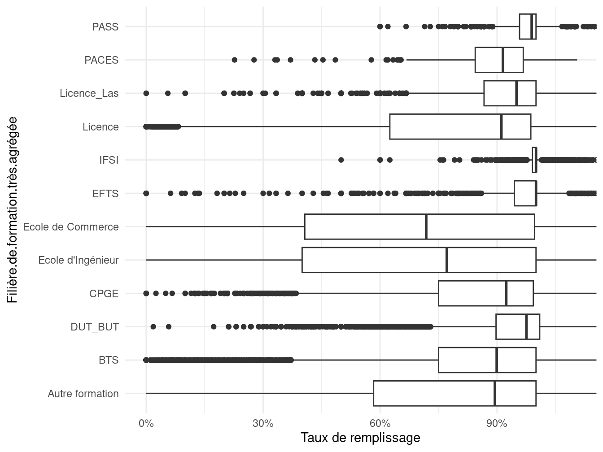

Et si Parcoursup était compté
================
Pauline Boyer, <pauline.boyer@cnrs.fr>Julien Gossa,
<gossa@unistra.fr>Université de Strasbourg

Projet d’article pour « Orientation post-bac : Parcoursup et
l’introduction de la sélection à l’université – Varia (72/juin 2024) ».

Axes : transversal.

## Introduction

Les données proviennent pour l’essentiel de la plateforme de données
ouvertes du ministère [^1] [^2] [^3] [^4] [^5] [^6], également utilisée
pour alimenter Parcoursup, ses tableaux de bord, et les notes
d’information du ministère.

Les traitements sont effectués en R (Xie, Allaire, and Grolemund 2019)
et les représentations en ggplot (Wickham 2009 ; Wilke 2019). Ils sont
mis en ligne et librement accessibles sur la plateforme GitHub[^7],
ainsi que les brouillons exploratoires [^8]. Les irrégularités ou
incohérences apparentes sont systématiquement discutées publiquement sur
le réseau social Twitter.

## Mesurer Parcoursup

### Qualité de l’affectation : de la `satisfaction de l'affectation` à la `satisfaction d'utilisation de la plateforme`

### Qualité de l’affectation : de la `satisfaction` au `débit`

### Offre de formation : `taille` et `nombre de formations`

## Offre de formation : de la `pression` au `taux d'accès`

### `Places non pourvues`, `Places vacantes` et `Taux de remplissage`

## `Taux de poursuite d'étude` et `Nombre de non poursuites d'étude`

## Informations additionnelles

### sur déclaration de capacités

Surdéclarants

| Session | capacité_plus_1000 | nb_formations |
|--------:|:-------------------|--------------:|
|    2016 | FALSE              |           446 |
|    2016 | TRUE               |            68 |
|    2017 | FALSE              |           358 |
|    2017 | TRUE               |            40 |
|    2018 | FALSE              |           207 |
|    2018 | TRUE               |             2 |
|    2019 | FALSE              |            96 |
|    2019 | TRUE               |             7 |
|    2020 | FALSE              |            51 |
|    2020 | TRUE               |             9 |
|    2021 | FALSE              |            74 |
|    2021 | TRUE               |            12 |
|    2022 | FALSE              |            84 |
|    2022 | TRUE               |            12 |

### Taux remplissage

Wickham, Hadley. 2009. *Ggplot2: Elegant Graphics for Data Analysis*.
Use R! New York: Springer.

Wilke, Claus. 2019. *Fundamentals of Data Visualization: A Primer on
Making Informative and Compelling Figures*. First edition. Beijing
Boston Farnham Sebastopol Tokyo: O’Reilly.

Xie, Yihui, Joseph J. Allaire, and Garrett Grolemund. 2019. *R Markdown:
The Definitive Guide*. Chapman & Hall/CRC, the R Series. Boca Raton
London New York: CRC Press, Taylor & Francis Group.

[^1]: <https://data.enseignementsup-recherche.gouv.fr/explore/dataset/fr-esr-parcoursup/>

[^2]: <https://data.enseignementsup-recherche.gouv.fr/explore/dataset/fr-esr-parcoursup_2020/>

[^3]: <https://data.enseignementsup-recherche.gouv.fr/explore/dataset/fr-esr-parcoursup-2019/>

[^4]: <https://data.enseignementsup-recherche.gouv.fr/explore/dataset/fr-esr-parcoursup-2018/>

[^5]: <https://data.enseignementsup-recherche.gouv.fr/explore/dataset/fr-esr-apb_voeux-et-admissions/>

[^6]: <https://data.enseignementsup-recherche.gouv.fr/explore/dataset/fr-esr-taux-poursuite-enseignement-superieur-par-academie/>

[^7]: <https://github.com/juliengossa/parcoursup/>

[^8]: <https://github.com/cpesr/RFC/>
