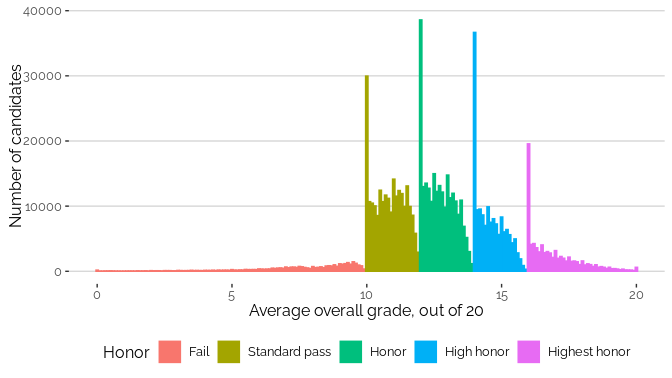
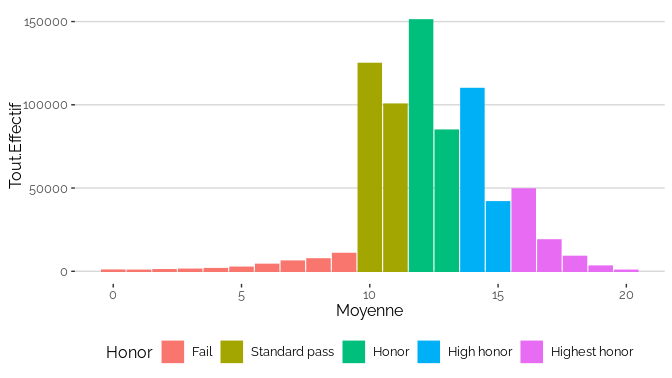
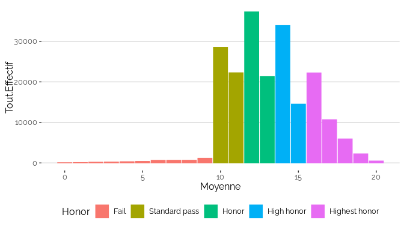
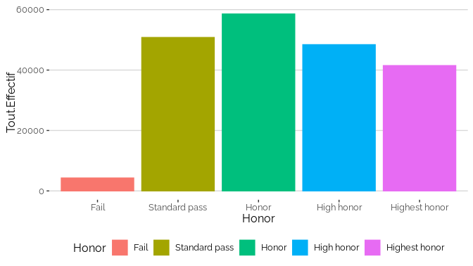
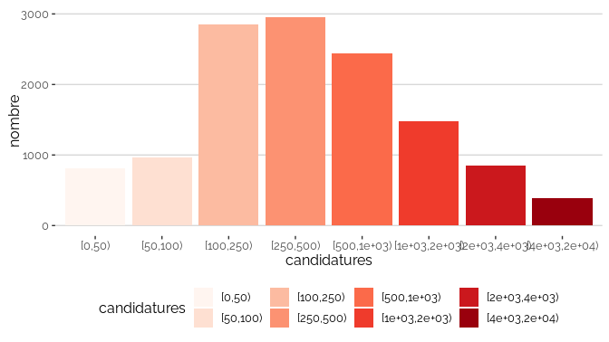
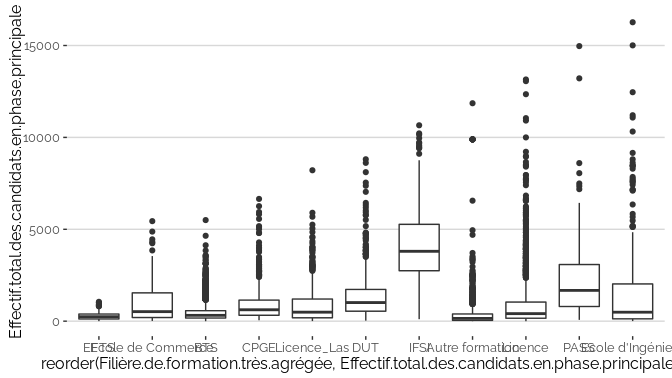
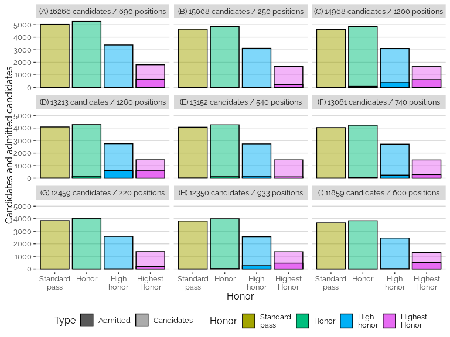

Ordonner les bacheliers avec leurs notes au Bac
================

Ce document propose d’illustrer la difficulté d’obtenir un résultat
équitable par l’application d’algorithmes dans la réalité. Sur le cas
concret de l’affectation des étudiants dans l’enseignement supérieur en
France, nous allons montrer qu’un problème de qualité des données peut
conduire à des décision différentes pour des individus pourtant
équivalents en regard des objectifs poursuivis.

Ce problème se défini ainsi : étant donné un nombre de candidats
formulant des vœux de poursuite d’étude, et un nombre de formations
proposant des places, comment affecter ces candidats dans ces formations
?

Une solution communément admise consiste à employer un algorithme
d’appariement, aussi appeler de mariage, tel que celui de Gale-Shapley.
Un tel algorithme nécessite que les candidats ordonnent leurs vœux, et
que les formations ordonnent leurs candidatures.

En France, les candidats ont le droit d’ordonner jusqu’à 10 vœux, et 20
sous-vœux (vœux communs à des formations équivalentes). En 2020, 658 000
lycéens ont ainsi formulé près de 7 millions de vœux, et donc autant de
candidatures, pour environ 13 000 formations.

Pour que l’algorithme fonctionne, il faut que les formations
construisent un ordre total entre les candidatures, c’est à dire
affecter à chacun d’eux un *rang*, sans *ex-æquo*. L’équité de
l’algorithme repose sur la qualité de cet ordre. Or, sa construction est
difficile, et parfois même impossible, et cela n’est pas sans
conséquence sur l’équité de la solution obtenue.

Nous allons d’abord discuter de la qualité des données au travers d’un
ordre basé sur les notes au bac, pour ensuite discuter de l’équité des
décisions que les formations peuvent prendre en l’utilisant. Nous en
tirerons ensuite une conclusion.

## L’ordonnancement de tous les bacheliers par leurs notes

Dans cette partie, nous allons illustrer la question de la qualité des
données servant d’entrée à l’algorithme, en prenant le cas concret des
notes au Bac, issues du jeu de données
`la distribution des notes au baccalauréat en 2020`.

En 2020, 729 361 lycéens ont passé leur bac. Le jeu de données présente
la distribution de leur note moyenne finale, avec une précision de 1/10e
de point :

<!-- -->

On y constate trois choses :

-   l’intervalle `[0,20]` n’est pas uniformément utilisé : notamment, il
    existe très peu de notes dans `[0,10)` ;
-   la distribution des notes ne suit pas directement une loi normale :
    il existe des notes très clairement sur-utilisées au début de chaque
    mention ;
-   de nombreux candidats partagent exactement la même note au dixième
    de point : par exemple, plus de 38 000 bacheliers ont exactement une
    moyenne de 12,0.

On peut constater les mêmes phénomènes en limitant la visualisation au
Bac général série scientifique (S) :

<!-- -->

Ceci s’explique notamment par la nature de ces notes, qui sont en
réalité construites pour refléter un niveau scolaire, et non pour
ordonner les bacheliers.

Pour pouvoir construire un ordre total, il faudrait calculer ces notes
moyennes au 1/100000e de point. Si elle est techniquement réalisable,
une telle précision n’a pourtant aucune pertinence pédagogique, à moins
de considérer qu’un candidat ayant 12,00002 de moyenne est effectivement
meilleur que quelqu’un ayant 12,00001, sachant que ces moyennes
proviennent d’épreuves différentes, par des correcteurs différents dans
des établissements différents, parfois même avec des options différentes
dans des filières différentes.

En détournant les données de leur usage initial, et en augmentant leur
précision pour correspondre aux besoins de l’algorithme, on prend donc
le risque de diminuer leur qualité en regard de l’objectif recherché.

Il faut donc s’interroger sur la pertinence de l’écart entre les notes
pour ordonner les bacheliers : si les notes 12,5 et 12,6 permettent en
soi un ordre, cet ordre a-t-il un sens pour décrire une réelle
différence de profil entre deux bacheliers ? Et si non, quel écart
permet d’obtenir du sens ?

La distribution des notes montre qu’il y a des différences
significatives à la frontière des mentions : 11,9 est effectivement
différent de 12, un jury étant intervenu pour décider que tel candidat
ayant 11.9 mérite 12, et pas tel autre. On peut donc construire ordre
plus pertinente des candidats en réduisant la précision des données, par
exemple en regroupant les notes avec une précision de 1/1 :

    ## `summarise()` has grouped output by 'Moyenne'. You can override using the
    ## `.groups` argument.

<!-- --> On augmente
ainsi la pertinence de l’ordre entre les candidats, mais au prix d’une
augmentation considérable des candidats partageant le même rang :
jusqu’à 150 000 candidats partagent la même note.

En regardant le seul Bac S, on dépasse encore les 30 000 candidats par
note :

    ## `summarise()` has grouped output by 'Moyenne'. You can override using the
    ## `.groups` argument.

<!-- -->

Il est possible d’aller plus loin dans cette démarche, en considérant
non plus les notes, mais les mentions, qui ont sans doute la meilleure
pertinence pédagogique (soit une précision de 2/1 au dessus de 10,0) :

<!-- -->

Nous dépassons alors les 200 000 candidats par rang, et presque 60 000
en ne regardant que le Bac S :

<!-- -->

Ce exemple illustre le problème qu’engendre un détournement des données,
et plus généralement l’utilisation de données non adaptées, ou
insuffisamment pertinentes en regard de l’objectif poursuivi : on peut
rapidement arriver à l’impossibilité de construire un ordre total
équitable entre les individus.

Regardons maintenant les conséquences que peut avoir l’utilisation de
telles données sur les prises de décisions.

## Parcoursup

Pour évaluer les possibles conséquences de l’utilisation d’un ordre de
mauvaise qualité sur les décisions d’affectation, nous allons utiliser
le jeu de données
`Parcoursup : propositions d'admission dans l'enseignement supérieur des élèves de terminale diplômés du baccalauréat général selon leurs enseignements de spécialité en 2020`.

A l’échelle des formations, le critère critique pour construire un ordre
total entre les candidatures est le nombre de ces candidatures.

La distribution du nombre de candidatures montre que 10% des formations
ont moins de 100 candidatures, et 25% en ont plus de mille. Quelques
centaines de formations ont plus de 10 000 candidatures.

<!-- -->

<!-- -->

<!-- -->

<!-- -->

Pour illustrer la difficulté, prenons les 9 formations recevant le plus
de candidatures. Il s’agit d’un groupe d’écoles d’ingénieur, de
formations en médecine, et de Licences, avec des capacité d’accueil
entre 220 et 1260 places.

<table>
<thead>
<tr>
<th style="text-align:left;">
Filière.de.formation.très.agrégée
</th>
<th style="text-align:left;">
Libellé.formation
</th>
<th style="text-align:right;">
Effectif.total.des.candidats.en.phase.principale
</th>
<th style="text-align:right;">
Capacité.de.l.établissement.par.formation
</th>
</tr>
</thead>
<tbody>
<tr>
<td style="text-align:left;">
Ecole d’Ingénieur
</td>
<td style="text-align:left;">
Groupe INSA - Formation d’ingénieur Bac + 5 - Bac S
</td>
<td style="text-align:right;">
16266
</td>
<td style="text-align:right;">
690
</td>
</tr>
<tr>
<td style="text-align:left;">
Ecole d’Ingénieur
</td>
<td style="text-align:left;">
Groupe INSA - Formation d’ingénieur Bac + 5 - Bac S
</td>
<td style="text-align:right;">
15008
</td>
<td style="text-align:right;">
250
</td>
</tr>
<tr>
<td style="text-align:left;">
PASS
</td>
<td style="text-align:left;">
Sorbonne Université ? Médecine - Licence - Parcours d’Accès Spécifique
Santé (PASS)
</td>
<td style="text-align:right;">
14968
</td>
<td style="text-align:right;">
1200
</td>
</tr>
<tr>
<td style="text-align:left;">
PASS
</td>
<td style="text-align:left;">
Université de Paris - Licence - Parcours d’Accès Spécifique Santé (PASS)
</td>
<td style="text-align:right;">
13213
</td>
<td style="text-align:right;">
1260
</td>
</tr>
<tr>
<td style="text-align:left;">
Licence
</td>
<td style="text-align:left;">
Sorbonne Université ? Sciences et Ingénierie - Licence - Portail MIPI
(maths, informatique, physique, ingénierie)
</td>
<td style="text-align:right;">
13152
</td>
<td style="text-align:right;">
540
</td>
</tr>
<tr>
<td style="text-align:left;">
Licence
</td>
<td style="text-align:left;">
Université Paris 1 Panthéon Sorbonne - Licence - Droit
</td>
<td style="text-align:right;">
13061
</td>
<td style="text-align:right;">
740
</td>
</tr>
<tr>
<td style="text-align:left;">
Ecole d’Ingénieur
</td>
<td style="text-align:left;">
Groupe INSA - Formation d’ingénieur Bac + 5 - Bac S
</td>
<td style="text-align:right;">
12459
</td>
<td style="text-align:right;">
220
</td>
</tr>
<tr>
<td style="text-align:left;">
Licence
</td>
<td style="text-align:left;">
Université Paris 2 Panthéon - Assas - Licence - Droit
</td>
<td style="text-align:right;">
12350
</td>
<td style="text-align:right;">
933
</td>
</tr>
<tr>
<td style="text-align:left;">
Autre formation
</td>
<td style="text-align:left;">
Université Paris-Dauphine - Formation valant grade de licence - Sciences
des Organisations - Paris - Classique
</td>
<td style="text-align:right;">
11859
</td>
<td style="text-align:right;">
600
</td>
</tr>
</tbody>
</table>

Regardons maintenant les mention des candidats admis dans ces formations
:

<!-- -->

On peut constater des profils assez variés, allant de formations ne
recrutant que des mentions TB (A), à des formation recrutant plus de
mentions B (E).

Ajoutons à ces données celles des candidatures. Malheureusement, ces
données ne sont pas disponibles dans le jeu de données. Nous allons donc
faire l’hypothèse que leur distribution est identique à la distribution
des Bac S. En réalité, les candidatures sont sans doute encore plus
concentrées qu’on l’estime ici. En effet, les lycéens les mieux classés
candidatent plus volontiers dans les formations les plus demandées, et
vice-versa. Notre hypothèse conduit donc à minimiser la difficulté de
construire un ordre total parmi les candidatures.

    ## Joining, by = "Honor"

<!-- -->

La différence entre le nombre de candidats et le nombre d’admis
s’expliquer par deux raisons :

-   par le haut : le désistement des candidats préférant une autre
    formation ;
-   par le bas : la non admission en raison d’un classement trop bas.

Avec un ordre par mention, ces deux raisons se confondent dans le même
groupe pour les formations ne recrutant que dans une seule mention. Les
données ne permettent par exemple pas de distinguer ces deux cas dans
les formations (A), (B), (G) et (I).

En revanche, pour les formations recrutant dans plusieurs mentions, les
non-admissions arrivent essentiellement dans la mention la plus basse du
recrutement : les mentions Bien pour les formations (F) et (H), et les
mentions Assez bien pour les formations (C), (D) et (E). Appelons cette
mention « frontière » car c’est dans celle-ci que se situe la frontière
du recrutement.

On peut souvent constater un flou dans cette frontière, par exemple avec
le recrutement d’un petit nombre de sans mention, qui peut s’expliquer
soit par une différence significative entre les résultats du bac et le
classement de la candidature, soit par l’application de quotas. Ignorons
ces cas.

Concentrons-nous sur la frontière des formations (C), (D) et (E) :

    ## Joining, by = "Honor"

<!-- -->

Selon notre hypothèse, la formation (C) a admis 88 candidats avec
mention AB sur 4400, la formation (D) 162 sur 3884, et la formation (E)
122 sur 3866.

Or, si on considère que la mention est la bonne précision pour ordonner
les candidatures, les admis ne sont pas distinguables des non-admis : la
décision n’est pas équitable.

Ajoutons plus de précision dans les notes. Si on rapporte le nombre
maximal de candidats partageant exactement la même note au niveau
national à l’effectif de ces formations, on peut faire le calcul suivant
: 768 candidats partagent la même note au dixième de point à la
frontière dans la formation (C), 678 dans formation (E) et 675 dans la
formation (F).

    ## Joining, by = "Honor"

    ## # A tibble: 3 × 3
    ##   id    Nombre candidats_confondus
    ##   <chr>  <dbl>               <dbl>
    ## 1 C       4839                 792
    ## 2 D       4271                 699
    ## 3 E       4252                 696

On montre ainsi qu’un dixième de point de plus ou de moins peut faire
gagner ou perdre des centaines de places, et conduire des candidats à
être finalement admis ou non, sur la base d’une donnée sans pertinence
vis-à-vis de l’objectif recherché. Là encore, l’application de
l’algorithme n’est pas équitable, mais seulement pour les candidats se
situation à la frontière. Les candidats qui en sont loin recevront la
même décision, malgré l’imprécision sur rang qui leur a été attribué.

Ce problème est donc d’autant plus fort que la frontière se situe dans
les zones où la densité de candidats est la plus forte, mais il est
aussi d’autant plus faible que le nombre de candidatures est bas pour un
nombre de places élevé.

Ainsi, nous avons présenté ici un échantillon des cas extrêmes, qui,
sans être exceptionnels, ne représentent pas la majorité des formations
en France. A l’autre extrême, dès lors qu’il y a assez de places pour
tous les candidats, l’algorithme est parfaitement équitable.

Nous montrons ainsi que le même algorithme peut proposer des solutions
équitables ou non, selon le contexte dans lequel il est employé, qui
dépend de choix de conception et d’utilisation de l’algorithme, mais
aussi de choix possiblement politiques, à priori extérieur au problème.

## Conclusion

Pour conclure, en utilisant les données ouvertes sur les notes du bac et
les recrutements Parcoursup, nous avons montré la difficulté de
construire un ordre total entre des candidats aux formations à
l’enseignement supérieur en France, en utilisant les notes moyennes au
baccalauréat. Cette difficulté s’explique ici par la qualité limitée des
données en regard de leur usage.

Les conséquences de cette difficulté se manifestent cependant de façon
potentiellement très différente selon le contexte d’usage. Le même
algorithme peut être très équitable sur une formation mais pas sur
l’autre, et même sur un individu et pas sur l’autre.

Nous avons montré que les inéquités se concentrent à la frontière de
bascule entre plusieurs décisions. Cette frontière ici est située au
rang du dernier admis, qui peut de ne pas être distinguable du premier
non-admis. Lorsque c’est le cas, la décision peut être considérée comme
inéquitable, sinon arbitraire.

L’identification de la frontière entre ordre pertinent et arbitraire
permet d’envisager des pistes pour augmenter l’équité de l’affectation,
par exemple par l’utilisation d’un ordre total loin de la frontière, et
par le recours au tirage au sort dès lors qu’on s’en approche, afin
d’être arbitaire mais au moins pas inéquitable.

### Annexe

Nombre de formations selon le nombre de regroupements (files d’attente)
différentes.

    ## `summarise()` has grouped output by 'id'. You can override using the `.groups`
    ## argument.
    ## `summarise()` has grouped output by 'Sélectivité'. You can override using the
    ## `.groups` argument.

    ## # A tibble: 5 × 4
    ##   Sélectivité         nb_grp nb_formation prop   
    ##   <chr>                <int>        <int> <chr>  
    ## 1 formation non selec      1         2720 21.715%
    ## 2 formation selective      1         3841 30.664%
    ## 3 formation selective      2         2118 16.909%
    ## 4 formation selective      3         3833 30.600%
    ## 5 formation selective      5           14 0.112%

Pourcentage de candidates

biais : positif si plus le pourcentage d’admises est supérieur au
pourcentage de candidates, négatif si le pourcentage d’admises est
inférieur au pourcentage de candidates.

<!-- -->

<!-- -->
