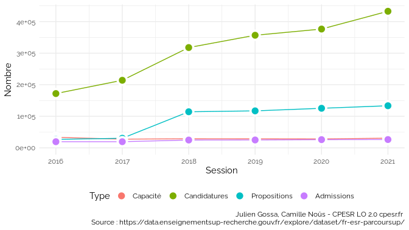
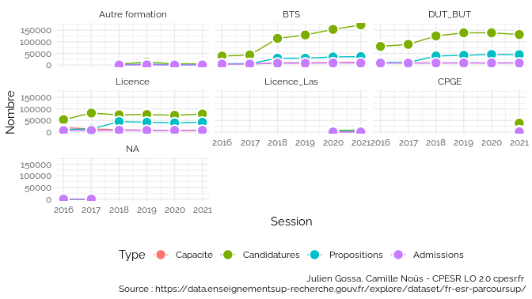
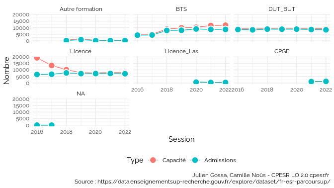
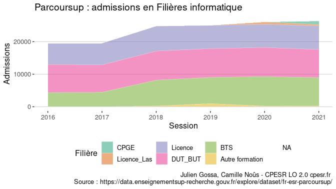
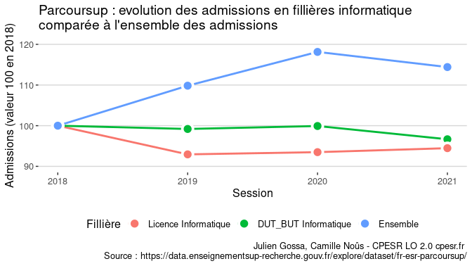

Untitled
================

Voir les données

    ## Joining, by = "col"
    ## Joining, by = "col"
    ## Joining, by = "col"

| col                                                                                                                                              | ps18 | ps19 | ps20 | ps21 |
|:-------------------------------------------------------------------------------------------------------------------------------------------------|:-----|:-----|:-----|:-----|
| Session                                                                                                                                          | TRUE | TRUE | TRUE | TRUE |
| Code.UAI.de.l.établissement                                                                                                                      | TRUE | TRUE | TRUE | TRUE |
| Établissement                                                                                                                                    | TRUE | TRUE | TRUE | TRUE |
| Code.départemental.de.l.établissement                                                                                                            | TRUE | TRUE | TRUE | TRUE |
| Département.de.l.établissement                                                                                                                   | TRUE | TRUE | TRUE | TRUE |
| Région.de.l.établissement                                                                                                                        | TRUE | TRUE | TRUE | TRUE |
| Académie.de.l.établissement                                                                                                                      | TRUE | TRUE | TRUE | TRUE |
| Filière.de.formation.très.agrégée                                                                                                                | TRUE | TRUE | TRUE | TRUE |
| Filière.de.formation                                                                                                                             | TRUE | TRUE | TRUE | TRUE |
| Concours.communs.et.banques.d.épreuves                                                                                                           | TRUE | TRUE | TRUE | NA   |
| Filière.de.formation.détaillée                                                                                                                   | TRUE | TRUE | TRUE | TRUE |
| Filière.de.formation.très.détaillée                                                                                                              | TRUE | TRUE | TRUE | TRUE |
| Lien.de.la.formation.sur.la.plateforme.Parcoursup                                                                                                | TRUE | TRUE | TRUE | TRUE |
| Coordonnées.GPS.de.la.formation                                                                                                                  | TRUE | TRUE | TRUE | TRUE |
| Capacité.de.l.établissement.par.formation                                                                                                        | TRUE | TRUE | TRUE | TRUE |
| Effectif.total.des.candidats.pour.une.formation                                                                                                  | TRUE | TRUE | TRUE | TRUE |
| Dont.effectif.des.candidates.pour.une.formation                                                                                                  | TRUE | TRUE | TRUE | TRUE |
| Effectif.total.des.candidats.en.phase.principale                                                                                                 | TRUE | TRUE | TRUE | TRUE |
| Dont.effectif.des.candidats.ayant.postulé.en.internat                                                                                            | TRUE | TRUE | TRUE | TRUE |
| Effectif.des.candidats.néo.bacheliers.généraux.en.phase.principale                                                                               | TRUE | TRUE | TRUE | TRUE |
| Dont.effectif.des.candidats.boursiers.néo.bacheliers.généraux.en.phase.principale                                                                | TRUE | TRUE | TRUE | TRUE |
| Effectif.des.candidats.néo.bacheliers.technologiques.en.phase.principale                                                                         | TRUE | TRUE | TRUE | TRUE |
| Dont.effectif.des.candidats.boursiers.néo.bacheliers.technologiques.en.phase.principale                                                          | TRUE | TRUE | TRUE | TRUE |
| Effectif.des.candidats.néo.bacheliers.professionnels.en.phase.principale                                                                         | TRUE | TRUE | TRUE | TRUE |
| Dont.effectif.des.candidats.boursiers.néo.bacheliers.professionnels.en.phase.principale                                                          | TRUE | TRUE | TRUE | TRUE |
| Effectif.des.autres.candidats.en.phase.principale                                                                                                | TRUE | TRUE | TRUE | TRUE |
| Effectif.total.des.candidats.en.phase.complémentaire                                                                                             | TRUE | TRUE | TRUE | TRUE |
| Effectif.des.candidats.néo.bacheliers.généraux.en.phase.complémentaire                                                                           | TRUE | TRUE | TRUE | TRUE |
| Effectif.des.candidats.néo.bacheliers.technologique.en.phase.complémentaire                                                                      | TRUE | TRUE | TRUE | TRUE |
| Effectif.des.candidats.néo.bacheliers.professionnels.en.phase.complémentaire                                                                     | TRUE | TRUE | TRUE | TRUE |
| Effectifs.des.autres.candidats.en.phase.complémentaire                                                                                           | TRUE | TRUE | TRUE | TRUE |
| Effectif.total.des.candidats.classés.par.l.établissement.en.phase.principale                                                                     | TRUE | TRUE | TRUE | TRUE |
| Effectif.des.candidats.classés.par.l.établissement.en.phase.complémentaire                                                                       | TRUE | TRUE | TRUE | TRUE |
| Effectif.des.candidats.classés.par.l.établissement.en.internat..CPGE.                                                                            | TRUE | TRUE | TRUE | TRUE |
| Effectif.des.candidats.classés.par.l.établissement.hors.internat..CPGE.                                                                          | TRUE | TRUE | TRUE | TRUE |
| Effectif.des.candidats.néo.bacheliers.généraux.classés.par.l.établissement                                                                       | TRUE | TRUE | TRUE | TRUE |
| Dont.effectif.des.candidats.boursiers.néo.bacheliers.généraux.classés.par.l.établissement                                                        | TRUE | TRUE | TRUE | TRUE |
| Effectif.des.candidats.néo.bacheliers.technologiques.classés.par.l.établissement                                                                 | TRUE | TRUE | TRUE | TRUE |
| Dont.effectif.des.candidats.boursiers.néo.bacheliers.technologiques.classés.par.l.établissement                                                  | TRUE | TRUE | TRUE | TRUE |
| Effectif.des.candidats.néo.bacheliers.professionnels.classés.par.l.établissement                                                                 | TRUE | TRUE | TRUE | TRUE |
| Dont.effectif.des.candidats.boursiers.néo.bacheliers.professionnels.classés.par.l.établissement                                                  | TRUE | TRUE | TRUE | TRUE |
| Effectif.des.autres.candidats.classés.par.l.établissement                                                                                        | TRUE | TRUE | TRUE | TRUE |
| Effectif.total.des.candidats.ayant.reçu.une.proposition.d.admission.de.la.part.de.l.établissement                                                | TRUE | TRUE | TRUE | TRUE |
| Rang.du.dernier.appelé                                                                                                                           | TRUE | TRUE | NA   | NA   |
| Effectif.total.des.candidats.ayant.accepté.la.proposition.de.l.établissement..admis.                                                             | TRUE | TRUE | TRUE | TRUE |
| Dont.effectif.des.candidates.admises                                                                                                             | TRUE | TRUE | TRUE | TRUE |
| Effectif.des.admis.en.phase.principale                                                                                                           | TRUE | TRUE | TRUE | TRUE |
| Effectif.des.admis.en.phase.complémentaire                                                                                                       | TRUE | TRUE | TRUE | TRUE |
| Dont.effectif.des.admis.en.internat                                                                                                              | TRUE | TRUE | TRUE | TRUE |
| Dont.effectif.des.admis.boursiers.néo.bacheliers                                                                                                 | TRUE | TRUE | TRUE | TRUE |
| Effectif.des.admis.néo.bacheliers                                                                                                                | TRUE | TRUE | TRUE | TRUE |
| Effectif.des.admis.néo.bacheliers.généraux                                                                                                       | TRUE | TRUE | TRUE | TRUE |
| Effectif.des.admis.néo.bacheliers.technologiques                                                                                                 | TRUE | TRUE | TRUE | TRUE |
| Effectif.des.admis.néo.bacheliers.professionnels                                                                                                 | TRUE | TRUE | TRUE | TRUE |
| Effectif.des.autres.candidats.admis                                                                                                              | TRUE | TRUE | TRUE | TRUE |
| Dont.effectif.des.admis.néo.bacheliers.sans.information.sur.la.mention.au.bac                                                                    | TRUE | TRUE | TRUE | TRUE |
| Dont.effectif.des.admis.néo.bacheliers.sans.mention.au.bac                                                                                       | TRUE | TRUE | TRUE | TRUE |
| Dont.effectif.des.admis.néo.bacheliers.avec.mention.Assez.Bien.au.bac                                                                            | TRUE | TRUE | TRUE | TRUE |
| Dont.effectif.des.admis.néo.bacheliers.avec.mention.Bien.au.bac                                                                                  | TRUE | TRUE | TRUE | TRUE |
| Dont.effectif.des.admis.néo.bacheliers.avec.mention.Très.Bien.au.bac                                                                             | TRUE | TRUE | TRUE | TRUE |
| Effectif.des.admis.néo.bacheliers.généraux.ayant.eu.une.mention.au.bac                                                                           | TRUE | TRUE | TRUE | TRUE |
| Effectif.des.admis.néo.bacheliers.technologiques.ayant.eu.une.mention.au.bac                                                                     | TRUE | TRUE | TRUE | TRUE |
| Effectif.des.admis.néo.bacheliers.professionnels.ayant.eu.une.mention.au.bac                                                                     | TRUE | TRUE | TRUE | TRUE |
| Dont.effectif.des.admis.issus.du.même.établissement..BTS.CPGE.                                                                                   | TRUE | TRUE | TRUE | TRUE |
| Dont.effectif.des.admises.issues.du.même.établissement..BTS.CPGE.                                                                                | TRUE | TRUE | TRUE | TRUE |
| Dont.effectif.des.admis.issus.de.la.même.académie                                                                                                | TRUE | TRUE | TRUE | TRUE |
| Dont.effectif.des.admis.issus.de.la.même.académie..Paris.Créteil.Versailles.réunies.                                                             | TRUE | TRUE | TRUE | TRUE |
| X..d.admis.dont.filles                                                                                                                           | TRUE | TRUE | TRUE | TRUE |
| X..d.admis.néo.bacheliers.issus.de.la.même.académie                                                                                              | TRUE | TRUE | TRUE | TRUE |
| X..d.admis.néo.bacheliers.issus.de.la.même.académie..Paris.Créteil.Versailles.réunies.                                                           | TRUE | TRUE | TRUE | TRUE |
| X..d.admis.néo.bacheliers.issus.du.même.établissement..BTS.CPGE.                                                                                 | TRUE | TRUE | NA   | NA   |
| X..d.admis.néo.bacheliers.boursiers                                                                                                              | TRUE | TRUE | TRUE | TRUE |
| X..d.admis.néo.bacheliers                                                                                                                        | TRUE | TRUE | TRUE | TRUE |
| X..d.admis.néo.bacheliers.sans.information.sur.la.mention.au.bac                                                                                 | TRUE | TRUE | TRUE | TRUE |
| X..d.admis.néo.bacheliers.sans.mention.au.bac                                                                                                    | TRUE | TRUE | TRUE | TRUE |
| X..d.admis.néo.bacheliers.avec.mention.Assez.Bien.au.bac                                                                                         | TRUE | TRUE | TRUE | TRUE |
| X..d.admis.néo.bacheliers.avec.mention.Bien.au.bac                                                                                               | TRUE | TRUE | TRUE | TRUE |
| X..d.admis.néo.bacheliers.avec.mention.Très.Bien.au.bac                                                                                          | TRUE | TRUE | TRUE | TRUE |
| X..d.admis.néo.bacheliers.généraux                                                                                                               | TRUE | TRUE | TRUE | TRUE |
| Dont…d.admis.avec.mention                                                                                                                        | TRUE | TRUE | TRUE | TRUE |
| X..d.admis.néo.bacheliers.technologiques                                                                                                         | TRUE | TRUE | TRUE | TRUE |
| Dont…d.admis.avec.mention.1                                                                                                                      | TRUE | TRUE | TRUE | TRUE |
| X..d.admis.néo.bacheliers.professionnels                                                                                                         | TRUE | TRUE | TRUE | TRUE |
| Dont…d.admis.avec.mention.2                                                                                                                      | TRUE | TRUE | TRUE | TRUE |
| tri                                                                                                                                              | TRUE | TRUE | TRUE | TRUE |
| Statut.de.l.établissement.de.la.filière.de.formation..public..privé..                                                                            | NA   | TRUE | TRUE | TRUE |
| Dont.effectif.des.admis.ayant.reçu.leur.proposition.d.admission.à.l.ouverture.de.la.procédure.principale                                         | NA   | TRUE | TRUE | TRUE |
| Dont.effectif.des.admis.ayant.reçu.leur.proposition.d.admission.avant.le.baccalauréat                                                            | NA   | TRUE | TRUE | TRUE |
| Dont.effectif.des.admis.ayant.reçu.leur.proposition.d.admission.avant.la.fin.de.la.procédure.principale                                          | NA   | TRUE | TRUE | TRUE |
| X..d.admis.ayant.reçu.leur.proposition.d.admission.à.l.ouverture.de.la.procédure.principale                                                      | NA   | TRUE | TRUE | TRUE |
| X..d.admis.ayant.reçu.leur.proposition.d.admission.avant.le.baccalauréat                                                                         | NA   | TRUE | TRUE | TRUE |
| X..d.admis.ayant.reçu.leur.proposition.d.admission.avant.la.fin.de.la.procédure.principale                                                       | NA   | TRUE | TRUE | TRUE |
| Sélectivité                                                                                                                                      | NA   | NA   | TRUE | TRUE |
| Libellé.formation                                                                                                                                | NA   | NA   | TRUE | TRUE |
| Effectif.des.candidats.en.terminale.générale.ayant.reçu.une.proposition.d.admission.de.la.part.de.l.établissement                                | NA   | NA   | TRUE | TRUE |
| Dont.effectif.des.candidats.boursiers.en.terminale.générale.ayant.reçu.une.proposition.d.admission.de.la.part.de.l.établissement                 | NA   | NA   | TRUE | TRUE |
| Effectif.des.candidats.en.terminale.technologique.ayant.reçu.une.proposition.d.admission.de.la.part.de.l.établissement                           | NA   | NA   | TRUE | TRUE |
| Dont.effectif.des.candidats.boursiers.en.terminale.technologique.ayant.reçu.une.proposition.d.admission.de.la.part.de.l.établissement            | NA   | NA   | TRUE | TRUE |
| Effectif.des.candidats.en.terminale.professionnelle.ayant.reçu.une.proposition.d.admission.de.la.part.de.l.établissement                         | NA   | NA   | TRUE | TRUE |
| Dont.effectif.des.candidats.boursiers.en.terminale.générale.professionnelle.ayant.reçu.une.proposition.d.admission.de.la.part.de.l.établissement | NA   | NA   | TRUE | TRUE |
| Effectif.des.autres.candidats.ayant.reçu.une.proposition.d.admission.de.la.part.de.l.établissement                                               | NA   | NA   | TRUE | TRUE |
| Regroupement.1.effectué.par.les.formations.pour.les.classements                                                                                  | NA   | NA   | TRUE | TRUE |
| Rang.du.dernier.appelé.du.groupe.1                                                                                                               | NA   | NA   | TRUE | TRUE |
| Regroupement.2.effectué.par.les.formations.pour.les.classements                                                                                  | NA   | NA   | TRUE | TRUE |
| Rang.du.dernier.appelé.du.groupe.2                                                                                                               | NA   | NA   | TRUE | TRUE |
| Regroupement.3.effectué.par.les.formations.pour.les.classements                                                                                  | NA   | NA   | TRUE | TRUE |
| Rang.du.dernier.appelé.du.groupe.3                                                                                                               | NA   | NA   | TRUE | TRUE |
| Regroupement.4.effectué.par.les.formations.pour.les.classements                                                                                  | NA   | NA   | TRUE | NA   |
| Rang.du.dernier.appelé.du.groupe.4                                                                                                               | NA   | NA   | TRUE | NA   |
| Regroupement.5.effectué.par.les.formations.pour.les.classements                                                                                  | NA   | NA   | TRUE | NA   |
| Rang.du.dernier.appelé.du.groupe.5                                                                                                               | NA   | NA   | TRUE | NA   |
| Indicateur.Parcoursup.du.taux.d.accès.des.candidats.ayant.postulé.à.la.formation..ratio.entre.le.dernier.appelé.et.le.dernier.classé.            | NA   | NA   | TRUE | NA   |
| Dont.taux.d.accès.des.candidats.ayant.un.bac.professionnel.ayant.postulé.à.la.formation                                                          | NA   | NA   | TRUE | TRUE |
| Dont.taux.d.accès.des.candidats.ayant.un.bac.général.ayant.postulé.à.la.formation                                                                | NA   | NA   | TRUE | TRUE |
| Dont.taux.d.accès.des.candidats.ayant.un.bac.technologique.ayant.postulé.à.la.formation                                                          | NA   | NA   | TRUE | TRUE |
| COD\_AFF\_FORM                                                                                                                                   | NA   | NA   | TRUE | TRUE |
| Commune.de.l.établissement                                                                                                                       | NA   | NA   | NA   | TRUE |
| Dont.effectif.des.admis.néo.bacheliers.avec.mention.Très.Bien.avec.félicitations.au.bac                                                          | NA   | NA   | NA   | TRUE |
| X..d.admis.néo.bacheliers.avec.mention.Très.Bien.avec.félicitations.au.bac                                                                       | NA   | NA   | NA   | TRUE |
| list\_com                                                                                                                                        | NA   | NA   | NA   | TRUE |
| Taux.d.accès.des.candidats.ayant.postulé.à.la.formation..ratio.entre.le.dernier.appelé.et.le.nombre.vœux.PP.                                     | NA   | NA   | NA   | TRUE |
| LIB\_FOR\_VOE\_INS                                                                                                                               | NA   | NA   | NA   | TRUE |
| detail\_forma2                                                                                                                                   | NA   | NA   | NA   | TRUE |
| etablissement\_id\_paysage                                                                                                                       | NA   | NA   | NA   | TRUE |
| composante\_id\_paysage                                                                                                                          | NA   | NA   | NA   | TRUE |

    ## `summarise()` has grouped output by 'Session'. You can override using the `.groups` argument.

    ## `summarise()` has grouped output by 'Session'. You can override using the `.groups` argument.

<!-- -->

    ## geom_path: Each group consists of only one observation. Do you need to adjust
    ## the group aesthetic?

<!-- -->

    ## geom_path: Each group consists of only one observation. Do you need to adjust
    ## the group aesthetic?

<!-- -->

<!-- -->

<!-- -->
