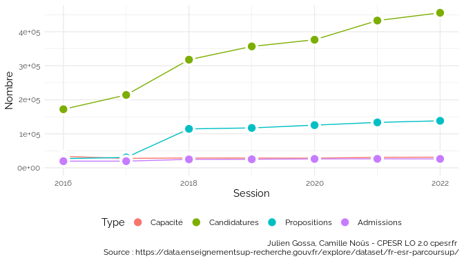
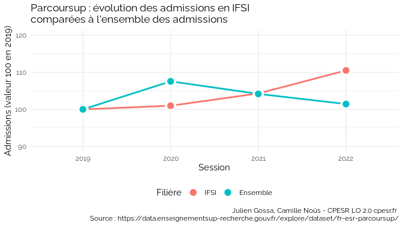
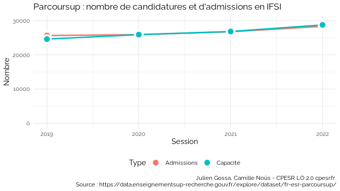

Untitled
================

## Licences d’informatique

    ## `summarise()` has grouped output by 'Session'. You can override using the
    ## `.groups` argument.

    ## `summarise()` has grouped output by 'Session'. You can override using the
    ## `.groups` argument.

<!-- -->

    ## `geom_line()`: Each group consists of only one observation.
    ## ℹ Do you need to adjust the group aesthetic?

<!-- -->

    ## `geom_line()`: Each group consists of only one observation.
    ## ℹ Do you need to adjust the group aesthetic?

<!-- -->

    ## Warning: Using `size` aesthetic for lines was deprecated in ggplot2 3.4.0.
    ## ℹ Please use `linewidth` instead.

<!-- -->

    ## Warning: Removed 6 rows containing missing values (`geom_line()`).

    ## Warning: Removed 6 rows containing missing values (`geom_point()`).

<!-- -->

<!-- -->

<!-- -->

    ## `summarise()` has grouped output by 'Session'. You can override using the
    ## `.groups` argument.

<!-- -->

### Places vacantes

### Discrimibilité
