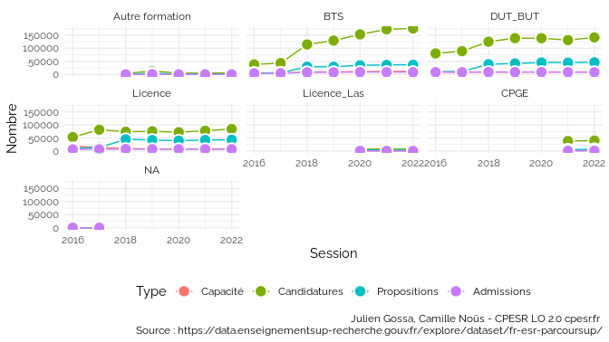
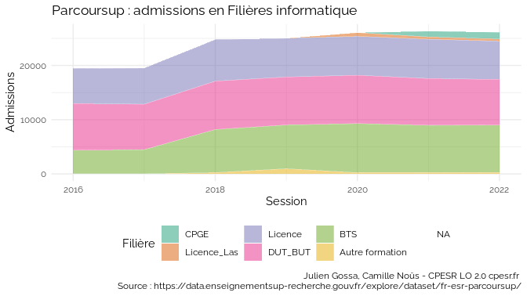
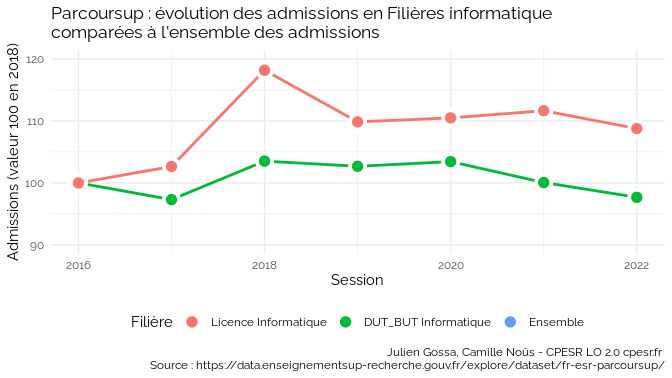

Untitled
================

## Licences d’informatique

    ## `summarise()` has grouped output by 'Session'. You can override using the
    ## `.groups` argument.

    ## `summarise()` has grouped output by 'Session'. You can override using the
    ## `.groups` argument.

<!-- -->

    ## geom_path: Each group consists of only one observation. Do you need to adjust
    ## the group aesthetic?

<!-- -->

    ## geom_path: Each group consists of only one observation. Do you need to adjust
    ## the group aesthetic?

<!-- -->

<!-- -->

    ## Warning: Removed 6 row(s) containing missing values (geom_path).

    ## Warning: Removed 6 rows containing missing values (geom_point).

<!-- -->

<!-- -->

<!-- -->

    ## `summarise()` has grouped output by 'Session'. You can override using the
    ## `.groups` argument.

<!-- -->

### Places vacantes

### Discrimibilité
